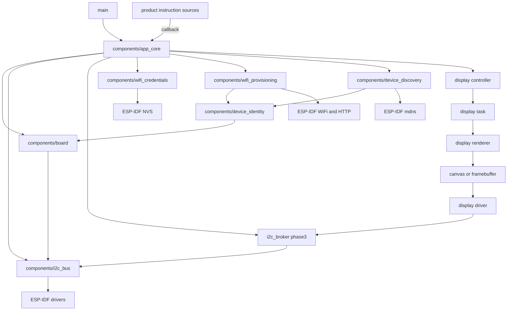

# Initial Architecture

This document describes the base firmware architecture for `b06_hil`. The board
uses an ESP32-C3 SuperMini module according to the hardware design, but final
pins must be confirmed against the schematic before enabling peripherals.

All agentic development methodology documentation in this firmware tree is
maintained in English.

Shared-document changes for the OLED display interface are motivated by
`agent-workspaces/architect/handoff.md`, `OLED_TEXT_DISPLAY_INTERFACE`.

Shared-document changes for I2C concurrency are motivated by
`agent-workspaces/architect/handoff.md`, `I2C_BUS_CONCURRENCY`.

Shared-document changes for the QR encoder are motivated by
`agent-workspaces/architect/handoff.md`, `QR_ENCODER_INTERFACE`.

Shared-document changes for display delivery are motivated by
`agent-workspaces/architect/handoff.md`, `DISPLAY_DELIVERY_CONTRACT`.

Shared-document changes for WiFi provisioning are motivated by
`agent-workspaces/architect/handoff.md`, `WIFI_PROVISIONING_ARCHITECTURE`.

Shared-document changes for LAN mDNS discovery are motivated by
`agent-workspaces/architect/handoff.md`, `DEVICE_DISCOVERY_MDNS_V1`.

## Layers



## Responsibilities

- `main/`: ESP-IDF entry point. It must initialize and delegate.
- `components/app_core/`: application orchestration, **sole caller of
  `display_controller_*` in v1**, public display facade
  (`app_core_display_show_template`, `app_core_display_show_qr_setup`), WiFi
  provisioning startup decisions, and main product rules. Display delivery is
  defined in `docs/display_delivery_contract.md`. Boot-time display demos are
  retired from normal product firmware.
- `components/board/`: pin map, board details, and abstractions specific to
  `b06_hil`, including the `GPIO7` active-low factory reset input.
- `components/i2c_bus/`: generic shared I2C master bus and device-handle
  registration. Device protocol drivers consume handles from this layer. The
  portable contract, incremental concurrency phases, and ESP-IDF binding are
  defined in `docs/i2c_bus_architecture.md`.
- `i2c_broker` (phase 3): optional priority queue that serializes I2C
  transactions from multiple application tasks before they reach `i2c_bus`.
- `components/wifi_credentials/`: NVS-backed WiFi credential storage for the
  provisioning profile. It owns namespace `wifi_prov` and the `ssid`,
  `password`, and `provisioned` keys defined in
  `docs/wifi_provisioning_architecture.md`.
- `components/wifi_provisioning/`: SoftAP, HTTP portal, STA connection attempts,
  and provisioning state transitions. The v1 product contract is defined in
  `docs/wifi_provisioning_architecture.md`.
- `components/device_identity/`: shared product hostname string
  `HIL-<board>-<MAC4>` from board number and SoftAP MAC; used by provisioning AP
  SSID and mDNS. See `docs/device_discovery_mdns_architecture.md`.
- `components/device_discovery/`: mDNS hostname announcement when STA has IPv4 on
  the user LAN. Orchestrated by `app_core_wifi`; see
  `docs/device_discovery_mdns_architecture.md`.
- `components/error_led/`: GPIO8 error LED patterns (off, slow/fast blink, solid
  on). WiFi link mapping is defined in `docs/error_led_wifi_link_architecture.md`;
  `app_core_wifi` is the adapter from `wifi_link_status_t`.
- Display interface: conceptual visual stack for the 0.96 inch I2C OLED display.
  The visual contract is defined in `docs/oled_text_display_interface.md`.
  QR matrix generation is defined in `docs/qr_encoder_interface.md`. QR payload
  strings are opaque instruction content validated via shared `setup_url` helpers.
  Delivery is defined in `docs/display_delivery_contract.md`.
  Implementation must keep display ownership in a controller/task boundary and
  must keep renderer/canvas logic independent from the physical I2C driver.
- `tests/`: documentation and future host or hardware tests.

## Principles

- Avoid application logic inside `app_main.c`.
- Keep pins concentrated in `board_pins.h`.
- Do not use peripherals until there is a decision recorded by the architect.
- Prefer conventional ESP-IDF components before custom abstractions.
- Keep I2C bus ownership in `i2c_bus`; keep device protocol logic in optional
  device drivers such as `display_driver` or a future `ina219` component.
- Optional device components are included per project. A display-only firmware
  may omit INA219 entirely without changing `i2c_bus`.
- The I2C bus layer is MCU-portable by design: portable semantics, startup
  order, and concurrency phases live in `docs/i2c_bus_architecture.md`; ESP-IDF
  is the current platform profile, not the long-term architectural boundary.
- I2C concurrency grows in authorized phases: direct sync, transaction executor,
  priority broker, optional observability. Implement only the active phase
  handoff.
- Do not let application modules draw pixels directly. Application data must be
  routed to a display controller, which owns visual priority and sends complete
  display states or layouts to the display task.
- QR codes are sporadic content, not a permanently reserved screen region. The
  active layout may be text-only or include QR depending on application state.
- QR appears only when a display instruction includes a QR region and payload.
  The display stack does not wait, poll, or depend on WiFi/network state.
- QR refresh is not special: payload or layout changes use the same display update
  path as any other content change.
- On-screen strings for v1 are printable ASCII only; tildes, accented letters,
  and non-English scripts are out of scope. Unsupported characters sanitize to `?`.
- Setup QR payloads are `http://IPv4` (implicit root `/` only). Path redirects
  and HTTPS are out of scope; another entity handles routing after scan.
- v1 OLED is read-only informational output: no menus, navigation, or on-display
  user input in the architecture.
- Display power saving (sleep, dim, panel off) is out of scope for v1; the product
  is occasional-use, not continuous 24/7 operation.
- WiFi provisioning follows `docs/wifi_provisioning_architecture.md`: missing
  credentials start an open AP named `HIL-06-<MAC4>` for this board at
  `192.168.4.1`, `GET /` serves a credential form, `POST /provision` tests
  credentials before saving, successful provisioning stops AP/HTTP, and failed
  saved credentials at boot leave the device disconnected until factory reset.
- The provisioning AP SSID uses `HIL-<board_number_2_digits>-<last_4_softap_mac>`.
  The board number comes from the project identifier (`b06_hil` → `06`) through
  board-owned configuration; `wifi_provisioning` must not hard-code `06`.
- Normal NVS is accepted for v1 WiFi credentials. Do not claim the stored password
  is encrypted unless a future security handoff changes the storage profile.
- `GPIO7` active-low factory reset erases WiFi credentials after a **10000 ms (10 s)**
  continuous hold, at **boot and runtime** (`docs/wifi_factory_reset_architecture.md`).
  Web reset, serial reset, automatic credential erase, and automatic AP fallback
  after connect failure are out of scope.
- WiFi provisioning may request QR/status screens only through `app_core` display
  APIs after receiving neutral provisioning events. Display code must not include
  WiFi, HTTP, or NVS credential-storage headers, and `wifi_provisioning` must not
  include `app_core.h` or display headers.

## Display Delivery (v1)

All display instructions (text or QR) follow **`docs/display_delivery_contract.md`**.

Summary:

```text
instruction source (TBD)
        --app_core_display_show_*-->
app_core
        --display_controller_*-->
display task / renderer / SSD1306 driver
```

Rules:

- **Only `app_core`** calls `display_controller_*` in v1.
- Text and QR instructions use the **same** notify → direct API path.
- Instruction sources call **`app_core` display entry points (callback)**; no
  polling; no bypass of `app_core`. `esp_event` is not used for display in v1.
- QR setup uses `app_core_display_show_qr_setup(url, text_lines, count)`.
  `DISPLAY_TEMPLATE_QR_LEFT_TEXT_RIGHT` is not a valid text-template request path.
- `setup_url` is a shared utility component for the root-only `http://IPv4`
  product profile. It is not a network component.
- `qr_encoder` contains only the vendored Nayuki `qrcodegen` C library; the
  `display_qr` adapter owns matrix generation and static buffers.
- The display architecture MUST NOT reference or depend on WiFi, network stacks, or
  connectivity state. Any such subsystem is fully decoupled.
- WiFi provisioning is a valid product instruction source for display requests
  only through neutral events consumed by `app_core`; it must not include
  `app_core.h`, call `app_core_display_show_*`, call `display_controller_*`, or
  call display task APIs directly.

Rejected for v1: direct producer → display calls, polling, multi-caller display
access, separate QR delivery channel, display/network coupling.

## WiFi Provisioning (v1)

WiFi provisioning follows **`docs/wifi_provisioning_architecture.md`**.

Summary:

```text
missing credentials or GPIO7 factory reset
        --start-->
open AP HIL-06-<MAC4> at 192.168.4.1
        --GET / and POST /provision-->
HTTP portal
        --valid submitted credentials-->
STA connection attempt
        --success-->
save NVS credentials, show success, stop AP/HTTP
        --failure-->
show failure, keep AP/HTTP for retry
```

Rules:

- `app_core` owns the startup decision: factory reset, load credentials, start
  provisioning, connect saved credentials, or remain disconnected after saved
  credential failure.
- `wifi_credentials` owns NVS namespace `wifi_prov`; WiFi provisioning code must
  not scatter credential keys across unrelated modules.
- `wifi_provisioning` owns SoftAP, STA attempts, HTTP routes, and form parsing.
- `wifi_provisioning` emits neutral `wifi_prov_event_t` events only; `app_core`
  maps those events to optional display templates or QR setup screens.
- The provisioning AP is open in v1. AP password, captive DNS, HTTPS, web reset,
  and encrypted NVS are non-goals until a future architect handoff.
- The provisioning QR payload is exactly `http://192.168.4.1` and remains a
  display instruction routed through `app_core`.

## LAN mDNS Discovery (v1)

After STA connects to the user network, the device announces an mDNS hostname
matching the provisioning SoftAP name (`HIL-06-<MAC4>`). Full contract:
**`docs/device_discovery_mdns_architecture.md`**.

Summary:

```text
STA GOT_IP + CONNECTED
        --app_core_wifi-->
device_discovery_start()
        --mdns hostname-->
HIL-06-24CE.local  →  DHCP IPv4
```

Rules:

- Hostname-only v1 (no `_http._tcp` service record).
- Active on user LAN STA only; not during provisioning SoftAP.
- Identity MAC4 from SoftAP interface bytes 4–5 (same as OLED/QR SSID).
- `wifi_provisioning` uses `device_identity`; it does not call mDNS directly.

## Toolchain Environment

ESP-IDF is already installed on the development computer, but its environment
variables are not created globally and must not be assumed to exist.

Build, test, and helper instructions may locate ESP-IDF tools through the local
filesystem at execution time, including absolute paths when needed for a local
command. Those discovered local paths are workstation-specific and must not be
recorded in committed source files, documentation, generated reports, scripts,
or configuration files. Any reusable command or script checked into the
repository must use relative project paths, caller-provided environment
variables, or documented parameters instead of embedding the developer's local
ESP-IDF installation path.

## Pending Assumptions

- OLED controller for v1 is SSD1306 at `0x3C` or `0x3D`; SH1106 is out of scope
  unless hardware changes.
- Confirm external interfaces that must be tested from HIL.
