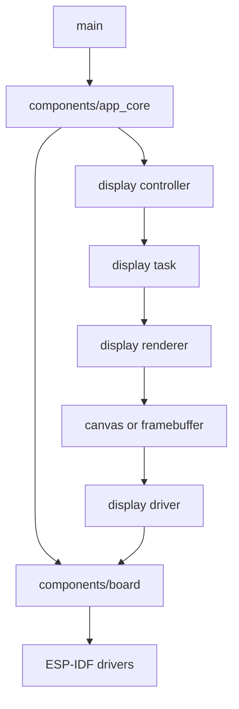

# Initial Architecture

This document describes the base firmware architecture for `b06_hil`. The board
uses an ESP32-C3 SuperMini module according to the hardware design, but final
pins must be confirmed against the schematic before enabling peripherals.

All agentic development methodology documentation in this firmware tree is
maintained in English.

Shared-document changes for the OLED display interface are motivated by
`agent-workspaces/architect/handoff.md`, `OLED_TEXT_DISPLAY_INTERFACE`.

## Layers

## Responsibilities

- `main/`: ESP-IDF entry point. It must initialize and delegate.
- `components/app_core/`: main loop and application rules.
- `components/board/`: pin map, board details, and abstractions specific to
  `b06_hil`.
- Display interface: conceptual visual stack for the 0.96 inch I2C OLED display.
  The visual contract is defined in `docs/oled_text_display_interface.md`.
  Implementation must keep display ownership in a controller/task boundary and
  must keep renderer/canvas logic independent from the physical I2C driver.
- `tests/`: documentation and future host or hardware tests.

## Principles

- Avoid application logic inside `app_main.c`.
- Keep pins concentrated in `board_pins.h`.
- Do not use peripherals until there is a decision recorded by the architect.
- Prefer conventional ESP-IDF components before custom abstractions.
- Do not let application modules draw pixels directly. Application data must be
  routed to a display controller, which owns visual priority and sends complete
  display states or layouts to the display task.

## Pending Assumptions

- Confirm available ESP32-C3 SuperMini pins in the schematic.
- Confirm I2C pins, address, and physical OLED driver before enabling display
  hardware communication.
- Confirm external interfaces that must be tested from HIL.
