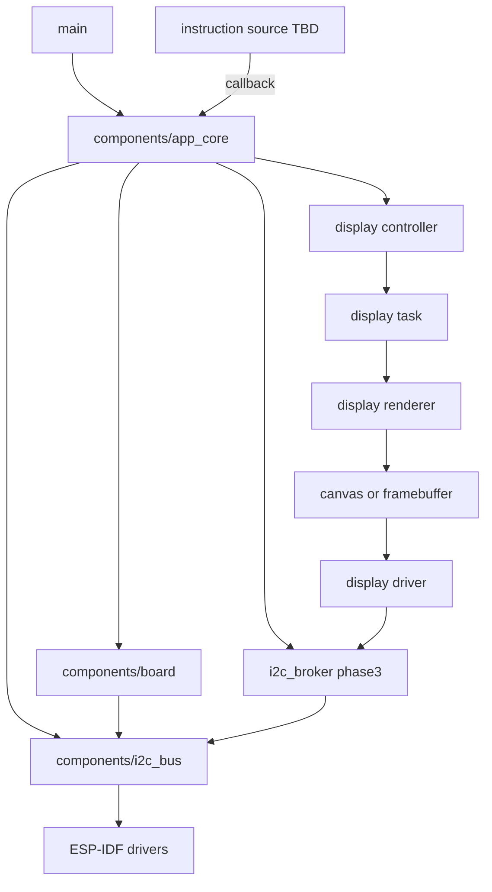

# Initial Architecture

This document describes the base firmware architecture for `b06_hil`. The board
uses an ESP32-C3 SuperMini module according to the hardware design, but final
pins must be confirmed against the schematic before enabling peripherals.

All agentic development methodology documentation in this firmware tree is
maintained in English.

Shared-document changes for the OLED display interface are motivated by
`agent-workspaces/architect/handoff.md`, `OLED_TEXT_DISPLAY_INTERFACE`.

Shared-document changes for I2C concurrency are motivated by
`agent-workspaces/architect/handoff.md`, `I2C_BUS_CONCURRENCY`.

Shared-document changes for the QR encoder are motivated by
`agent-workspaces/architect/handoff.md`, `QR_ENCODER_INTERFACE`.

Shared-document changes for display delivery are motivated by
`agent-workspaces/architect/handoff.md`, `DISPLAY_DELIVERY_CONTRACT`.

## Layers



## Responsibilities

- `main/`: ESP-IDF entry point. It must initialize and delegate.
- `components/app_core/`: application orchestration, **sole caller of
  `display_controller_*` in v1**, and main product rules. Display delivery is
  defined in `docs/display_delivery_contract.md`.
- `components/board/`: pin map, board details, and abstractions specific to
  `b06_hil`.
- `components/i2c_bus/`: generic shared I2C master bus and device-handle
  registration. Device protocol drivers consume handles from this layer. The
  portable contract, incremental concurrency phases, and ESP-IDF binding are
  defined in `docs/i2c_bus_architecture.md`.
- `i2c_broker` (phase 3): optional priority queue that serializes I2C
  transactions from multiple application tasks before they reach `i2c_bus`.
- Display interface: conceptual visual stack for the 0.96 inch I2C OLED display.
  The visual contract is defined in `docs/oled_text_display_interface.md`.
  QR matrix generation is defined in `docs/qr_encoder_interface.md`. QR payload
  strings are opaque instruction content validated via shared `setup_url` helpers.
  Delivery is defined in `docs/display_delivery_contract.md`.
  Implementation must keep display ownership in a controller/task boundary and
  must keep renderer/canvas logic independent from the physical I2C driver.
- `tests/`: documentation and future host or hardware tests.

## Principles

- Avoid application logic inside `app_main.c`.
- Keep pins concentrated in `board_pins.h`.
- Do not use peripherals until there is a decision recorded by the architect.
- Prefer conventional ESP-IDF components before custom abstractions.
- Keep I2C bus ownership in `i2c_bus`; keep device protocol logic in optional
  device drivers such as `display_driver` or a future `ina219` component.
- Optional device components are included per project. A display-only firmware
  may omit INA219 entirely without changing `i2c_bus`.
- The I2C bus layer is MCU-portable by design: portable semantics, startup
  order, and concurrency phases live in `docs/i2c_bus_architecture.md`; ESP-IDF
  is the current platform profile, not the long-term architectural boundary.
- I2C concurrency grows in authorized phases: direct sync, transaction executor,
  priority broker, optional observability. Implement only the active phase
  handoff.
- Do not let application modules draw pixels directly. Application data must be
  routed to a display controller, which owns visual priority and sends complete
  display states or layouts to the display task.
- QR codes are sporadic content, not a permanently reserved screen region. The
  active layout may be text-only or include QR depending on application state.
- QR appears only when a display instruction includes a QR region and payload.
  The display stack does not wait, poll, or depend on WiFi/network state.
- QR refresh is not special: payload or layout changes use the same display update
  path as any other content change.
- On-screen strings for v1 are printable ASCII only; tildes, accented letters,
  and non-English scripts are out of scope. Unsupported characters sanitize to `?`.
- Setup QR payloads are `http://IPv4` (implicit root `/` only). Path redirects
  and HTTPS are out of scope; another entity handles routing after scan.
- v1 OLED is read-only informational output: no menus, navigation, or on-display
  user input in the architecture.
- Display power saving (sleep, dim, panel off) is out of scope for v1; the product
  is occasional-use, not continuous 24/7 operation.

## Display Delivery (v1)

All display instructions (text or QR) follow **`docs/display_delivery_contract.md`**.

Summary:

```text
instruction source (TBD)  --notify-->  app_core  --display_controller_*-->  display stack
```

Rules:

- **Only `app_core`** calls `display_controller_*` in v1.
- Text and QR instructions use the **same** notify → direct API path.
- Instruction sources call **`app_core` display entry points (callback)**; no
  polling; no bypass of `app_core`. `esp_event` is not used for display in v1.
- The display architecture MUST NOT reference or depend on WiFi, network stacks, or
  connectivity state. Any such subsystem is fully decoupled.

Rejected for v1: direct producer → display calls, polling, multi-caller display
access, separate QR delivery channel, display/network coupling.

## Toolchain Environment

ESP-IDF is already installed on the development computer, but its environment
variables are not created globally and must not be assumed to exist.

Build, test, and helper instructions may locate ESP-IDF tools through the local
filesystem at execution time, including absolute paths when needed for a local
command. Those discovered local paths are workstation-specific and must not be
recorded in committed source files, documentation, generated reports, scripts,
or configuration files. Any reusable command or script checked into the
repository must use relative project paths, caller-provided environment
variables, or documented parameters instead of embedding the developer's local
ESP-IDF installation path.

## Pending Assumptions

- Confirm physical OLED driver before enabling display hardware communication.
- Confirm external interfaces that must be tested from HIL.
