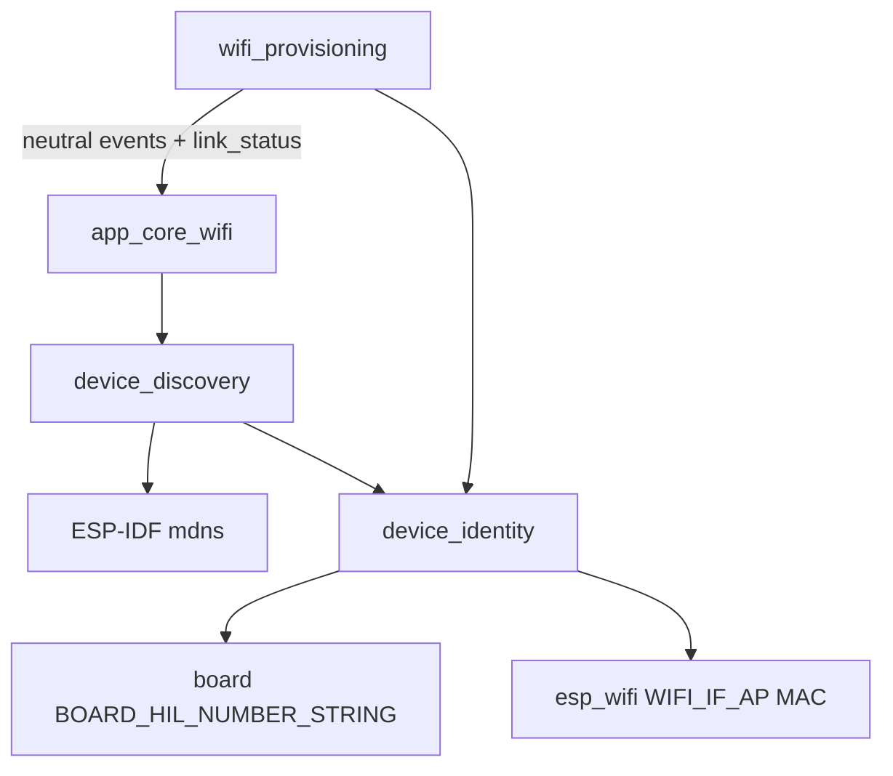
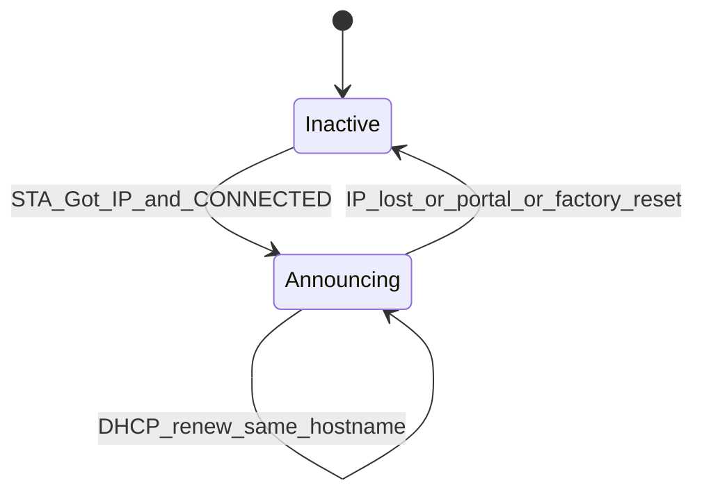

# Device Discovery mDNS Architecture (HIL Hostname)

Normative architecture for LAN hostname discovery of a provisioned `b06_hil`
device using ESP-IDF mDNS (Bonjour-style `.local` resolution).

Source handoff: `DEVICE_DISCOVERY_MDNS_V1` in
`agent-workspaces/architect/handoff.md`.

Related:

- [`wifi_provisioning_architecture.md`](wifi_provisioning_architecture.md) —
  SoftAP SSID format and provisioning lifecycle
- [`architecture.md`](architecture.md) — layer model
- [`test_strategy.md`](test_strategy.md) — LAN discovery validation

## Purpose

Allow a client on the same LAN to resolve the device IPv4 address when DHCP
assigns a variable IP, using a **stable hostname** that matches the product name
shown on the OLED and provisioning SoftAP SSID:

```text
HIL-<board_number_2_digits>-<last_4_softap_mac_hex>
```

Example for `b06_hil`: `HIL-06-24CE` → `HIL-06-24CE.local`.

v1 announces **hostname → IPv4 only**. No DNS-SD service records (`_http._tcp`,
custom `_hil._tcp`, TXT, port, or path).

## Normative Language

- `MUST` means required.
- `MUST NOT` means prohibited.
- `SHOULD` means expected unless there is a strong platform reason not to.
- `MAY` means optional.

## Product Decisions (v1)

| Topic | v1 decision |
| --- | --- |
| Protocol | mDNS (multicast DNS), ESP-IDF `mdns` component |
| When active | **STA only**, after IPv4 assigned on the user LAN |
| When inactive | Provisioning SoftAP, no IP, link loss, factory reset portal |
| Discovery shape | Hostname A record only (`*.local` resolution) |
| Hostname string | Same spelling as SoftAP SSID / OLED: uppercase `HIL-06-24CE` |
| MAC source for `<MAC4>` | **SoftAP interface** bytes 4–5, not STA MAC |
| OLED display of `.local` | Out of scope v1 |

Human decisions recorded 2026-06-28.

## Critical Rule: SoftAP MAC for Identity

The four hex digits MUST be derived from `esp_wifi_get_mac(WIFI_IF_AP, mac)` and
formatted as `%02X%02X` from `mac[4]` and `mac[5]`.

On ESP32, STA and SoftAP interface MAC addresses differ in the last byte. Using
STA MAC would produce a hostname **different** from the QR/OLED/SoftAP name.

Example:

```text
SoftAP MAC …:a9:24:ce  →  HIL-06-24CE
STA MAC    …:a9:24:cd  →  must NOT be used for product identity
```

This rule applies to **all** consumers of the identity string: provisioning AP
SSID, mDNS hostname, and future product identifiers.

## Layer Model



### Module Boundaries

| Module | Owns | MUST NOT |
| --- | --- | --- |
| `components/device_identity/` | `HIL-NN-XXXX` string builder | Display, HTTP, mDNS, WiFi connect |
| `components/device_discovery/` | mDNS init/start/stop | WiFi connect, OLED, portal HTTP |
| `components/wifi_provisioning/` | Portal/STA; SSID via `device_identity` | mDNS headers or calls |
| `components/app_core/` (`app_core_wifi.c`) | Start/stop discovery from WiFi events | Direct `mdns_*` API calls |

Rules:

- `wifi_provisioning` MUST NOT include `mdns.h`.
- `device_discovery` MUST NOT include display or `app_core.h`.
- Only `app_core_wifi` orchestrates discovery lifecycle from neutral WiFi events.

## Expected Components

```text
components/device_identity/
  include/device_identity.h
  device_identity.c
  CMakeLists.txt

components/device_discovery/
  include/device_discovery.h
  device_discovery.c
  CMakeLists.txt
```

## Device Identity API

Public header: `components/device_identity/include/device_identity.h`

```c
#define DEVICE_ID_MAX_LEN 32

esp_err_t device_identity_init(void);
esp_err_t device_identity_get(char *out, size_t out_len);
```

### `device_identity_init()`

- Idempotent.
- Requires WiFi stack initialized (`esp_wifi_init` completed).
- MAY be called from `device_discovery_init()` or early boot after WiFi init.

### `device_identity_get()`

- Writes null-terminated string: `HIL-<BOARD_HIL_NUMBER_STRING>-<MAC4>`.
- Uses `BOARD_HIL_NUMBER_STRING` from [`board_pins.h`](../components/board/include/board_pins.h).
- Uses SoftAP MAC bytes 4–5 uppercase hex, no separators.
- Returns `ESP_ERR_INVALID_STATE` if WiFi MAC unavailable.
- Returns `ESP_ERR_INVALID_SIZE` if buffer too small (minimum useful size: 12 for
  `HIL-06-ABCD`).

### SSID refactor

[`build_provisioning_ap_ssid()`](../components/wifi_provisioning/wifi_provisioning.c)
MUST call `device_identity_get()` into `s_ap_ssid` instead of duplicating the
format string. Log line remains:

```text
wifi_prov: provisioning AP SSID generated ssid=HIL-06-24CE
```

## Device Discovery API

Public header: `components/device_discovery/include/device_discovery.h`

```c
esp_err_t device_discovery_init(void);
esp_err_t device_discovery_start(void);
esp_err_t device_discovery_stop(void);
bool device_discovery_is_active(void);
```

### `device_discovery_init()`

- Idempotent.
- Calls `mdns_init()` once.
- Calls `device_identity_init()` if needed.
- Does not start announcing.

### `device_discovery_start()`

 Preconditions:

1. STA has IPv4 on the home LAN (`WIFI_LINK_STATUS_CONNECTED` in product state).
2. Not in provisioning SoftAP-only mode.

Behavior:

1. `device_identity_get()` → hostname string.
2. `mdns_hostname_set(hostname)`.
3. `mdns_instance_name_set(hostname)` — same human-readable product name.
4. Register/bind to active STA `esp_netif` per ESP-IDF docs for the installed
   IDF version (e.g. `mdns_register_netif(sta_netif)` when applicable).
5. **Do not** call `mdns_service_add()` in v1 (hostname-only).

Idempotent: if already active with same hostname, return `ESP_OK` without error.

Log:

```text
device_discovery: mdns start hostname=HIL-06-24CE
```

Also log once at first identity read:

```text
device_id: identity HIL-06-24CE
```

### `device_discovery_stop()`

- Idempotent.
- Stops mDNS announcement on STA netif; does not deinit global mDNS unless WiFi
  stack is torn down.
- Log reason enum in message:

```text
device_discovery: mdns stop reason=link_lost
device_discovery: mdns stop reason=portal
device_discovery: mdns stop reason=factory_reset
device_discovery: mdns stop reason=wifi_stop
```

Implementer MAY use a single stop path with a string reason parameter.

## Lifecycle



### Start triggers (`app_core_wifi`)

Call `device_discovery_start()` when **all** true:

1. `info->link_status == WIFI_LINK_STATUS_CONNECTED`.
2. Device is on the user LAN as STA (not provisioning AP-only boot path).
3. Discovery not already active (delegate idempotency to component).

Hook on these events (or equivalent `LINK_STATUS_CHANGED` to `CONNECTED`):

| Event | Typical context |
| --- | --- |
| `WIFI_PROV_EVENT_SUBMITTED_SUCCESS` | First provision success |
| `WIFI_PROV_EVENT_SAVED_SUCCESS` | Saved-credentials boot success |
| `WIFI_PROV_EVENT_CONNECT_RESTORED` | Connect cycle restored IP |
| `WIFI_PROV_EVENT_RUNTIME_RESTORED` | Runtime reconnect restored IP |
| `WIFI_PROV_EVENT_LINK_STATUS_CHANGED` | Transition to `CONNECTED` |

Recommended helper in `app_core_wifi.c`:

```c
static void sync_device_discovery(const wifi_prov_event_info_t *info)
{
    if (info != NULL && info->link_status == WIFI_LINK_STATUS_CONNECTED) {
        (void)device_discovery_start();
    }
}
```

Call from success events and from `LINK_STATUS_CHANGED` when status is
`CONNECTED`. Avoid double-start via component idempotency.

### Stop triggers (`app_core_wifi`)

Call `device_discovery_stop()` on:

| Event / condition | Stop reason |
| --- | --- |
| `WIFI_PROV_EVENT_AP_STARTED` / `PORTAL_READY` | `portal` |
| Factory reset → portal transition | `factory_reset` |
| `LINK_STATUS_CHANGED` leaving `CONNECTED` | `link_lost` |
| Connect cycle / runtime reconnect while not `CONNECTED` | `link_lost` |
| WiFi stack stop / deinit if implemented | `wifi_stop` |

Do **not** announce during SoftAP provisioning on `192.168.4.0/24`.

### Boot integration

In `app_core_wifi_start()`:

1. After `wifi_provisioning_init()`, call `device_discovery_init()`.
2. Do not start until a connected event arrives.

## Build Configuration

Implementer MUST add ESP-IDF `mdns` component dependency to
`device_discovery/CMakeLists.txt`.

Persist required Kconfig in `sdkconfig.defaults` as needed for the project's
ESP-IDF version. Minimum:

- Enable mDNS component (not only `CONFIG_LWIP_DNS_SUPPORT_MDNS_QUERIES`, which
  is client query support in lwIP).

Document actual `CONFIG_MDNS_*` values in implementer handoff after first
successful build.

## Client Discovery (v1)

On the **same LAN / subnet** without AP client isolation:

| Platform | Example command |
| --- | --- |
| macOS / iOS | `ping HIL-06-24CE.local` |
| Linux | `avahi-resolve -n HIL-06-24CE.local` |
| Windows | `ping HIL-06-24CE.local` (mDNS client enabled) |

Limitations (document for operators):

- mDNS is multicast; blocked by VLANs, guest networks, or AP client isolation.
- Resolution time typically under 30 s after `mdns start` log.
- Hostnames are case-insensitive on the wire; product uses uppercase in logs and
  UI for consistency.

## Non-Goals (v1)

- DNS-SD service types (`_http._tcp`, `_hil._tcp`)
- mDNS during provisioning SoftAP
- HTTPS, TXT records, port, or path in announcements
- OLED / QR display of `.local` hostname
- Cross-subnet unicast mDNS reflector
- Replacing DHCP or static IP configuration

## Error Handling

| Condition | Required behavior |
| --- | --- |
| `device_identity_get()` fails at start | Log error; do not crash; skip mDNS start |
| `mdns_hostname_set()` fails | Log error; return error to caller; remain inactive |
| Duplicate start | Idempotent success |
| Stop when inactive | Idempotent success |
| IP changes (DHCP renew) | mDNS stack SHOULD update A record; no firmware reboot required |

## Acceptance Criteria

An implementation satisfies this architecture if:

1. After STA obtains IPv4, serial logs include `device_id: identity HIL-06-XXXX`
   and `device_discovery: mdns start hostname=HIL-06-XXXX`.
2. LAN client on same subnet resolves `HIL-06-XXXX.local` to the same IPv4 as
   serial `STA got IP` / OLED within ~30 s.
3. Hostname `XXXX` matches SoftAP SSID suffix from provisioning (SoftAP MAC4).
4. During portal mode (no home STA), mDNS is not announcing (no start log after
   portal boot until STA connects).
5. WiFi disconnect or reconnect episode stops mDNS (`mdns stop reason=link_lost`)
   and restarts after GOT_IP.
6. Factory reset to portal stops mDNS (`reason=factory_reset`).
7. `wifi_provisioning` builds SoftAP SSID via `device_identity_get()` with no
   duplicated format string.

## Validation References

See [`test_strategy.md`](test_strategy.md) section **LAN mDNS discovery**.
