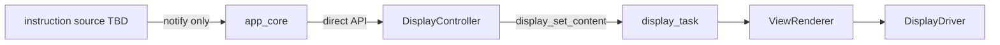

# Display Delivery Contract (v1)

This document is the **normative architecture** for how application logic
delivers **display instructions** to the OLED stack in `b06_hil` v1.

Source handoff: `agent-workspaces/architect/handoff.md`, `DISPLAY_DELIVERY_CONTRACT`.

Related documents:

- `docs/architecture.md` — system layers and principles
- `docs/oled_text_display_interface.md` — visual contract and internal display task
- `docs/qr_encoder_interface.md` — QR payload format and encoder boundaries

## Purpose

Define one deterministic path from **display instructions** (text layouts or QR
layouts) to on-screen pixels: no polling, no multiple unsynchronized callers, and
**no architectural coupling** between the display stack and WiFi, network stacks,
or any other subsystem that may exist elsewhere in the firmware.

The display contract MUST NOT mention, assume, or depend on how a QR payload
string was produced. Drawing QR uses the **same delivery mechanism** as drawing
text.

## Core Rule: QR Equals Text (Delivery)

Normative:

- A **draw-QR instruction** is a display instruction with the same transport,
  caller rules, refresh behavior, and orchestration as a **draw-text instruction**.
- The only difference is the target API and layout shape (`display_controller_show_qr_setup`
  vs `display_controller_show_template` / `display_controller_show_layout`).
- There is **no separate display path** for QR, no network-triggered display
  branch, and no display-side awareness of WiFi or connectivity state.

```text
display instruction (text or QR)
        ↓
   notify app_core
        ↓
 app_core calls display_controller_*
        ↓
   display_task → render → OLED
```

## Selected Pattern (v1)

**Centralized orchestration in `app_core` with direct calls to `DisplayController`.**



Normative rules:

1. **Only `app_core` MAY call `display_controller_*` in v1.**
2. **Instruction sources MUST NOT** include `display_controller.h`, build
   `DisplayLayout` values, or call `display_set_*` directly.
3. Instruction sources notify `app_core` when the screen should change by calling
   **registered callbacks** (or direct `app_core` internal functions when logic is
   centralized in the same component).
4. `app_core` translates each notification into **one direct call** to the matching
   display API (text template, explicit layout, or QR setup helper).
5. **Polling is forbidden.** Instruction sources push events; `app_core` does not
   poll for pending display work.
6. The existing **internal queue** from `DisplayController` to `display_task` is
   the only queue in the display pipeline. v1 does **not** add an application-level
   queue between instruction sources and `app_core`.

## Layer Boundaries

| Layer | May do | Must not |
| --- | --- | --- |
| Instruction source (TBD) | Decide when the product needs a new screen; supply instruction payload; notify `app_core` | Call `display_controller_*` or `display_set_*`; draw pixels |
| `app_core` | Own display orchestration; validate QR URL shape when applicable; call `display_controller_*` | Encode QR matrices; touch I2C; couple to WiFi/network APIs |
| `DisplayController` | Build layouts; forward to display task | Infer instruction origin; read connectivity state |
| `display_task` | Queue/coalesce; render; flush | Choose screens without `app_core` |

WiFi, TCP/IP, provisioning, or any network component MAY exist in the firmware tree
but MUST remain **fully decoupled** from this contract. The display stack neither
knows nor documents those subsystems.

## Instruction Types (v1)

All types share the same notification → `app_core` → direct API path.

| Instruction | `app_core` API call | Payload |
| --- | --- | --- |
| Text template | `display_controller_show_template(...)` | Template id + ASCII lines |
| Explicit layout | `display_controller_show_layout(...)` | `DisplayLayout` |
| QR layout | `display_controller_show_qr_setup(...)` | `http://IPv4` string + optional ASCII lines |

Rules:

- QR instructions MUST NOT be treated as higher priority, different transport, or
  network-derived unless `app_core` explicitly chooses that product policy before
  calling the API.
- Replacing content (text or QR) is always a new instruction through the same path.

## Instruction Source → `app_core` Notification

Instruction sources deliver **intent and payload**, not pixels.

### Selected transport (v1): callback into `app_core`

v1 uses **direct callbacks** (or internal `app_core` function calls when all
instruction logic is centralized in `components/app_core/`).

Rationale:

- Display orchestration is expected to stay **centralized in `app_core`**.
- Callbacks minimize boilerplate and keep stack traces easy to follow.
- Text and QR instructions share the same call pattern into `app_core`.

Normative rules:

- Instruction sources invoke `app_core` entry points such as
  `app_core_display_show_template(...)` and `app_core_display_show_qr_setup(...)`.
- Calls MUST occur from **FreeRTOS task context**, not from an ISR.
- Optional hook registration is allowed when a separate component must notify
  `app_core`, but the handler implementation still lives in `app_core`.
- `esp_event` is **not** the v1 transport. A future architect handoff is required
  before switching to or adding an event-bus path.

Illustrative public surface (implementer names may vary):

```c
esp_err_t app_core_display_show_template(display_layout_template_t template_id,
                                         const char *const *lines,
                                         size_t line_count);

esp_err_t app_core_display_show_qr_setup(const char *url,
                                         const char *const *text_lines,
                                         size_t text_line_count);
```

Each function validates input as needed, then calls the matching
`display_controller_*` API.

### Deferred alternative (not v1)

`esp_event` posting remains a valid pattern for **future** multi-emitter firmware
only if a new architect handoff authorizes it. Do not implement `esp_event` for
display instructions in v1 unless that handoff exists.

### QR instruction payload rules

When the instruction type is QR:

- Payload string MUST pass `setup_url_validate()` before `app_core` calls the
  display API, or `app_core` MUST reject the instruction without drawing.
- Payload MUST be printable ASCII (`http://IPv4` product profile).
- Optional companion lines follow the same ASCII rules as text instructions.

`setup_url` validates **string shape only**. It does not imply a network origin.

## `app_core` → `DisplayController` Direct Calls

After accepting an instruction, `app_core` calls exactly one API:

```c
/* Text — same delivery path as QR */
display_controller_show_template(DISPLAY_TEMPLATE_FULL_FOUR_LINES, lines, n);

/* QR — same delivery path as text */
display_controller_show_qr_setup(url, text_lines, text_line_count);
```

Rules:

- Calls MUST occur from a **FreeRTOS task context**, not from an ISR.
- On failure, `app_core` MAY log; it MUST NOT poll-retry.
- Refresh and coalescing follow `docs/oled_text_display_interface.md` for all
  instruction types equally.

### Single-caller discipline

```text
Allowed:    app_core  →  display_controller_*  →  display_set_*  →  display_task
Forbidden:  any_other_module  →  display_controller_*  (bypass)
Forbidden:  any_other_module  →  display_set_*  (bypass)
Forbidden:  any module  →  display_driver / renderer  (bypass)
```

Enforcement:

- Only `app_core.c` (and display component internals) should include
  `display_controller.h` in v1 unless a future handoff widens callers.

## Threading and Ordering

- Multiple instructions MAY arrive close together. `display_task` coalesces to
  **latest wins**.
- Screen priority (alert vs status vs QR) is decided in **`app_core`** before the
  API call. Instruction sources supply intent; they do not call the display.

## Startup Order (canonical)

```text
1. board + i2c_bus init
2. display_start(config) + display_controller_init()
3. app_core registers event handlers and/or accepts hook registration
4. instruction sources may register/post
5. default informational screen until an instruction replaces it
```

Instructions MUST NOT be delivered before step 3 completes.

## Non-Goals (v1)

- Any architectural link between display instructions and WiFi/network state.
- Application-level message queue between instruction sources and `app_core`.
- Polling for pending display instructions.
- Multiple unsynchronized callers to `display_controller_*`.
- Instruction sources linking against `display.h` or `display_controller.h`.
- ISR-to-display calls.
- Separate QR delivery channel distinct from text delivery.

## Acceptance Criteria

An implementation satisfies this contract if:

- All `display_controller_*` calls originate from `app_core` in v1 firmware.
- Text and QR instructions both flow notify → `app_core` → direct API only.
- No display or `app_core` code references WiFi/network APIs for choosing screens.
- No firmware loop polls for pending QR or text instructions.
- Valid QR instructions render on hardware; invalid QR payloads are rejected at
  `app_core` without display calls.
- Internal `display_task` queue remains the only display pipeline queue.

## Suggested Validation

Implementer:

- Grep audit: only `app_core` includes `display_controller.h`.
- Grep audit: display component tree excludes WiFi/network headers.
- Test: post text instruction event → template API called.
- Test: post QR instruction event → `display_controller_show_qr_setup` called.

Tester:

- Device test: trigger text and QR instructions via the same `app_core` hook/event
  path; confirm no module bypasses `app_core`.

## Open Questions

1. **Instruction source identity** — component or role name and product events that
   emit text vs QR instructions (may be internal to `app_core` if fully centralized).

Closed in v1 architecture:

- **Notification transport** — callback / direct `app_core` entry points (not
  `esp_event`).
