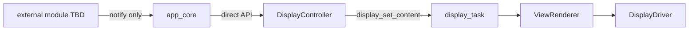

# Display Delivery Contract (v1)

This document is the **normative architecture** for how application modules
deliver display and draw-QR instructions to the OLED stack in `b06_hil` v1.

Source handoff: `agent-workspaces/architect/handoff.md`, `DISPLAY_DELIVERY_CONTRACT`.

Related documents:

- `docs/architecture.md` — system layers and principles
- `docs/oled_text_display_interface.md` — visual contract and internal display task
- `docs/qr_encoder_interface.md` — QR payload profile and encoder boundaries

## Purpose

Define a single, deterministic path from application events (for example “show
setup QR with this URL”) to on-screen pixels, without polling, without multiple
unsynchronized callers, and without coupling network modules to the display API.

## Selected Pattern (v1)

**Centralized orchestration in `app_core` with direct calls to `DisplayController`.**



Normative rules:

1. **Only `app_core` (or code explicitly owned by the same orchestration layer)
   MAY call `display_controller_*` in v1.**
2. **Producer modules MUST NOT** include `display_controller.h`, build
   `DisplayLayout` values, or call `display_set_*` directly.
3. Producers notify `app_core` when a display action is required, using either:
   - a **registered callback** into `app_core`, or
   - an **`esp_event` post** handled by an `app_core` event handler.
4. `app_core` translates notifications into **direct, synchronous calls** to
   `display_controller_show_qr_setup`, `display_controller_show_template`, or
   `display_controller_show_layout`.
5. **Polling is forbidden** for draw-QR instructions or URL availability. Producers
   push notifications; `app_core` does not periodically ask “is there a QR pending?”.
6. The existing **internal queue** from `DisplayController` to `display_task` remains
   unchanged. v1 does **not** add a second application-level queue between producers
   and `app_core`.

## Layer Boundaries

| Layer | May do | Must not |
| --- | --- | --- |
| Producer (network/setup TBD) | Detect product conditions; format URL with `setup_url`; notify `app_core` | Call `display_controller_*` or `display_set_*`; draw pixels |
| `app_core` | Own display orchestration; call `display_controller_*`; choose layouts | Encode QR matrices; touch I2C; read OLED hardware |
| `DisplayController` | Build layouts from templates or explicit `DisplayLayout`; forward to display task | Poll for URL; read network interfaces for QR payload |
| `display_task` | Queue/coalesce updates; render; flush | Decide business priority without `app_core` input |

## Producer → `app_core` Notification

Producers deliver **intent**, not pixels.

### Allowed notification transports (v1)

Choose **one primary transport** per firmware build and document it in the
implementer handoff. Both are acceptable:

#### Option A — Callback into `app_core`

```c
typedef void (*app_core_display_notify_fn_t)(void *ctx);

typedef struct {
    app_core_display_notify_fn_t on_show_qr_setup;
    app_core_display_notify_fn_t on_show_status; /* optional future */
    void *ctx;
} app_core_display_hooks_t;

esp_err_t app_core_register_display_hooks(const app_core_display_hooks_t *hooks);
```

The producer registers hooks during startup **after** `app_core` init order is
defined. When the producer needs a QR screen, it invokes the registered hook with
a payload prepared according to the contract below.

#### Option B — `esp_event` loop

```c
ESP_EVENT_DEFINE_BASE(APP_CORE_DISPLAY_EVENTS);

typedef enum {
    APP_CORE_DISPLAY_EVENT_SHOW_QR_SETUP = 0,
    /* future: APP_CORE_DISPLAY_EVENT_SHOW_STATUS, CLEAR, etc. */
} app_core_display_event_id_t;

typedef struct {
    char url[64]; /* validated http://IPv4 when SHOW_QR_SETUP */
    const char *text_lines[4];
    size_t text_line_count;
} app_core_display_show_qr_setup_t;
```

The producer calls `esp_event_post` with a copied struct. An `app_core` handler
runs in the event task context and calls `display_controller_show_qr_setup`.

### Notification payload rules

For `SHOW_QR_SETUP`:

- `url` MUST pass `setup_url_validate()` before post/callback, or `app_core` MUST
  reject the notification and MUST NOT call the display.
- `url` MUST be printable ASCII per `docs/oled_text_display_interface.md`.
- `text_lines` are optional companion text for the QR template; ASCII only.
- Producers MUST NOT send partial paths, `https://`, or hostname forms.

For future status updates (non-QR), notifications SHOULD carry template id plus
line pointers or embedded ASCII strings; exact shape is reserved for a future
handoff when a producer module is named.

## `app_core` → `DisplayController` Direct Calls

After receiving a valid notification, `app_core` calls exactly one display API
for that instruction:

```c
esp_err_t err = display_controller_show_qr_setup(
    event->url,
    event->text_lines,
    event->text_line_count);
```

Rules:

- Calls MUST occur from a **FreeRTOS task context**, not from an ISR.
- If the notification arrives in an unsafe context (ISR, critical section),
  `app_core` MUST defer to a task (for example `esp_event` already does this).
- On failure (`!= ESP_OK`), `app_core` MAY log; it MUST NOT retry in a polling loop.
- Replacing a QR URL is a normal content update: call the API again with the new
  payload. No special QR refresh path (see `docs/qr_encoder_interface.md`).

### Single-caller discipline

```text
Allowed:    app_core  →  display_controller_*  →  display_set_*  →  display_task
Forbidden:  wifi_module  →  display_controller_*  (bypass)
Forbidden:  wifi_module  →  display_set_*  (bypass)
Forbidden:  any module  →  display_driver / renderer  (bypass)
```

Enforcement expectation for implementers:

- Only `app_core.c` (and display component internals) should include
  `display_controller.h` in v1 unless a future handoff explicitly widens callers.
- Code review and grep checks treat any other include as an architecture violation.

## Threading and Ordering

- Multiple notifications MAY arrive close together. `display_task` coalesces
  `SET_CONTENT` to **latest wins** per `docs/oled_text_display_interface.md`.
- `app_core` SHOULD NOT implement a second coalescing queue in v1 unless profiling
  shows event storms; rely on the display task mailbox behavior first.
- Display priority rules (error vs QR vs live readings) are owned by **`app_core`**
  when it decides which `display_controller_*` call to make. Producers emit facts;
  `app_core` chooses the resulting screen.

## Startup Order (canonical)

```text
1. board + i2c_bus init
2. display_start(config) + display_controller_init()
3. app_core registers event handlers and/or accepts producer hook registration
4. producer modules start and may register/post notifications
5. default informational screen (for example FULL_FOUR_LINES demo) until a notification replaces it
```

Producers MUST NOT post display notifications before step 3 completes.

## Non-Goals (v1)

- Application-level message queue between producers and display (separate from the
  existing `display_task` queue).
- Polling loops for pending QR or URL state.
- Multiple unsynchronized callers to `display_controller_*`.
- Producer modules linking against `display.h` or `display_controller.h`.
- ISR-to-display direct calls.

## Acceptance Criteria

An implementation satisfies this contract if:

- All `display_controller_*` calls originate from `app_core` (or its documented
  orchestration file) in v1 firmware.
- A producer can trigger `display_controller_show_qr_setup` only via notification
  to `app_core` (callback or `esp_event`), never by calling display APIs directly.
- No firmware loop polls for QR/URL readiness.
- Valid `http://IPv4` notifications result in the QR layout on hardware; invalid
  URLs are rejected at `app_core` without display calls.
- Replacing the URL via a second notification uses the same path and updates the screen.
- Internal `display_task` queue behavior remains the only queue in the display pipeline.

## Suggested Validation

Implementer:

- Grep/firmware audit: only `app_core` includes `display_controller.h`.
- Unit or component test: mock producer posts event; verify
  `display_controller_show_qr_setup` invoked with expected URL.

Tester:

- Integration test on device: simulate producer event (test hook or CLI) and confirm
  QR appears without any module other than `app_core` calling display APIs.

## Open Questions

1. **Producer module identity** — component name, location, and the product event
   that triggers `SHOW_QR_SETUP` (for example AP started, provisioning mode entered).
2. **Primary notification transport** — confirm callback vs `esp_event` when the
   producer module is implemented (either is valid per this document).
