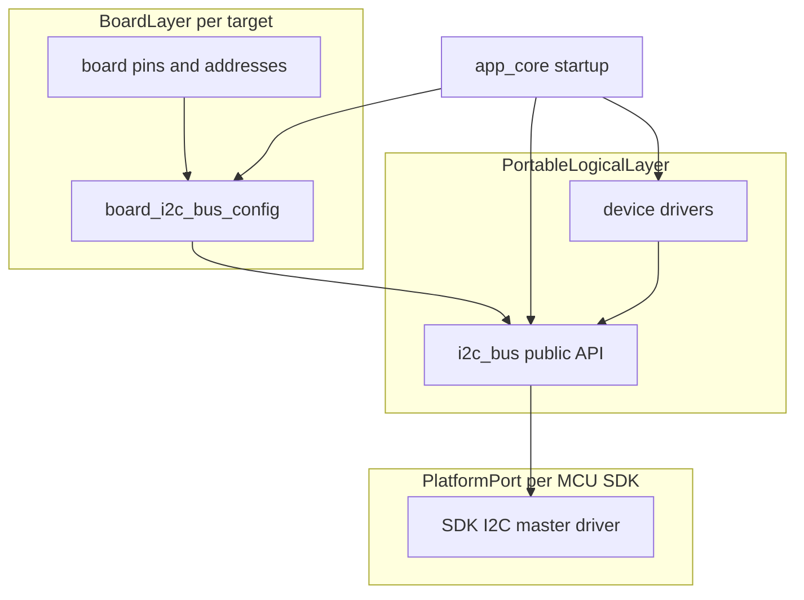
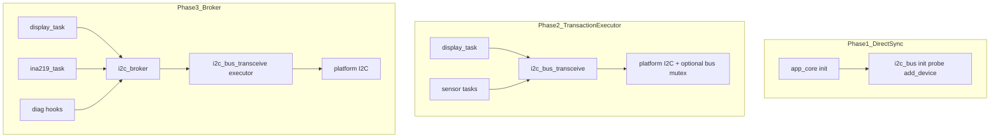

# Generic Shared I2C Bus Architecture

This document is the **normative architecture** for shared I2C bus access in this
firmware tree. It is written so that independent LLM implementers produce
substantially similar structure and behavior, while keeping the bus layer
portable across microcontrollers.

Source handoff: `agent-workspaces/architect/handoff.md`, `I2C_BUS_ARCHITECTURE`.

Board electrical details for the current target remain in
`docs/esp32_c3_supermini_connections.md`.

## Normative Language

- `MUST` means required.
- `MUST NOT` means prohibited.
- `SHOULD` means expected unless a platform has a strong reason not to.
- `MAY` means optional.

## Design Goals

1. **One bus owner.** Exactly one module initializes and owns the shared master
   bus.
2. **Device-agnostic bus.** The bus layer knows 7-bit addresses and opaque device
   handles, not OLED, INA219, or any other peripheral type.
3. **Deterministic implementer output.** File layout, API names, init order, and
   caching rules are fixed in this document.
4. **MCU portability.** Portable semantics are defined first; ESP-IDF is the current
   platform binding, not the architectural center.
5. **Optional peripherals.** Projects without INA219 omit that driver and its
   startup calls. The bus component stays unchanged.

## Three-Layer Model



| Layer | Owns | Must not know |
| --- | --- | --- |
| `board` | GPIO map, expected addresses, default bus frequency for the PCB | Device protocols, SDK driver handles |
| `i2c_bus` | Bus init, device registration, address probe, handle cache | OLED, INA219, display/renderer logic |
| Device drivers (`display_driver`, future `ina219`) | Peripheral protocol over one handle | Bus-wide init, unrelated peripherals |
| `app_core` | Startup order and which devices exist in this firmware | I2C register maps, framebuffers |
| Platform port inside `i2c_bus` | Mapping to SDK master bus/device APIs | Application policy |

**Portability rule:** Only the platform port layer inside `components/i2c_bus/`
may include SDK-specific headers such as `driver/i2c_master.h`. Public headers
must stay usable from other components without spreading SDK types beyond the
opaque handle.

## Fixed Component Layout

Implementations MUST use this layout:

```text
components/i2c_bus/
  CMakeLists.txt
  include/
    i2c_bus.h          # portable public contract
  i2c_bus.c            # portable logic + platform calls
```

Optional future split if a second MCU is added:

```text
components/i2c_bus/
  port/
    esp_idf/i2c_bus_port.c
    stub/i2c_bus_port.c
```

Do not create separate bus components per peripheral. Do not embed bus init in
`display_driver` or future `ina219`.

## Portable Public Contract

The public C API below is the **logical contract**. Platform-specific status
types may wrap these semantics, but behavior MUST match.

### Constants

```text
I2C_BUS_DEFAULT_FREQUENCY_HZ = 400000
I2C_BUS_MAX_DEVICES = 8
I2C_BUS_PROBE_TIMEOUT_MS = 50
I2C_BUS_ADDRESS_MIN = 0x08
I2C_BUS_ADDRESS_MAX = 0x77
```

7-bit addressing is mandatory. 10-bit addressing is out of scope.

### Types

```c
typedef struct {
    int scl_pin;              /* board-defined pin identifier */
    int sda_pin;              /* board-defined pin identifier */
    uint32_t bus_frequency_hz;
} i2c_bus_config_t;

typedef struct i2c_bus_device *i2c_bus_device_t;
```

Notes for implementers:

- On ESP-IDF, `scl_pin` and `sda_pin` map to `gpio_num_t` values supplied by
  `board`. The portable contract intentionally uses `int` in documentation so
  other MCUs are not tied to Espressif GPIO types in the architecture record.
- The implementation header for this repository MAY typedef or cast to the local
  GPIO type, but MUST NOT leak that type into renderer, controller, or unrelated
  drivers.

### Functions

```c
status_t i2c_bus_init(const i2c_bus_config_t *config);
status_t i2c_bus_add_device(uint8_t address, i2c_bus_device_t *out_device);
status_t i2c_bus_probe(uint8_t address, bool *present);
void i2c_bus_deinit(void);
```

`status_t` represents success or a platform-mapped error. In this tree the
implementer uses `esp_err_t`.

## Canonical Behavior

### State machine

```text
UNINITIALIZED
  -- i2c_bus_init(success) --> BUS_READY
BUS_READY
  -- i2c_bus_add_device(success) --> BUS_READY with cached device
  -- i2c_bus_probe(...) --> BUS_READY
  -- i2c_bus_deinit() --> UNINITIALIZED
```

Rules:

- `i2c_bus_init()` MUST be called once before any other bus API.
- `i2c_bus_init()` MUST fail with an invalid-state error if called twice without
  `i2c_bus_deinit()`.
- `i2c_bus_add_device()` and `i2c_bus_probe()` MUST fail if the bus is not
  initialized.
- `i2c_bus_deinit()` MUST be safe to call from the uninitialized state and MUST
  release all device handles and the master bus.

### `i2c_bus_init(config)`

Input validation:

- `config` MUST NOT be null.
- `bus_frequency_hz` equal to `0` MUST be replaced by
  `I2C_BUS_DEFAULT_FREQUENCY_HZ`.
- The platform port MUST configure one master bus on the provided SCL/SDA pins.

Postconditions on success:

- Exactly one master bus exists.
- Device cache is empty.
- Internal stored frequency equals the effective bus frequency.

### `i2c_bus_add_device(address, out_device)`

Input validation:

- `out_device` MUST NOT be null.
- `address` MUST be within `0x08` to `0x77`.

Caching algorithm:

```text
add_device(address):
  if address already cached:
    return existing handle
  if device table full:
    return NO_MEM
  create platform device handle at address and effective bus frequency
  store in cache
  return handle
```

Rules:

- Repeated calls with the same address MUST return the same `i2c_bus_device_t`.
- Different addresses MUST produce different handles on the same bus.
- The bus layer MUST NOT interpret address meaning (display vs sensor).

### `i2c_bus_probe(address, present)`

Input validation:

- `present` MUST NOT be null.
- `address` MUST be within `0x08` to `0x77`.

Algorithm:

```text
probe(address):
  perform short master presence check with timeout I2C_BUS_PROBE_TIMEOUT_MS
  if device ACKs:
    present = true
    return success
  if no ACK / not found:
    present = false
    return success
  otherwise return transport error
```

Rules:

- Probe MUST NOT permanently register a device.
- Probe failure due to "not found" is not a fatal bus error; it returns success
  with `present = false`.

### Concurrency (baseline)

- Multiple FreeRTOS tasks MAY eventually share the same initialized bus.
- Physical bus collisions MUST be prevented by atomic transactions and by the
  incremental concurrency architecture in the next section.
- Platform driver serialization alone is necessary but not sufficient once
  multiple application tasks perform I2C work concurrently.

## Incremental Concurrency Architecture

This section defines how the I2C stack grows over time without redesigning
device drivers. Implementers MUST follow the active phase handoff only; later
phases MUST remain documented but unimplemented until authorized.

Source handoff: `agent-workspaces/architect/handoff.md`, `I2C_BUS_CONCURRENCY`.

### Immutable rules (all phases)

1. Only `i2c_bus` initializes the master bus.
2. Application modules and device drivers MUST NOT call the SDK I2C driver
   directly.
3. The minimum access unit is one **atomic transaction**: START, data transfer,
   STOP.
4. Every transaction MUST specify a timeout.
5. Timeout or recoverable bus errors MUST return failure to the caller and MUST
   leave the bus ready for the next transaction.
6. Device drivers MUST NOT hold a bus lock while doing rendering, business
   logic, or long computations.

### Problem classes

| Class | Example | Addressed by |
| --- | --- | --- |
| Physical collision | Two START/STOP sequences overlap on SCL/SDA | Atomic transactions + executor serialization |
| Logical interleaving | Register write interrupted before burst completes | Transaction API and later broker |
| Policy contention | OLED flush blocks INA219 periodic sampling | Priority broker |

### Growth model



| Phase | Name | Activate when | Delivers |
| --- | --- | --- | --- |
| 1 | Direct sync | Boot-only sequential I2C | Bus init, probe, device registration |
| 2 | Transaction executor | Two or more tasks perform I2C | `i2c_bus_transceive`, optional internal mutex |
| 3 | Priority broker | Periodic sensors + display share bus | `i2c_broker`, queue, priorities |
| 4 | Observability | Field debug or production diagnostics | Counters and debug logging |

`b06_hil` MUST be designed for phase 3, but implementers MUST deliver one phase
per authorized handoff.

### Phase 1 — Direct sync

Scope:

- `i2c_bus_init`, `i2c_bus_add_device`, `i2c_bus_probe`, `i2c_bus_deinit`
- Sequential startup in `app_core`

Rules:

- Only startup code performs I2C before general application tasks run.
- No broker and no `i2c_bus_transceive` requirement yet.

Handoff ID: `I2C_BUS_PHASE1` (same scope as initial `I2C_BUS_ARCHITECTURE`
implementation).

### Phase 2 — Transaction executor

Add to the public contract:

```c
typedef struct {
    i2c_bus_device_t device;
    const uint8_t *tx;
    size_t tx_len;
    uint8_t *rx;
    size_t rx_len;
    uint32_t timeout_ms;
} i2c_transaction_t;

status_t i2c_bus_transceive(const i2c_transaction_t *txn);
```

Behavior:

- `tx_len > 0` and `rx_len == 0` means write-only.
- `tx_len >= 0` and `rx_len > 0` means write-read; `tx` may be null when
  `tx_len == 0` if the platform supports read-only probes.
- Each call MUST complete one atomic transaction before another transaction on
  the same bus begins.
- If the platform port does not guarantee safe concurrent entry, `i2c_bus.c`
  MUST serialize calls with one internal bus mutex.
- Device drivers such as `display_driver` and future `ina219` MUST use
  `i2c_bus_transceive`; they MUST NOT call SDK I2C APIs.

Handoff ID: `I2C_BUS_PHASE2`.

### Phase 3 — Priority broker

Add component API:

```c
typedef enum {
    I2C_CLIENT_DISPLAY = 0,
    I2C_CLIENT_INA219,
    I2C_CLIENT_DIAG,
} i2c_client_id_t;

typedef struct {
    i2c_client_id_t client;
    uint8_t priority;
    i2c_transaction_t txn;
} i2c_broker_request_t;

status_t i2c_broker_start(void);
void i2c_broker_stop(void);
status_t i2c_broker_submit(const i2c_broker_request_t *req, uint32_t wait_ms);
```

Rules:

- The broker is the only module allowed to call `i2c_bus_transceive` from
  application-facing tasks once phase 3 is active.
- Requests are ordered by descending `priority`; equal priority uses FIFO.
- `wait_ms` is the maximum time a caller waits for request acceptance and
  completion; timeout MUST return an error without deadlocking the bus.
- Client priority tables are product configuration in `board` or `app_core`;
  `i2c_bus` and `i2c_broker` MUST remain device-agnostic.

Recommended `b06_hil` priority table:

| Client | Priority | Typical timeout |
| --- | --- | --- |
| Boot / probe | 255 | 50 ms |
| Diagnostic / factory | 200 | 100 ms |
| INA219 | 150 | 20 ms |
| OLED flush | 100 | 50 ms |

Policy rules:

- INA219 periodic reads MUST NOT miss more than one sample interval because of
  an OLED flush.
- OLED flush MAY defer to the next refresh cycle after timeout.
- Diagnostic traffic MAY preempt normal queue entries but MUST NOT block boot
  initialization.

Handoff ID: `I2C_BUS_PHASE3`.

### Phase 4 — Observability (optional)

Optional debug-only counters:

- requests submitted
- requests completed
- timeouts
- queue drops

These counters MUST be enabled only in debug builds unless the architect adds a
production telemetry handoff.

Handoff ID: `I2C_BUS_PHASE4`.

### Growing component layout

Base layout:

```text
components/i2c_bus/
  include/i2c_bus.h
  i2c_bus.c
  CMakeLists.txt
```

Phase 2 adds transaction execution to `i2c_bus.c`.

Phase 3 adds:

```text
components/i2c_bus/
  include/i2c_broker.h
  i2c_broker.c
```

Optional future platform split:

```text
components/i2c_bus/
  port/esp_idf/i2c_bus_port.c
```

### Driver migration contract

| Phase | Display driver | Future INA219 |
| --- | --- | --- |
| 1 | Stores handle only; stub allowed | Not present |
| 2 | Uses `i2c_bus_transceive` | Uses `i2c_bus_transceive` |
| 3 | Uses `i2c_broker_submit` | Uses `i2c_broker_submit` |

The shape of `i2c_transaction_t` MUST remain stable across phases 2 and 3.

### Anti-patterns (forbidden)

- One mutex per device driver with different lock order across modules.
- Holding bus ownership during rendering or application logic.
- Long OLED transfers without timeout and without broker policy in phase 3.
- Hardcoding OLED or INA219 priorities inside generic `i2c_bus` code.
- Skipping phase 2 and jumping to a broker when only sequential boot I2C exists.

## Board Integration Contract

`components/board/` MUST remain the only source of PCB pin numbers and expected
device addresses for a target.

Required helper:

```c
void board_i2c_bus_config(i2c_bus_config_t *out_config);
```

Behavior:

- Fill `scl_pin` and `sda_pin` from the board pin map.
- Fill `bus_frequency_hz` with the board default, normally
  `I2C_BUS_DEFAULT_FREQUENCY_HZ`.
- MUST NOT initialize hardware.
- MUST NOT reference specific peripherals beyond pin constants.

Example address macros for `b06_hil`:

```text
BOARD_OLED_ALLOWED = [0x3C, 0x3D]
BOARD_INA219_ADDRESSES = [0x40, 0x41, 0x42]
```

Other boards MAY omit INA219 macros entirely.

## Application Startup Contract

Startup MUST follow this order:

```text
1. board_i2c_bus_config()
2. i2c_bus_init()
3. for each enabled peripheral in this firmware:
     resolve address policy
     i2c_bus_add_device(address)
     pass handle to the device driver boundary
4. start higher-level services (display task, sensor tasks, etc.)
```

### Address resolution policy

Address discovery belongs to **application startup** or the **device driver
init path**, not to `i2c_bus` internals.

Canonical OLED policy for this repository:

```text
if display_config.has_address:
  use display_config.address
else:
  probe 0x3C
  if not present, probe 0x3D
  if found, set has_address = true
  if not found, continue without I2C device handle
```

Rules:

- Allowed OLED addresses are board constants, not hardcoded inside `i2c_bus`.
- Missing OLED at boot MUST NOT crash the firmware; the display stack MAY remain
  on a hardware stub until a driver is enabled.

### `b06_hil` profile

| Step | Action |
| --- | --- |
| 1 | `board_i2c_bus_config()` using GPIO0/GPIO1 |
| 2 | `i2c_bus_init()` |
| 3 | Resolve OLED address with policy above |
| 4 | `i2c_bus_add_device(oled_address)` when found |
| 5 | Pass handle through `display_config_t` to `display_start()` |
| 6 | Future optional: register `0x40`, `0x41`, `0x42` for INA219 when component exists |

### Display-only profile

Steps 1 through 5 only. No INA219 component, no INA219 startup calls.

## Device Driver Boundary

Device drivers MUST receive an opaque `i2c_bus_device_t`. They MUST NOT call
`i2c_bus_init()` themselves.

### Display driver

Only `display_driver` in the display stack may consume the handle.

`display_config_t` MUST include:

```c
uint8_t address;
bool has_address;
i2c_bus_device_t i2c_device;
bool has_i2c_device;
```

Rules:

- `display_renderer`, `display_task`, and `display_controller` MUST NOT include
  I2C headers or refer to GPIO/address constants.
- Until SSD1306/SH1106 is confirmed, the driver MAY remain a stub that stores
  the handle without transmitting frames.

### Future INA219 driver (optional component)

Expected shape:

```c
status_t ina219_init(i2c_bus_device_t device, ...);
status_t ina219_read(i2c_bus_device_t device, ...);
```

After phase 2, read/write paths MUST use `i2c_bus_transceive`. After phase 3,
they MUST use `i2c_broker_submit`.

`b06_hil` expects three instances at `0x40`, `0x41`, and `0x42`. Other projects
omit the component.

## ESP-IDF 5.x Platform Profile (Current Target)

This repository currently binds the portable contract to ESP-IDF 5.x using the
modern master driver:

- Header: `driver/i2c_master.h`
- Bus create: `i2c_new_master_bus`
- Device add: `i2c_master_bus_add_device`
- Presence check: `i2c_master_probe`
- Bus delete: `i2c_del_master_bus`

Binding rules:

- Use one `i2c_master_bus_handle_t` stored inside `i2c_bus.c`.
- Enable internal pull-ups unless the board schematic explicitly provides
  external pull-ups and the architect records otherwise.
- Do not use legacy `driver/i2c.h`.
- Public `i2c_bus.h` SHOULD minimize inclusion of ESP-IDF headers; if needed,
  keep them isolated to the implementation file except for `esp_err_t` return
  types already used project-wide.

## Porting To Another Microcontroller

To port, keep these unchanged:

- Component name: `i2c_bus`
- Public function names and semantics for the active phase
- Transaction and broker request shapes once introduced
- Device cache behavior and init order
- Board helper pattern
- Opaque `i2c_bus_device_t`
- Optional-peripheral project model
- Incremental phase boundaries

Replace only the platform port internals:

| Portable concept | Platform mapping examples |
| --- | --- |
| `i2c_bus_init` | ESP-IDF `i2c_new_master_bus`, STM32 I2C HAL init, Zephyr `i2c_dt_spec` bus ready |
| `i2c_bus_add_device` | SDK device/session handle per 7-bit address |
| `i2c_bus_probe` | SDK address scan or zero-length write probe |
| Pin identifiers | Board header maps PCB pins to SDK pin types |

Porting checklist:

1. Create `components/i2c_bus/` with the same public header contract.
2. Implement platform calls in `i2c_bus.c` or `port/<platform>/`.
3. Map board pins in `components/board/` only.
4. Keep device drivers unchanged except for any platform status type aliases.
5. Preserve startup order in `app_core`.
6. Verify repeated `i2c_bus_add_device(same_address)` returns the same handle.

## Forbidden Dependencies

`i2c_bus` MUST NOT depend on:

- `display`, `display_driver`, renderer, canvas, controller
- future `ina219`
- application modules

`i2c_broker` MUST depend only on `i2c_bus` and RTOS primitives.

`display` renderer/controller/task MUST NOT depend on `i2c_bus` or `i2c_broker`.

`board` MAY depend on `i2c_bus` only for the config helper type, not for init.

## Non-Goals

- SSD1306/SH1106 frame transmission.
- Functional INA219 measurement logic in the base I2C bus handoffs.
- 10-bit I2C addressing.
- Multiple independent I2C buses in the base version.
- Workstation-specific ESP-IDF absolute paths in committed files.
- Implementing broker or observability before the corresponding phase handoff is
  authorized.

## Acceptance Criteria

An implementation satisfies this architecture if:

- `components/i2c_bus/` matches the fixed layout and public contract for the
  active phase.
- Behavior matches the canonical algorithms, startup order, and active concurrency
  phase.
- `board` remains the source of pin and address constants for the PCB.
- `app_core` initializes the bus before display or sensor drivers.
- Display renderer/controller code contains no I2C or GPIO references.
- A display-only firmware reuses `i2c_bus` without source changes.
- `b06_hil` can attach OLED and INA219 clients to the same shared bus.
- Another LLM implementer can read only this document and produce substantially
  similar module boundaries, file paths, and runtime behavior.

### Phase acceptance criteria

| Phase | Acceptance |
| --- | --- |
| 1 | Bus init once; probe does not register devices; missing OLED does not panic |
| 2 | Two tasks can issue transactions without corruption; timeouts recover cleanly |
| 3 | Display and INA219 traffic coexist under priority rules without deadlock |
| 4 | Debug counters reflect submitted/completed/timeout counts |

## Suggested Validation

Implementer/build validation:

- Project builds on the current ESP-IDF target for the active phase only.

Tester/hardware validation:

| Phase | Tests |
| --- | --- |
| 1 | Build, boot, probe logs, no crash without OLED |
| 2 | Alternating transactions from two tasks; no data corruption |
| 3 | Concurrent display refresh and INA219 sampling for at least 60 s without deadlock |
| 4 | Counter values match observed traffic in debug build |

Additional validation when peripherals exist:

- Probe detects a known device address.
- Missing OLED at boot leaves the system running with stub display behavior.
