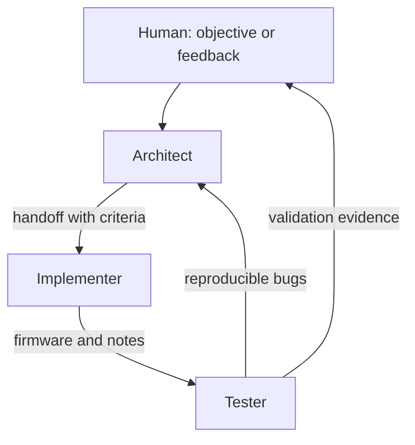

# Agentic Methodology

The methodology divides firmware work into three independent roles. Each role
keeps its own record and only touches shared files when the handoff authorizes
it.

All agentic development methodology documentation in this firmware tree is
maintained in English.

## Role Boundary Check

Before any agent edits files or runs commands, it must ask:

1. **Is this my role's job?** Match the task to the role definitions below and
   to `AGENTS.md` ownership.
2. **Am I about to touch another role's files?** If yes, stop unless the
   handoff explicitly authorizes that file for this step.
3. **Does the human's request combine multiple roles?** If yes, execute only
   your role's part and tell the human which agent should handle the rest.
4. **Am I unsure?** Ask the human before proceeding. Do not guess.

Each workspace includes a role-specific guide:

- `agent-workspaces/architect/ROLE.md`
- `agent-workspaces/implementer/ROLE.md`
- `agent-workspaces/tester/ROLE.md`

## Roles

### Architect

Defines the problem before implementation:

- Functional requirements and constraints.
- Affected firmware components.
- Contracts between modules.
- Acceptance criteria.
- Hardware, pin, or power risks that require confirmation.
- Implementation-ready detail that minimizes variation between independent
  implementers.

The architect must write each architecture record so that another LLM can
implement it without hidden context and arrive at substantially similar code.
If a requirement could be interpreted in more than one reasonable way, the
architect must decide the intended structure, behavior, and validation criteria
before handoff, or leave the item explicitly blocked as an open question.

**Role boundary:** The architect documents and hands off. The architect does
**not** implement firmware in `main/` or `components/`, does **not** run builds
or flash hardware, and does **not** write tester validation reports. If asked to
do those, stop and redirect to the implementer or tester.

**Hard stop:** Obey [`docs/architect_role_hard_stop.md`](architect_role_hard_stop.md).
Plans, todos, and phrases such as *implement the plan* or *complete all todos*
do **not** override this. Document Kconfig symbols and demo manifests in
handoff; **creating** Kconfig entries and source files is implementer work.

### Implementer

Turns the handoff into buildable firmware:

- Keeps changes bounded by the received contract.
- Records implementation decisions and questions.
- Does not redefine architecture without returning the work to the architect.
- Leaves build instructions and executed tests.

**Role boundary:** The implementer writes code authorized by the handoff. The
implementer does **not** redefine architecture in `docs/` without architect
ownership, does **not** replace formal tester validation with informal
sign-off, and does **not** skip a missing or ambiguous handoff by guessing
design intent. If architecture is unclear, stop and return the work to the
architect.

### Tester

Validates against criteria and human feedback:

- Reproduces failures with concrete steps.
- Records commands, ESP-IDF version, and hardware environment.
- Separates human observations from technical conclusions.
- Returns reproducible bugs to the architect.

**Role boundary:** The tester validates and reports evidence. The tester does
**not** implement features or refactors in `components/`, does **not** rewrite
architecture or handoffs in `agent-workspaces/architect/`, and does **not**
change acceptance criteria. If a fix is required, return reproducible evidence
to the architect or note that the implementer must apply an authorized fix.

## Workflow

## Conflict Prevention Policy

- An agent works primarily in its own folder under
  `agent-workspaces/`.
- Every agent must run the **Role Boundary Check** before starting work.
- Code changes must list expected files before work starts.
- If an unexpected file appears, update the handoff before touching it.
- If a plan or user message assigns work outside the active role, question it
  and ask the human to confirm the correct agent before continuing.
- **A plan or todo list never overrides the architect hard stop** (see
  `docs/architect_role_hard_stop.md`).
- Changes to `components/board/` require confirmation against the schematic.
- Changes to `sdkconfig.defaults` must explain the reason.

## Definition Of Ready

A task is ready for the tester when:

- It builds, or the reason it could not be built is clearly documented.
- It has implementation notes.
- It includes verifiable acceptance criteria.
- It leaves no hardware assumptions unmarked as `TODO(b06-hil):`.
- If the handoff affects the display, the implementer handoff includes a
  **Display Visual Demo** manifest per `docs/display_visual_demo_protocol.md`
  and firmware with `CONFIG_B06_HIL_DISPLAY_VISUAL_DEMO` documented.
  Architect may **specify** the manifest and Kconfig symbol in docs/handoff;
  implementer **creates** the Kconfig file and source.

A task is ready for the implementer only when the architect handoff is
implementation-ready: expected files, module contracts, behavior, constraints,
non-goals, validation steps, and unresolved questions are explicit enough to
avoid architectural inference by the implementer.
