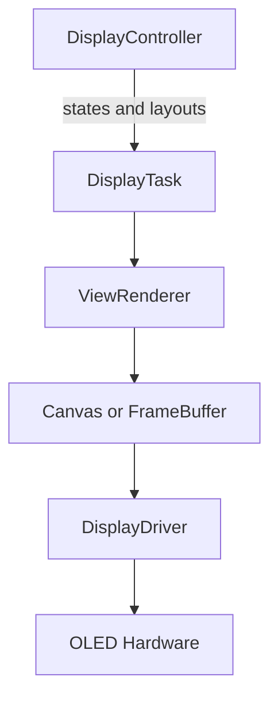

# 0.96 Inch I2C OLED Text Display Interface

This document defines the base visual contract for a monochrome `128x64`
0.96 inch OLED display connected through I2C. It is intended to be
implementation-ready for different languages, frameworks, or microcontrollers
without depending on a specific display driver, RTOS, SDK, or graphics library.

All implementation work derived from this document must preserve the separation
between drawing logic, visual state, layout rendering, display ownership, and
physical display communication.

Source handoff: `agent-workspaces/architect/handoff.md`,
`OLED_TEXT_DISPLAY_INTERFACE`.

## Purpose

The display interface must provide a simple, portable, and deterministic visual
surface for text-first firmware screens. The active layout is data and can
change at runtime. Common two-line and four-line screens are reference
templates for estimating font size and information density, not rigid rendering
modes.

The base interface also supports constrained QR codes for local setup URLs in
the product profile `http://IPv4`. Matrix generation is defined in
`docs/qr_encoder_interface.md`; this document defines rendering and layout only.

## Scope

Included:

- Display and coordinate model.
- Minimal graphics primitives.
- Region-based layout.
- Text content rendering.
- Constrained QR code rendering for local setup URLs (`http://IPv4` product
  profile).
- Font selection rules based on available space.
- Reference layout templates for common arrangements.
- Runtime layout updates.
- Contract for an independent rendering task or process.
- Conceptual API for updating content without coupling callers to the physical
  driver.
- Truncation, alignment, clipping, and refresh rules.

Excluded:

- A concrete I2C driver.
- QR matrix encoding implementation details (see `docs/qr_encoder_interface.md`).
- Network URL construction or IP discovery.
- Dependencies on a concrete operating system, RTOS, SDK, or framework.
- Electrical bus configuration.
- Proprietary font details or graphics library details.
- Icons, graphical indicators, gauges, cursors, arbitrary bitmaps, or
  interactive widgets.

## Normative Language

This document uses RFC-style requirement keywords:

- `MUST` means the implementation is required to follow the rule.
- `MUST NOT` means the implementation is prohibited from following the rule.
- `SHOULD` means the implementation is expected to follow the rule unless there
  is a strong platform reason not to.
- `MAY` means the behavior is optional.

When this document says "the implementation must", it is equivalent to `MUST`.
When this document says "the implementation should", it is equivalent to
`SHOULD`.

## Fixed Constants

Implementations MUST use these constants for the base version:

```text
DISPLAY_WIDTH = 128
DISPLAY_HEIGHT = 64
PIXEL_OFF = 0
PIXEL_ON = 1
DEFAULT_MARGIN_X = 2
DEFAULT_MARGIN_Y = 0
DEFAULT_REFRESH_LIMIT_HZ = 10
DEFAULT_SEPARATOR_ENABLED = false

FULL_SCREEN_RECT = { x: 0, y: 0, width: 128, height: 64 }
TOP_HALF_RECT = { x: 0, y: 0, width: 128, height: 32 }
BOTTOM_HALF_RECT = { x: 0, y: 32, width: 128, height: 32 }
QR_LEFT_RECT = { x: 0, y: 0, width: 64, height: 64 }
QR_TEXT_RIGHT_RECT = { x: 64, y: 0, width: 64, height: 64 }

FULL_FOUR_LINES_BAND_HEIGHT = 16
FULL_TWO_LINES_BAND_HEIGHT = 32

ASCII_MIN = 0x20
ASCII_MAX = 0x7E

QR_ERROR_CORRECTION = LOW
QR_PREFERRED_SCALE = 2
QR_FALLBACK_SCALE = 1
QR_QUIET_ZONE_MODULES = 1
```

Implementations MUST NOT silently use a different display size in the base
version. If the physical display is not `128x64`, that implementation is
outside this specification.

## Base Assumptions

- The display is monochrome.
- The target resolution is `128x64` pixels.
- The coordinate origin is the top-left corner.
- The `x` axis grows to the right.
- The `y` axis grows downward.
- The framebuffer uses binary pixels: on/off.
- The system can redraw the full display when visual state changes.

Other display resolutions are outside the scope of this base specification.

## Character Set Policy (v1 Product)

For `b06_hil` v1, on-screen text and QR payloads use **printable ASCII only**
(code points `0x20` through `0x7E`, space through tilde).

Product rules:

- Do **not** use accented letters, tildes on vowels, n-with-tilde, or other
  language-specific letters in display strings for v1.
- Do **not** use symbols, emoji, or text in other languages/scripts (Cyrillic,
  CJK, Arabic, etc.) in v1 product copy shown on the OLED.
- Application and controller code SHOULD supply ASCII-only strings. Callers must
  not rely on the renderer to transliterate Spanish or other languages.
- When input contains a character outside printable ASCII, or a character for
  which the active font has no glyph, the renderer MUST replace it with `?` via
  `sanitize_ascii` (one `?` per unsupported character). This is the only v1
  fallback; there is no icon or alternate glyph substitution.
- Multi-byte UTF-8 sequences for non-ASCII characters MUST NOT be interpreted as
  single display characters in v1; each invalid byte or non-ASCII code unit is
  handled by the sanitization rules above.

Examples:

| Input | Rendered |
| --- | --- |
| `READY` | `READY` |
| `cafe` | `cafe` |
| `café` | `caf?` |
| `Espana` | `Espana` |
| `España` | `Espa?a` |

UTF-8, Unicode fonts, locale-aware shaping, and right-to-left text remain out of
scope until a future architect handoff authorizes a new character-set profile.

## Expected Architecture

The solution must be split into five conceptual layers:



### DisplayDriver

- Initializes the physical display.
- Sends buffers or pages to the hardware.
- Does not decide what content is shown.

### Canvas Or FrameBuffer

- Represents an in-memory drawing area.
- Exposes graphics primitives.
- Does not know about business events or application states.

### ViewRenderer

- Converts visual state into pixels.
- Implements region-based layouts.
- Selects fonts according to region size and font policy.
- Generates or renders constrained QR regions when requested.
- Uses the canvas primitives.

### DisplayController

- Is the single owner of display content decisions.
- Receives or observes application data such as sensor readings, machine
  states, menu state, and alerts.
- Chooses what should be visible at any moment.
- Builds the `DisplayLayout` and region content sent to the display task.
- Applies priority rules outside the low-level display renderer.

### DisplayTask

- Receives update requests.
- Keeps the latest visual state.
- Decides when to render and send changes to the driver.
- Must be able to run independently from the application's main flow.
- Must receive content updates only from `DisplayController`.

## Visual State Model

The display must be represented by an immutable or atomically replaceable state:

```text
DisplayState
  layout: DisplayLayout
  dirty: optional boolean

DisplayLayout
  regions: DisplayRegion[]

DisplayRegion
  id: optional string
  rect: Rect
  content: RegionContent

RegionContent
  type: TEXT | QR
  text: TextRegion optional
  qr: QrRegion optional

TextRegion
  lines: TextLine[]
  max_lines: number
  font_policy: FontPolicy
  horizontal_align: LEFT | CENTER | RIGHT
  vertical_align: TOP | CENTER | BOTTOM
  emphasis: NORMAL | INVERTED | BOLD optional

Rect
  x: number
  y: number
  width: number
  height: number

TextLine
  text: string
  align: LEFT | CENTER | RIGHT optional
  emphasis: NORMAL | INVERTED | BOLD optional

FontPolicy
  AUTO_FIT
  SMALL
  MEDIUM
  LARGE
  CUSTOM optional

QrRegion
  payload: string
  error_correction: LOW
  scale: AUTO | 1 | 2
  quiet_zone_modules: number = 1
```

## Canonical Data Schema

The implementation MAY use native structs, classes, or C records, but their
fields MUST map directly to this canonical schema.

```json
{
  "layout": {
    "regions": [
      {
        "id": "optional-string",
        "rect": { "x": 0, "y": 0, "width": 128, "height": 64 },
        "content": {
          "type": "TEXT",
          "text": {
            "lines": [
              { "text": "READY", "align": "LEFT", "emphasis": "NORMAL" }
            ],
            "max_lines": 4,
            "font_policy": "AUTO_FIT",
            "horizontal_align": "LEFT",
            "vertical_align": "CENTER",
            "emphasis": "NORMAL"
          }
        }
      }
    ]
  }
}
```

For QR regions, the content MUST use this shape:

```json
{
  "id": "qr",
  "rect": { "x": 0, "y": 0, "width": 64, "height": 64 },
  "content": {
    "type": "QR",
    "qr": {
      "payload": "http://192.168.4.1",
      "error_correction": "LOW",
      "scale": "AUTO",
      "quiet_zone_modules": 1
    }
  }
}
```

Default values:

- Missing `id` defaults to an empty string.
- Missing `TextLine.align` inherits from `TextRegion.horizontal_align`.
- Missing `TextLine.emphasis` inherits from `TextRegion.emphasis`.
- Missing `TextRegion.horizontal_align` defaults to `LEFT`.
- Missing `TextRegion.vertical_align` defaults to `CENTER`.
- Missing `TextRegion.emphasis` defaults to `NORMAL`.
- Missing `QrRegion.error_correction` defaults to `LOW`.
- Missing `QrRegion.scale` defaults to `AUTO`.
- Missing `QrRegion.quiet_zone_modules` defaults to `1`.

Invalid enum values MUST be replaced with the corresponding default value.
Invalid numeric dimensions MUST be handled through best-effort clipping.

## Region Rules

- Each region owns its rectangle and its own content.
- A region renders either text or a QR code in the base version.
- Each `TextLine.text` contains displayable characters only.
- Character set policy for v1 is defined in **Character Set Policy (v1 Product)**
  above: printable ASCII only; unsupported characters become `?`.
- The base character set is printable ASCII only, from space `0x20` through
  tilde `0x7E`.
- Accented characters, n-with-tilde characters, Unicode symbols, and custom
  glyphs are outside v1; callers must not depend on them appearing correctly.
- The base version must not reserve space for icons, indicators, cursors, or
  side widgets.
- `INVERTED` emphasis must be supported at region level and line level.
- Inverted text means the text band background is lit and the characters are
  drawn unlit.
- Inverted emphasis is intended for alerts, warnings, selected menu lines, or
  other high-priority states.
- For text regions, `max_lines` defines how many text lines may be rendered
  inside the region.
- For text regions, if fewer lines are provided, the remaining line slots are
  drawn empty.
- For text regions, if extra lines are provided, the excess lines are ignored.
- For text regions, if a line does not define alignment or emphasis, it inherits
  from the text region.
- QR payloads must use printable ASCII.
- In the `b06_hil` v1 product profile, QR payloads MUST be `http://` followed by
  a valid IPv4 address. Payload strings are supplied by modules outside the
  display controller; see `docs/qr_encoder_interface.md`.
- QR rendering must not imply support for arbitrary images or general bitmap
  drawing.
- The renderer should use best-effort rendering for malformed or partially
  out-of-bounds regions.
- Regions are clipped to the visible display area before drawing.
- Regions with no visible area after clipping are skipped.
- Overlapping regions are allowed in best-effort mode; later regions in the
  array are drawn over earlier regions.
- State updates must be atomic from the renderer's point of view.

## Minimal Graphics Primitives

The implementation must provide these primitives on top of a canvas or
framebuffer:

```text
clear(color)
set_pixel(x, y, color)
draw_horizontal_line(x, y, width, color)
draw_vertical_line(x, y, height, color)
draw_rect(x, y, width, height, color)
fill_rect(x, y, width, height, color)
draw_text(x, y, text, font, color)
measure_text(text, font) -> { width, height }
draw_qr(x, y, payload, options) optional helper
flush() optional
```

The primitives must automatically clip any drawing that falls outside the
visible area. Drawing outside the display bounds must not cause a fatal error.
The renderer must attempt to draw requested content and show the visible portion
whenever possible.

## Canonical Rendering Algorithm

Implementations MUST follow this rendering order:

```text
render_display(state):
  canvas.clear(PIXEL_OFF)

  if state is null:
    canvas.flush()
    return

  if state.layout is null:
    canvas.flush()
    return

  for each region in state.layout.regions in array order:
    normalized = normalize_region(region)
    clipped_rect = clip_rect(normalized.rect, FULL_SCREEN_RECT)

    if clipped_rect.width <= 0 or clipped_rect.height <= 0:
      continue

    if normalized.content.type == TEXT:
      render_text_region(canvas, clipped_rect, normalized.content.text)
      continue

    if normalized.content.type == QR:
      render_qr_region(canvas, clipped_rect, normalized.content.qr)
      continue

  canvas.flush()
```

Normalization MUST apply default values from the canonical schema. Unknown
content types MUST be skipped.

Clipping MUST use this behavior:

```text
clip_rect(rect, bounds):
  x0 = max(rect.x, bounds.x)
  y0 = max(rect.y, bounds.y)
  x1 = min(rect.x + rect.width, bounds.x + bounds.width)
  y1 = min(rect.y + rect.height, bounds.y + bounds.height)
  return { x: x0, y: y0, width: x1 - x0, height: y1 - y0 }
```

Regions are drawn in array order. Later regions MUST overwrite earlier regions
where they overlap.

## Canonical Text Rendering Algorithm

Text regions MUST be rendered using this algorithm:

```text
render_text_region(canvas, rect, text_region):
  max_lines = clamp(text_region.max_lines, 0, 8)
  if max_lines == 0:
    return

  usable_x = rect.x + DEFAULT_MARGIN_X
  usable_y = rect.y + DEFAULT_MARGIN_Y
  usable_width = max(0, rect.width - (DEFAULT_MARGIN_X * 2))
  usable_height = max(0, rect.height - (DEFAULT_MARGIN_Y * 2))

  if usable_width <= 0 or usable_height <= 0:
    return

  band_height = floor(usable_height / max_lines)
  if band_height <= 0:
    return

  font = select_font(text_region.font_policy, band_height)
  rendered_line_count = min(max_lines, length(text_region.lines))
  group_height = band_height * max_lines
  group_y = compute_vertical_group_y(
    usable_y,
    usable_height,
    group_height,
    text_region.vertical_align
  )

  for i from 0 to max_lines - 1:
    line = text_region.lines[i] if i < rendered_line_count else empty line
    line_text = sanitize_ascii(line.text)
    line_align = line.align if present else text_region.horizontal_align
    line_emphasis = line.emphasis if present else text_region.emphasis
    line_band = {
      x: usable_x,
      y: group_y + (i * band_height),
      width: usable_width,
      height: band_height
    }

    fitted_text = truncate_to_width(line_text, font, usable_width)
    text_size = measure_text(fitted_text, font)
    text_x = compute_text_x(line_band, text_size.width, line_align)
    text_y = line_band.y + floor((line_band.height - text_size.height) / 2)

    if line_emphasis == INVERTED:
      canvas.fill_rect(line_band.x, line_band.y, line_band.width, line_band.height, PIXEL_ON)
      canvas.draw_text(text_x, text_y, fitted_text, font, PIXEL_OFF)
    else:
      canvas.draw_text(text_x, text_y, fitted_text, font, PIXEL_ON)
```

`sanitize_ascii(text)` MUST replace characters outside printable ASCII with `?`.

`truncate_to_width(text, font, width)` MUST remove characters from the end until
`measure_text(text, font).width <= width`. It MUST NOT add an ellipsis.

Horizontal alignment MUST use:

```text
compute_text_x(line_band, text_width, align):
  if align == LEFT:
    return line_band.x
  if align == CENTER:
    return line_band.x + floor((line_band.width - text_width) / 2)
  if align == RIGHT:
    return line_band.x + line_band.width - text_width
```

Vertical group alignment MUST use:

```text
compute_vertical_group_y(y, height, group_height, align):
  if align == TOP:
    return y
  if align == CENTER:
    return y + floor((height - group_height) / 2)
  if align == BOTTOM:
    return y + height - group_height
```

## Canonical Font Selection Algorithm

Implementations MUST define at least one font in each class if available from
the chosen graphics stack:

```text
SMALL
MEDIUM
LARGE
```

If fewer fonts are available, the implementation MUST map missing classes to the
closest available smaller font. If no smaller font exists, it MUST use the
smallest available font.

Font selection MUST use this algorithm:

```text
select_font(policy, band_height):
  candidates = fonts sorted by visual height ascending

  if policy == SMALL:
    preferred = largest SMALL font that fits band_height
  else if policy == MEDIUM:
    preferred = largest MEDIUM font that fits band_height
  else if policy == LARGE:
    preferred = largest LARGE font that fits band_height
  else:
    preferred = largest font from candidates that fits band_height

  if preferred exists:
    return preferred

  return smallest font from candidates
```

The same input layout and same available font set MUST produce the same
selected font. This canonical algorithm is authoritative for the base version:
when a requested class does not fit, the implementation uses the smallest
available font rather than inventing another fallback policy.

Recommended font classes for a `128x64` display:

- `SMALL`: approximate visual height `8` to `12 px`.
- `MEDIUM`: approximate visual height `12` to `16 px`.
- `LARGE`: approximate visual height `16` to `24 px`.

A monospaced or semi-monospaced font is preferred for visual stability.

## Canonical QR Rendering Algorithm

QR matrix generation MUST follow `docs/qr_encoder_interface.md`. This section
defines only how an already-generated matrix is drawn.

QR regions MUST be generated from the payload string at render time or from a
cached matrix derived from the same payload. Passing a pre-rendered bitmap into
the display API is outside the base version.

QR generation MUST use a standards-compliant QR Code encoder documented in
`docs/qr_encoder_interface.md`. For `b06_hil`, the encoder is Nayuki `qrcodegen`
(MIT). Micro QR, rMQR,
Data Matrix, Aztec, or any other 2D code format MUST NOT be used in the base
version.

The encoder MUST use these canonical generation rules:

- Use regular QR Code, not Micro QR.
- Use error correction level `LOW`.
- Use the smallest QR version that can encode the payload.
- Prefer QR version 1 or version 2; larger versions MAY be generated but are
  less likely to fit reliably on this display.
- Encode payload as printable ASCII byte data.
- Do not add ECI metadata in the base version.
- Do not compress, shorten, rewrite, normalize, or otherwise modify the payload
  before QR generation, except for replacing non-printable or non-ASCII
  characters with `?`.
- The QR mask pattern MAY be selected by the QR encoder's standard penalty
  algorithm.
- Implementations MUST NOT hand-roll QR encoding unless they fully implement the
  QR Code standard for the required payload sizes.

```text
render_qr_region(canvas, rect, qr):
  payload = sanitize_ascii(qr.payload)
  matrix = generate_qr_matrix(payload, error_correction = LOW)

  if matrix cannot be generated:
    return

  module_count = matrix.width
  quiet_zone = qr.quiet_zone_modules if present else QR_QUIET_ZONE_MODULES

  if qr.scale == 1 or qr.scale == 2:
    scale = qr.scale
  else:
    scale = QR_PREFERRED_SCALE

  required_size = (module_count + quiet_zone * 2) * scale

  if required_size > rect.width or required_size > rect.height:
    scale = QR_FALLBACK_SCALE
    required_size = (module_count + quiet_zone * 2) * scale

  if required_size > rect.width or required_size > rect.height:
    return

  origin_x = rect.x + floor((rect.width - required_size) / 2) + quiet_zone * scale
  origin_y = rect.y + floor((rect.height - required_size) / 2) + quiet_zone * scale

  for y from 0 to module_count - 1:
    for x from 0 to module_count - 1:
      if matrix.module_at(x, y) is dark:
        canvas.fill_rect(origin_x + x * scale, origin_y + y * scale, scale, scale, PIXEL_ON)
```

The QR background and quiet zone remain `PIXEL_OFF`. Dark QR modules are drawn
as `PIXEL_ON`. Light QR modules are left unchanged as `PIXEL_OFF`. Only integer
module scales are allowed. If the QR cannot fit, the QR region is left blank.
Any fallback text MUST be chosen before rendering by `DisplayController`, not by
`ViewRenderer`.

## Layout Model

The renderer must treat the screen as one or more rectangular regions. Each
region may contain text or one constrained QR code. For text regions, the number
of lines, region height, and selected font determine final text size.

### Dynamic screen, sporadic QR

The display is not partitioned into permanent zones such as “text area” and “QR
area”. The full `128x64` surface is available to whichever `DisplayLayout` is
active at that moment.

Normative rules:

- Layouts are replaced at runtime as application state changes.
- Most of the time the screen may show text only (one line, two lines, four lines,
  or other text arrangements).
- A QR appears only when the active layout includes a `QR` region for that
  refresh cycle.
- Templates like `FULL_FOUR_LINES`, `FULL_TWO_LINES`, and `QR_LEFT_TEXT_RIGHT`
  describe possible layouts, not simultaneous visible partitions.
- `QR_LEFT_TEXT_RIGHT` MUST NOT be treated as a fixed split-screen mode that
  always reserves the left half for QR.
- When a new layout without QR regions is applied, the renderer clears the canvas
  and draws only the new regions. Previous QR content MUST NOT persist.

The active layout is data, not a compile-time decision. The application may send
a new `DisplayLayout` at runtime when it needs to present text in a different
form.

Expected text content includes:

- Sensor readings.
- Machine or process states.
- Text-only menu screens.
- Error or warning messages.

Expected QR content includes:

- `http://aaa.bbb.ccc.ddd` local IPv4 setup URLs supplied with an explicit
  draw-QR instruction from outside the display stack. If no such instruction
  arrives, the display shows text or other layouts only; it does not wait for IP
  or URL availability.

Reference templates are convenience examples for common arrangements. They are not
mandatory default screens and do not reserve screen area when another layout is
active. The core renderer must work from explicit regions so application code can
define other arrangements without changing the display task or driver.

`QR_LEFT_TEXT_RIGHT` is one reference for a **temporary** setup-style screen. It
must not be interpreted as a permanent QR slot on the display.

The implementation should document at least these reference templates:

- `FULL_FOUR_LINES`: four compact lines across the full display.
- `FULL_TWO_LINES`: two larger lines across the full display.
- `TOP_TWO_BOTTOM_ONE`: two compact lines in the upper half and one larger line
  in the lower half.
- `QR_LEFT_TEXT_RIGHT`: QR code on the left side and explanatory text on the
  right side.

Implementations may expose helper functions to create these templates, but
callers must also be able to provide an explicit `DisplayLayout` at runtime.

## Reference Layout Templates

### Full Four Lines

Goal: show compact and easy-to-scan information.

```text
DisplayRegion
  rect: { x: 0, y: 0, width: 128, height: 64 }
  content:
    type: TEXT
    text:
      max_lines: 4
      font_policy: AUTO_FIT or SMALL
```

Effective line bands:

- Line 0: `y = 0`, height `16 px`.
- Line 1: `y = 16`, height `16 px`.
- Line 2: `y = 32`, height `16 px`.
- Line 3: `y = 48`, height `16 px`.

### Full Two Lines

Goal: show primary information with better readability.

```text
DisplayRegion
  rect: { x: 0, y: 0, width: 128, height: 64 }
  content:
    type: TEXT
    text:
      max_lines: 2
      font_policy: AUTO_FIT or LARGE
```

Effective line bands:

- Line 0: `y = 0`, height `32 px`.
- Line 1: `y = 32`, height `32 px`.

### Top Two Lines, Bottom One Large Line

Goal: show context in the upper half and one primary value or state in the lower
half.

```text
DisplayLayout
  regions:
    - id: "top"
      rect: { x: 0, y: 0, width: 128, height: 32 }
      content:
        type: TEXT
        text:
          max_lines: 2
          font_policy: AUTO_FIT or SMALL
    - id: "bottom"
      rect: { x: 0, y: 32, width: 128, height: 32 }
      content:
        type: TEXT
        text:
          max_lines: 1
          font_policy: AUTO_FIT or LARGE
```

Effective line bands:

- Top line 0: `y = 0`, height `16 px`.
- Top line 1: `y = 16`, height `16 px`.
- Bottom line 0: `y = 32`, height `32 px`.

### QR Left, Text Right

Goal: show a scannable local setup QR code with short explanatory text.

```text
DisplayLayout
  regions:
    - id: "qr"
      rect: { x: 0, y: 0, width: 64, height: 64 }
      content:
        type: QR
        qr:
          payload: "http://192.168.4.1"
          error_correction: LOW
          scale: AUTO
          quiet_zone_modules: 1
    - id: "text"
      rect: { x: 64, y: 0, width: 64, height: 64 }
      content:
        type: TEXT
        text:
          max_lines: 4
          font_policy: AUTO_FIT or SMALL
```

Recommended text examples:

- `SETUP`
- `SCAN QR`
- `AP MODE`
- A short local address if it fits.

## Truncation And Overflow

Text must never break the layout or be drawn unpredictably.

Rules:

- If the text fits within the available region width, draw it fully.
- If it does not fit, truncate it to the largest amount of text that fits.
- If the font can be measured, truncation must be pixel-based.
- If text measurement is not available, character-count truncation is
  acceptable.
- The base version must cut overflowing text directly and must not add an
  ellipsis or any other truncation indicator.
- Automatic scrolling is not required in the base version.
- Text must be clipped to its own region.
- If a region is partially outside the screen, text is clipped to the visible
  part of that region.

## Alignment

Each region defines default horizontal and vertical alignment. Each line can
override horizontal alignment.

Horizontal alignment:

- `LEFT`: text starts at the left margin.
- `CENTER`: text is centered within the line band.
- `RIGHT`: text is aligned to the right margin.

Vertical alignment:

- `TOP`: line group starts at the top of the region.
- `CENTER`: line group is vertically centered in the region.
- `BOTTOM`: line group ends at the bottom of the region.

The recommended horizontal margin is `0` to `2 px` to maximize usable space. The
base constant uses `2 px`.

## Visual Separators

The base version does not require separators. Separators must be enabled or
disabled through configuration and default to disabled.

Optional reference separators:

- `FULL_FOUR_LINES`: separators at `y = 15`, `31`, and `47`.
- `FULL_TWO_LINES`: separator at `y = 31`.
- `TOP_TWO_BOTTOM_ONE`: separator at `y = 31`; optional separator at `y = 15`
  inside the top region.

## Independent Display Task

The display must be managed by an independent task, process, actor, or
component.

The display task is not responsible for deciding what information has priority.
Only `DisplayController` should send content updates to the display task. Other
application modules must report their data or state to `DisplayController`
instead of writing to the display directly.

Responsibilities:

- Initialize the driver.
- Keep the current visual state.
- Receive new states or commands.
- Render the state into a framebuffer.
- Send the framebuffer to the display.
- Avoid unnecessary redraws when the state has not changed.

Conceptual contract:

```text
display_start(config)
display_stop()
display_set_state(DisplayState state)
display_set_layout(DisplayLayout layout)
display_set_content(DisplayLayout layout)
display_clear()
display_force_refresh()
display_tick() when no concurrent task is available
```

`display_set_content(DisplayLayout layout)` is a convenience operation for
replacing both layout and region content in one atomic update. The API should be
non-blocking for the main application flow whenever the platform allows it. If
an implementation does not support concurrency, it must simulate the same
contract through periodic calls to `display_tick()`.

## Message Model

If the platform supports queues or messaging, the display task must accept
messages from `DisplayController`:

```text
DisplayMessage
  SET_STATE
  SET_LAYOUT
  SET_CONTENT
  CLEAR
  REFRESH
```

Rules:

- If several `SET_STATE`, `SET_LAYOUT`, or `SET_CONTENT` messages arrive
  quickly, keeping only the latest one is allowed.
- `REFRESH` forces a redraw even if the state has not changed.
- `CLEAR` clears both the state and the display.
- The queue must not grow indefinitely.
- The display task does not arbitrate between producers; producer arbitration
  belongs to `DisplayController`.

## Refresh Policy

The display must be updated when:

- The visual state changes.
- The layout changes.
- Region content changes, including QR payload changes in a QR region.
- `force_refresh` is requested.

QR updates are not a special case. A new URL in a draw-QR instruction follows the
same coalescing, rate limiting, full redraw, and message rules as text or layout
updates.

The base version does not require animations or display power management.

Recommendations:

- Avoid continuous refreshes when content is static.
- Limit refresh rate if changes are frequent.
- Keep a configurable maximum frequency, defaulting to `10 Hz`.

## Configuration

The implementation must accept a configuration equivalent to:

```text
DisplayConfig
  width: number = 128
  height: number = 64
  address: optional hardware address
  orientation: NORMAL | ROTATED_180 optional
  contrast: optional number
  separators_enabled: boolean = false
  default_layout_template: LayoutTemplate = FULL_FOUR_LINES
  refresh_limit_hz: number = 10

LayoutTemplate
  FULL_FOUR_LINES
  FULL_TWO_LINES
  TOP_TWO_BOTTOM_ONE
  QR_LEFT_TEXT_RIGHT
```

Hardware-related fields must be optional or isolated so they do not pollute the
visual contract.

## Invalid Input Handling

The renderer MUST prefer deterministic best-effort behavior over rejection.

Rules:

- A null state renders a blank screen.
- A null layout renders a blank screen.
- A missing region list renders a blank screen.
- A region with missing content is skipped.
- A region with unknown content type is skipped.
- A region with negative width or height is treated as having no visible area
  and is skipped.
- A region partially outside the display is clipped to the visible area.
- A text region with `max_lines <= 0` draws nothing.
- A text region with more lines than `max_lines` ignores the extra lines.
- A text region with fewer lines than `max_lines` draws empty line slots.
- A text line with null text is treated as an empty string.
- A text line containing non-printable or non-ASCII characters replaces those
  characters with `?`.
- A QR region with null payload is skipped.
- A QR region whose payload cannot be encoded is skipped.
- A QR region whose generated matrix cannot fit at scale `2` MAY try scale `1`.
- A QR region whose generated matrix cannot fit at scale `1` is left blank.
- Overlapping regions are drawn in array order, with later regions overwriting
  earlier regions.

## Acceptance Criteria

An implementation satisfies this specification if:

- It follows the canonical data schema and rendering algorithms.
- It can render text inside one or more rectangular regions.
- It can show a full-screen four-line layout.
- It can show a full-screen two-line layout.
- It can show two compact lines in the upper half and one larger line in the
  lower half.
- It can show a QR code on the left half and short text on the right half.
- It can receive a complete layout and content update at runtime.
- It can render inverted text for a full region or for an individual line.
- It can generate a QR code from a short ASCII payload.
- It chooses a usable font size based on region height and line count.
- It allows content updates without making the caller draw pixels directly.
- It separates driver, framebuffer/canvas, renderer, display task, and display
  controller.
- It does not conceptually depend on a specific microcontroller or SDK.
- It handles long text through controlled truncation.
- It does not fail when receiving fewer or more lines than a region supports.
- It avoids permanent redraws when the state does not change.

## Suggested Test Cases

1. Show 4 short left-aligned lines using `FULL_FOUR_LINES`.
2. Show 2 centered lines using `FULL_TWO_LINES`.
3. Show 2 compact top lines and 1 larger bottom line using
   `TOP_TWO_BOTTOM_ONE`.
4. Send text longer than the region width.
5. Send zero lines to a region.
6. Switch quickly between different runtime layouts.
7. Send several consecutive states and verify that the latest one is shown.
8. Force a refresh without changing state.
9. Draw with separators enabled and disabled.
10. Render partially out-of-bounds regions by clipping them to the visible
    display area.
11. Render overlapping regions using array order, where later regions appear on
    top.
12. Render `QR_LEFT_TEXT_RIGHT` using a short setup URL.
13. Attempt to render an oversized QR payload and verify that the renderer fails
    gracefully or shows the fallback chosen by `DisplayController`.

## Golden Test Cases

Golden tests define deterministic behavior that all implementations SHOULD
match. Pixel-perfect output can differ only because of the selected platform
font. Region coordinates, line bands, clipping behavior, draw order, and QR
placement MUST match.

### Golden 1: Full Four Lines

Input:

```json
{
  "layout": {
    "regions": [
      {
        "id": "main",
        "rect": { "x": 0, "y": 0, "width": 128, "height": 64 },
        "content": {
          "type": "TEXT",
          "text": {
            "max_lines": 4,
            "font_policy": "AUTO_FIT",
            "horizontal_align": "LEFT",
            "vertical_align": "CENTER",
            "lines": [
              { "text": "LINE1" },
              { "text": "LINE2" },
              { "text": "LINE3" },
              { "text": "LINE4" }
            ]
          }
        }
      }
    ]
  }
}
```

Expected behavior:

- The framebuffer is cleared first.
- One text region is rendered.
- Effective clipped rect is `{ x: 0, y: 0, width: 128, height: 64 }`.
- Usable text rect is `{ x: 2, y: 0, width: 124, height: 64 }`.
- Four line bands are used, each `16 px` high.
- Line band y positions are `0`, `16`, `32`, and `48`.
- Text is left-aligned in each band.
- No ellipsis is added.

### Golden 2: Top Two, Bottom One

Input:

```json
{
  "layout": {
    "regions": [
      {
        "id": "top",
        "rect": { "x": 0, "y": 0, "width": 128, "height": 32 },
        "content": {
          "type": "TEXT",
          "text": {
            "max_lines": 2,
            "font_policy": "SMALL",
            "horizontal_align": "LEFT",
            "vertical_align": "CENTER",
            "lines": [
              { "text": "TEMP 24C" },
              { "text": "HUM  50%" }
            ]
          }
        }
      },
      {
        "id": "bottom",
        "rect": { "x": 0, "y": 32, "width": 128, "height": 32 },
        "content": {
          "type": "TEXT",
          "text": {
            "max_lines": 1,
            "font_policy": "LARGE",
            "horizontal_align": "CENTER",
            "vertical_align": "CENTER",
            "lines": [
              { "text": "READY" }
            ]
          }
        }
      }
    ]
  }
}
```

Expected behavior:

- Regions are rendered in the order `top`, then `bottom`.
- Top region line bands are `y = 0` and `y = 16`, each `16 px` high.
- Bottom region has one line band at `y = 32`, height `32 px`.
- Top text is left-aligned.
- Bottom text is centered horizontally.

### Golden 3: Inverted Alert Line

Input:

```json
{
  "layout": {
    "regions": [
      {
        "id": "alert",
        "rect": { "x": 0, "y": 0, "width": 128, "height": 16 },
        "content": {
          "type": "TEXT",
          "text": {
            "max_lines": 1,
            "font_policy": "SMALL",
            "horizontal_align": "CENTER",
            "vertical_align": "CENTER",
            "lines": [
              { "text": "ALERT", "emphasis": "INVERTED" }
            ]
          }
        }
      }
    ]
  }
}
```

Expected behavior:

- The line band `{ x: 2, y: 0, width: 124, height: 16 }` is filled with
  `PIXEL_ON`.
- The text `ALERT` is drawn using `PIXEL_OFF`.
- Text is centered in the line band.

### Golden 4: Out-Of-Bounds Clipping

Input:

```json
{
  "layout": {
    "regions": [
      {
        "id": "partial",
        "rect": { "x": -10, "y": 48, "width": 80, "height": 32 },
        "content": {
          "type": "TEXT",
          "text": {
            "max_lines": 1,
            "font_policy": "SMALL",
            "horizontal_align": "LEFT",
            "vertical_align": "CENTER",
            "lines": [
              { "text": "VISIBLE" }
            ]
          }
        }
      }
    ]
  }
}
```

Expected behavior:

- Region is clipped to `{ x: 0, y: 48, width: 70, height: 16 }`.
- Usable text rect is `{ x: 2, y: 48, width: 66, height: 16 }`.
- The visible portion is rendered without error.

### Golden 5: QR Left, Text Right

Input:

```json
{
  "layout": {
    "regions": [
      {
        "id": "qr",
        "rect": { "x": 0, "y": 0, "width": 64, "height": 64 },
        "content": {
          "type": "QR",
          "qr": {
            "payload": "http://192.168.4.1",
            "error_correction": "LOW",
            "scale": "AUTO",
            "quiet_zone_modules": 1
          }
        }
      },
      {
        "id": "text",
        "rect": { "x": 64, "y": 0, "width": 64, "height": 64 },
        "content": {
          "type": "TEXT",
          "text": {
            "max_lines": 4,
            "font_policy": "SMALL",
            "horizontal_align": "LEFT",
            "vertical_align": "CENTER",
            "lines": [
              { "text": "SETUP" },
              { "text": "SCAN QR" },
              { "text": "AP MODE" }
            ]
          }
        }
      }
    ]
  }
}
```

Expected behavior:

- QR region is clipped to `{ x: 0, y: 0, width: 64, height: 64 }`.
- Text region is clipped to `{ x: 64, y: 0, width: 64, height: 64 }`.
- QR generation uses `LOW` error correction.
- QR rendering first tries scale `2`.
- If scale `2` does not fit, scale `1` is tried.
- Text region uses four `16 px` line bands inside the right half.

## Implementation Constraints For `b06_hil`

- On-screen copy for v1 is printable ASCII only. Do not use tildes, accented
  letters, or non-English scripts in product strings; unsupported input is
  sanitized to `?` per Character Set Policy (v1 Product).
- QR encoding must follow `docs/qr_encoder_interface.md`. The display controller
  must not construct setup URLs from network state.
- The initial implementation must not enable the I2C peripheral until the
  ESP32-C3 SuperMini pin map is confirmed against the schematic.
- Hardware address, I2C bus, contrast, and orientation belong to driver or
  board configuration and must stay isolated from the visual contract.
- The first implementation should prefer host-testable renderer and canvas
  logic before integrating physical display communication.
- Any unresolved hardware value must be marked with `TODO(b06-hil):`.
