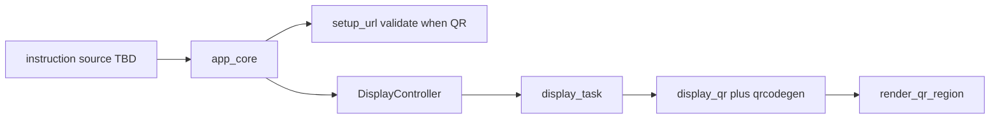

# QR Encoder Interface

This document is the **normative architecture** for QR Code matrix generation in
the `b06_hil` firmware tree. It is separate from QR **rendering**, which remains
defined in `docs/oled_text_display_interface.md`.

Source handoff: `agent-workspaces/architect/handoff.md`, `QR_ENCODER_INTERFACE`.

## Purpose

Generate standards-compliant QR Code matrices when a **display instruction** includes
a QR region. The v1 product payload shape is a fixed-format `http://IPv4` string.

The encoder and display stack MUST NOT depend on WiFi, network stacks, or any
subsystem that may produce the payload string elsewhere in the firmware. The
payload is opaque content supplied with the instruction; shared format validation
lives in `setup_url`.

Display text and QR instructions use the **same delivery path** per
`docs/display_delivery_contract.md`: instruction source → `app_core` →
`display_controller_*`.

## Sporadic QR Usage and Dynamic Display

QR is **occasional**, not a permanent reserved area on the screen.

Rules:

- The OLED surface is **fully dynamic**. At runtime the product may show:
  - full-screen text with one line;
  - full-screen text with multiple lines;
  - a layout that includes one QR region (for example `QR_LEFT_TEXT_RIGHT`);
  - text-only layouts with **no** QR region at all.
- QR MUST NOT be modeled as a fixed widget, status slot, or always-visible panel.
- Reference templates such as `QR_LEFT_TEXT_RIGHT` are **convenience examples** for
  one possible layout shape. They are not the default home screen and do not
  reserve pixels when another layout is active.
- `DisplayController` applies the active `DisplayLayout` when `app_core` calls the
  display API. Showing a QR is one layout choice among others, not a special mode.
- When the active layout switches away from QR, the new layout replaces the prior
  one atomically. No QR artifacts may remain from the prior layout after render.
- The encoder runs only when the active layout contains a `QR` region.
- `display_controller_show_qr_setup(...)` builds a QR layout from instruction
  payload; custom `DisplayLayout` values with QR regions are also valid.

Implementers MUST NOT assume that setup demo screens, boot flows, or default
templates keep QR visible at all times.

## Instruction-Driven QR Display

QR appearance follows the **same instruction model as text**. A QR is shown only
when a display instruction (via `app_core`) requests a layout with a QR region
and supplies the payload string.

Rules:

- The display stack MUST NOT poll, wait, or block for payload availability.
- If no QR instruction arrives, the display shows whatever text or layout was last
  instructed. There is no implicit waiting screen.
- Absence of a QR instruction is normal operation, not an error state.
- The display MUST NOT reference WiFi, network state, or connectivity when deciding
  whether to draw QR.

Implementers MUST NOT add display-side placeholders such as `WAITING` unless a
future architect handoff explicitly authorizes them.

## QR Refresh Policy

Updating a QR payload or redrawing a QR region uses the **same refresh path** as
any other display update. There is no separate QR debounce, partial-QR update mode,
or QR-specific refresh policy.

Rules:

- A new draw-QR instruction with a different URL is a normal layout or content
  update (for example `SET_CONTENT` / `display_set_content`).
- The display task applies the same rules as in
  `docs/oled_text_display_interface.md` Refresh Policy: latest state wins,
  coalesced updates, optional `10 Hz` rate limit, full canvas clear and redraw.
- QR re-encoding happens during render when the active layout includes a QR region
  whose payload changed or when a forced refresh requires it.
- Implementers MUST NOT add QR-only incremental framebuffer updates unless a
  future architect handoff authorizes a general partial-update feature for all
  region types.

## Layer Model



Instruction sources notify `app_core`; only `app_core` calls `display_controller_*`.
See `docs/display_delivery_contract.md`. No layer in this diagram may depend on
WiFi or network APIs.

| Layer | Responsibility | Must not |
| --- | --- | --- |
| Instruction source (TBD) | Emit display instructions with payload when product logic requires | Draw pixels, encode QR, or call `display_controller_*` |
| `setup_url` | Validate `http://IPv4` string shape | Talk to display hardware or network stacks |
| `app_core` | Accept instructions; call `display_controller_*` | Encode QR matrices; touch I2C; call WiFi/network APIs for display |
| `DisplayController` | Build layout from instruction payload | Infer payload origin |
| `display_qr` | Encode payload to module matrix via Nayuki | Choose QR library |
| `ViewRenderer` | Scale, quiet zone, clip, draw modules | Encode QR matrices |

## Product Payload Profile (v1)

### Allowed format

- Scheme: `http://` only.
- Host: IPv4 dotted-decimal with four octets in `0` to `255`.
- Implicit path: **root only** (`/`). The encoded string is exactly
  `http://a.b.c.d` with no path suffix.
- No port, path, query, fragment, username, or password in the QR payload string.
- No `https://` in v1.

### Root page and redirects (out of firmware scope)

The QR points the user's device at the **site root** on that IPv4 address. HTTP
clients treat `http://192.168.4.1` as `http://192.168.4.1/` by default.

Rules:

- The firmware display and encoder stack MUST NOT encode paths such as `/setup`
  or `/config` in the QR payload for v1.
- If scanning must reach a subpath after the root URL, **another entity outside the
  display and encoder stack** handles that behavior. The display contract does not
  name or depend on that entity.
- The draw-QR instruction supplies only the root URL form; redirect policy is not
  a display concern.

### Why not HTTPS in v1

`https://` is intentionally excluded for this product profile. Small
microcontrollers such as the ESP32-C3 SuperMini target on `b06_hil` are unlikely
to terminate TLS for a local setup page in this use case: certificate handling,
memory, and CPU cost are poor fits for v1. Local setup over plain `http://` on a
private IPv4 address is the accepted trade-off until a future handoff authorizes
HTTPS and defines who terminates TLS.

### Grammar

```text
setup_url = "http://" octet "." octet "." octet "." octet
octet     = 1..3 ASCII digits, numeric value 0..255, no leading-zero rule required
```

Equivalent validation pattern for implementers:

```text
^http://([0-9]{1,3})\.([0-9]{1,3})\.([0-9]{1,3})\.([0-9]{1,3})$
```

Each captured octet MUST parse to an integer in `0..255`.

### Length and QR version

| Payload example | Length (chars) | QR version (LOW, byte mode) | Module size |
| --- | --- | --- | --- |
| `http://1.1.1.1` | 14 | 1 | 21 x 21 |
| `http://192.168.4.1` | 18 | 2 | 25 x 25 |
| `http://255.255.255.255` | 22 | 2 | 25 x 25 |

Rules:

- Buffer capacity in display types: `DISPLAY_MAX_LINE_LEN` (64 bytes).
- Maximum encodable payload in v1 product profile: **32 bytes** (QR version 2,
  error correction LOW, byte mode).
- Encoder MUST use the **smallest** QR version that fits the sanitized payload.
- Product ceiling: **version 2**. Payloads that require version 3 or higher MUST
  fail encoding.
- Payloads longer than 32 bytes after ASCII sanitization MUST fail encoding.

### Out of scope for v1

- `https://` (see **Why not HTTPS in v1** above)
- Hostnames and DNS
- IPv6
- Port suffixes (`:8080`)
- URL paths in the QR string (`/setup`, `/config`, etc.); root `/` is implicit only
- HTTP redirects to subpaths (handled by another entity, not firmware)
- Arbitrary URLs or free-form text QR payloads

## Encoder Library

### Selection

- **Library:** Nayuki QR Code generator (`qrcodegen`)
- **License:** MIT
- **Upstream:** https://github.com/nayuki/QR-Code-generator

Rationale: permissive license, small C implementation, standards-compliant QR
Code encoder suitable for embedded firmware without copyleft obligations.

### Integration layout (implementer)

Preferred component layout:

```text
components/qr_encoder/
  CMakeLists.txt
  vendor/qrcodegen/     # upstream C sources plus LICENSE
  include/qr_encoder.h  # optional thin wrapper
```

Alternative acceptable only if recorded in implementer handoff:
`components/display/vendor/qrcodegen/`.

Requirements:

- Copy upstream `LICENSE` into the vendor tree.
- Pin upstream version or commit in `agent-workspaces/architect/decisions.md`.
- Do not hand-roll QR encoding in `display_qr.c`.

### Encoding rules

- QR type: regular QR Code only (not Micro QR, rMQR, or other 2D symbols).
- Error correction: **LOW** only in v1.
- Encoding mode: **byte mode** fixed for all product payloads.
- ECI metadata: not used in v1.
- Payload MUST NOT be compressed, shortened, or rewritten before encoding except
  for ASCII sanitization (`?` replacement) defined in the visual contract.
- Mask pattern: encoder MAY use its standard penalty-based mask selection.
- Golden tests MUST verify `module_count` and on-screen fit, not exact mask bits.

## Generator Public API

Normative API in `components/display/include/display_qr.h`:

```c
typedef struct {
    int width;
    int height;
    const uint8_t *modules;
} display_qr_matrix_t;

bool display_qr_generate(const char *payload, display_qr_matrix_t *matrix);
bool display_qr_module_at(const display_qr_matrix_t *matrix, int x, int y);
void display_qr_release(display_qr_matrix_t *matrix);
```

`display_qr_generate` behavior:

1. Reject `NULL` payload, empty string, or `NULL` matrix output.
2. Optionally require `setup_url_validate(payload)` success before encoding.
3. Sanitize non-printable/non-ASCII bytes to `?` per display contract.
4. Reject sanitized payload if longer than 32 bytes or if version would exceed 2.
5. Encode with Nayuki using byte mode and LOW error correction.
6. On success, fill `matrix` with square `width == height == module_count` and
   `modules` pointing at dark-module storage (`non-zero` = dark).

`display_qr_module_at`:

- Returns whether module `(x, y)` is dark.
- Returns `false` for out-of-bounds coordinates.

`display_qr_release`:

- Invalidates the caller-facing matrix view.
- Does not free static encoder storage in v1.

## Memory and Concurrency (v1)

- Matrix storage: one **static internal buffer** sized for version 2 (25 x 25 =
  625 bytes) inside `display_qr.c`.
- No heap allocation in the base encoder path.
- Only one active matrix view at a time in v1.
- Optional optimization: cache last successful payload hash or string compare in
  `display_qr` to skip re-encoding when the display refreshes unchanged content.
- Only the `display_task` context MAY call `display_qr_generate` in v1.

## Shared `setup_url` Utility

Validation and formatting for the v1 QR payload shape. Any code path that builds or
accepts QR instruction payloads MAY use these helpers, including `app_core` and
instruction sources. This utility MUST NOT create a dependency between the display
stack and WiFi or network components.

Recommended component: `components/setup_url/`.

```c
bool setup_url_format_ipv4(unsigned a, unsigned b, unsigned c, unsigned d,
                           char *out, size_t out_len);
bool setup_url_validate(const char *url);
```

Rules:

- `setup_url_format_ipv4` writes `http://a.b.c.d` when all octets are `0..255`
  and `out_len` is sufficient (minimum 15 bytes for `http://0.0.0.0` plus NUL).
- `setup_url_validate` accepts only the v1 product profile (`http://IPv4`).
- An instruction source includes the finished URL string in a QR display instruction.
- `app_core` validates with `setup_url` and calls `display_controller_show_qr_setup`
  or equivalent layout API.
- `DisplayController` MUST NOT discover or construct payload strings from outside
  the instruction it receives via `app_core`.

## Invalid Input and Fallback Behavior

| Input | Encoder | Renderer |
| --- | --- | --- |
| `NULL` or empty payload | `display_qr_generate` returns false | QR region blank |
| Fails `setup_url_validate` | returns false | QR region blank |
| Too long for version 2 | returns false | QR region blank |
| Encoder internal error | returns false | QR region blank |

When a draw-QR instruction was issued but encoding fails, optional companion text
in the same layout MAY be supplied by whoever issued the instruction. The
renderer MUST NOT invent fallback copy. The display MUST NOT enter a generic
“waiting for URL” mode on its own.

## Relationship to QR Rendering

Rendering rules (scale 2 then 1, quiet zone, centering, clipping) remain in
`docs/oled_text_display_interface.md`. The encoder delivers only the module
matrix. The renderer MUST NOT call Nayuki directly.

## Acceptance Criteria

An implementation satisfies this document if:

- Nayuki `qrcodegen` is integrated with MIT `LICENSE` recorded in the tree.
- `display_qr_generate("http://192.168.4.1")` succeeds with `width == 25`.
- `display_qr_generate("http://1.1.1.1")` succeeds with `width == 21`.
- Invalid product payloads return false without crashing.
- Encoded product payloads fit in a `64x64` QR region at scale 2 with quiet zone
  1 per the visual contract.
- `setup_url_validate` and `setup_url_format_ipv4` exist and match the v1
  profile.
- Display controller continues to accept externally supplied payload strings.
- Renderer and controller remain free of Nayuki includes.
- Switching from a QR layout to a text-only layout removes QR from the screen with
  no residual modules after render.
- Encoder is invoked only when the active layout includes a QR region.
- No draw-QR instruction means no QR region and no wait/poll behavior in the
  display stack.
- QR payload or layout updates use the same refresh policy as any other display
  content change.

## Suggested Validation

Implementer:

- Build with `qr_encoder` component linked.
- Host or component tests for `setup_url_validate` and canonical encode sizes.

Tester:

- Visual scan of `QR_LEFT_TEXT_RIGHT` with `http://192.168.4.1` on hardware.
- Confirm blank QR region for invalid payload without firmware crash.
- Switch layout from `QR_LEFT_TEXT_RIGHT` to `FULL_FOUR_LINES` and confirm no QR
  remains visible.

## Open Questions

These items do not block encoder or delivery-contract implementation:

1. **Instruction source identity** — component or role that emits display
   instructions (may live entirely inside `app_core` if centralized).
2. **`setup_url` component path** — confirm `components/setup_url/` at implementation.
3. **Nayuki vendor path** — confirm `components/qr_encoder/vendor/` layout at implementation.
4. **Measured flash/RAM budget** — record after first integration build.
5. **Future URL extensions** — `https://`, port, path in QR payload, IPv6 remain
   out of scope until a new product profile is authorized.

Closed in v1 architecture:

- **Delivery contract** — text and QR instructions share callback → `app_core` →
  direct `display_controller_*` (`docs/display_delivery_contract.md`).
- **WiFi/network decoupling** — display architecture MUST NOT reference or depend
  on connectivity subsystems.
- **Notification transport** — callback / direct `app_core` APIs (not `esp_event`).
