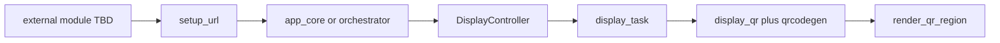

# QR Encoder Interface

This document is the **normative architecture** for QR Code matrix generation in
the `b06_hil` firmware tree. It is separate from QR **rendering**, which remains
defined in `docs/oled_text_display_interface.md`.

Source handoff: `agent-workspaces/architect/handoff.md`, `QR_ENCODER_INTERFACE`.

## Purpose

Generate standards-compliant QR Code matrices for local setup screens. The base
product payload is a fixed-format HTTP URL pointing at a local IPv4 address.

The display stack must not own network logic or URL construction. An external
module supplies the payload string; shared validation lives in `setup_url`.

## Sporadic QR Usage and Dynamic Display

QR is **occasional**, not a permanent reserved area on the screen.

Rules:

- The OLED surface is **fully dynamic**. At runtime the product may show:
  - full-screen text with one line;
  - full-screen text with multiple lines;
  - a layout that includes one QR region (for example `QR_LEFT_TEXT_RIGHT`);
  - text-only layouts with **no** QR region at all.
- QR MUST NOT be modeled as a fixed widget, status slot, or always-visible panel.
- Reference templates such as `QR_LEFT_TEXT_RIGHT` are **convenience examples** for
  one possible layout shape. They are not the default home screen and do not
  reserve pixels when another layout is active.
- `DisplayController` chooses the active `DisplayLayout` per application state.
  Showing a QR is an explicit layout decision for a specific moment (for example
  setup/provisioning), not continuous background behavior.
- When the controller switches from a QR layout to a text-only layout, the new
  layout replaces the previous one atomically. No QR artifacts may remain from
  the prior layout after render.
- The external URL producer sends a payload only when a QR layout is requested.
  The encoder runs only when the current layout contains a `QR` region.
- `display_controller_show_qr_setup(...)` is a helper to build a QR layout for a
  transient screen; callers may also supply a custom `DisplayLayout` with or
  without QR regions.

Implementers MUST NOT assume that setup demo screens, boot flows, or default
templates keep QR visible at all times.

## Layer Model



| Layer | Responsibility | Must not |
| --- | --- | --- |
| External module (TBD) | Obtain network context and trigger URL updates | Draw pixels or encode QR |
| `setup_url` | Format and validate `http://IPv4` strings | Talk to display hardware |
| `app_core` or orchestrator | Deliver validated payload to display API | Encode QR matrices |
| `DisplayController` | Build layout and fallback text | Read network interfaces |
| `display_qr` | Encode payload to module matrix via Nayuki | Parse IP addresses |
| `ViewRenderer` | Scale, quiet zone, clip, draw modules | Choose QR library |

## Product Payload Profile (v1)

### Allowed format

- Scheme: `http://` only.
- Host: IPv4 dotted-decimal with four octets in `0` to `255`.
- No port, path, query, fragment, username, or password in v1.
- No `https://` in v1.

### Grammar

```text
setup_url = "http://" octet "." octet "." octet "." octet
octet     = 1..3 ASCII digits, numeric value 0..255, no leading-zero rule required
```

Equivalent validation pattern for implementers:

```text
^http://([0-9]{1,3})\.([0-9]{1,3})\.([0-9]{1,3})\.([0-9]{1,3})$
```

Each captured octet MUST parse to an integer in `0..255`.

### Length and QR version

| Payload example | Length (chars) | QR version (LOW, byte mode) | Module size |
| --- | --- | --- | --- |
| `http://1.1.1.1` | 14 | 1 | 21 x 21 |
| `http://192.168.4.1` | 18 | 2 | 25 x 25 |
| `http://255.255.255.255` | 22 | 2 | 25 x 25 |

Rules:

- Buffer capacity in display types: `DISPLAY_MAX_LINE_LEN` (64 bytes).
- Maximum encodable payload in v1 product profile: **32 bytes** (QR version 2,
  error correction LOW, byte mode).
- Encoder MUST use the **smallest** QR version that fits the sanitized payload.
- Product ceiling: **version 2**. Payloads that require version 3 or higher MUST
  fail encoding.
- Payloads longer than 32 bytes after ASCII sanitization MUST fail encoding.

### Out of scope for v1

- `https://`
- Hostnames and DNS
- IPv6
- Port suffixes (`:8080`)
- URL paths (`/setup`)
- Arbitrary arbitrary URLs or free-form text QR payloads

## Encoder Library

### Selection

- **Library:** Nayuki QR Code generator (`qrcodegen`)
- **License:** MIT
- **Upstream:** https://github.com/nayuki/QR-Code-generator

Rationale: permissive license, small C implementation, standards-compliant QR
Code encoder suitable for embedded firmware without copyleft obligations.

### Integration layout (implementer)

Preferred component layout:

```text
components/qr_encoder/
  CMakeLists.txt
  vendor/qrcodegen/     # upstream C sources plus LICENSE
  include/qr_encoder.h  # optional thin wrapper
```

Alternative acceptable only if recorded in implementer handoff:
`components/display/vendor/qrcodegen/`.

Requirements:

- Copy upstream `LICENSE` into the vendor tree.
- Pin upstream version or commit in `agent-workspaces/architect/decisions.md`.
- Do not hand-roll QR encoding in `display_qr.c`.

### Encoding rules

- QR type: regular QR Code only (not Micro QR, rMQR, or other 2D symbols).
- Error correction: **LOW** only in v1.
- Encoding mode: **byte mode** fixed for all product payloads.
- ECI metadata: not used in v1.
- Payload MUST NOT be compressed, shortened, or rewritten before encoding except
  for ASCII sanitization (`?` replacement) defined in the visual contract.
- Mask pattern: encoder MAY use its standard penalty-based mask selection.
- Golden tests MUST verify `module_count` and on-screen fit, not exact mask bits.

## Generator Public API

Normative API in `components/display/include/display_qr.h`:

```c
typedef struct {
    int width;
    int height;
    const uint8_t *modules;
} display_qr_matrix_t;

bool display_qr_generate(const char *payload, display_qr_matrix_t *matrix);
bool display_qr_module_at(const display_qr_matrix_t *matrix, int x, int y);
void display_qr_release(display_qr_matrix_t *matrix);
```

`display_qr_generate` behavior:

1. Reject `NULL` payload, empty string, or `NULL` matrix output.
2. Optionally require `setup_url_validate(payload)` success before encoding.
3. Sanitize non-printable/non-ASCII bytes to `?` per display contract.
4. Reject sanitized payload if longer than 32 bytes or if version would exceed 2.
5. Encode with Nayuki using byte mode and LOW error correction.
6. On success, fill `matrix` with square `width == height == module_count` and
   `modules` pointing at dark-module storage (`non-zero` = dark).

`display_qr_module_at`:

- Returns whether module `(x, y)` is dark.
- Returns `false` for out-of-bounds coordinates.

`display_qr_release`:

- Invalidates the caller-facing matrix view.
- Does not free static encoder storage in v1.

## Memory and Concurrency (v1)

- Matrix storage: one **static internal buffer** sized for version 2 (25 x 25 =
  625 bytes) inside `display_qr.c`.
- No heap allocation in the base encoder path.
- Only one active matrix view at a time in v1.
- Optional optimization: cache last successful payload hash or string compare in
  `display_qr` to skip re-encoding when the display refreshes unchanged content.
- Only the `display_task` context MAY call `display_qr_generate` in v1.

## Shared `setup_url` Utility

Validation and formatting MUST be shared between the future network module and
the display path.

Recommended component: `components/setup_url/`.

```c
bool setup_url_format_ipv4(unsigned a, unsigned b, unsigned c, unsigned d,
                           char *out, size_t out_len);
bool setup_url_validate(const char *url);
```

Rules:

- `setup_url_format_ipv4` writes `http://a.b.c.d` when all octets are `0..255`
  and `out_len` is sufficient (minimum 15 bytes for `http://0.0.0.0` plus NUL).
- `setup_url_validate` accepts only the v1 product profile (`http://IPv4`).
- The external network module is responsible for deciding **when** to produce a
  URL and **which IP** to expose.
- `DisplayController` receives the finished string through APIs such as
  `display_controller_show_qr_setup(const char *payload, ...)` and MUST NOT read
  network interfaces directly.

## Invalid Input and Fallback Behavior

| Input | Encoder | Renderer |
| --- | --- | --- |
| `NULL` or empty payload | `display_qr_generate` returns false | QR region blank |
| Fails `setup_url_validate` | returns false | QR region blank |
| Too long for version 2 | returns false | QR region blank |
| Encoder internal error | returns false | QR region blank |

Fallback explanatory text (for example `SETUP`, `WAITING`) MUST be chosen by
`DisplayController` before rendering. The renderer MUST NOT invent fallback
copy when QR encoding fails.

## Relationship to QR Rendering

Rendering rules (scale 2 then 1, quiet zone, centering, clipping) remain in
`docs/oled_text_display_interface.md`. The encoder delivers only the module
matrix. The renderer MUST NOT call Nayuki directly.

## Acceptance Criteria

An implementation satisfies this document if:

- Nayuki `qrcodegen` is integrated with MIT `LICENSE` recorded in the tree.
- `display_qr_generate("http://192.168.4.1")` succeeds with `width == 25`.
- `display_qr_generate("http://1.1.1.1")` succeeds with `width == 21`.
- Invalid product payloads return false without crashing.
- Encoded product payloads fit in a `64x64` QR region at scale 2 with quiet zone
  1 per the visual contract.
- `setup_url_validate` and `setup_url_format_ipv4` exist and match the v1
  profile.
- Display controller continues to accept externally supplied payload strings.
- Renderer and controller remain free of Nayuki includes.
- Switching from a QR layout to a text-only layout removes QR from the screen with
  no residual modules after render.
- Encoder is invoked only when the active layout includes a QR region.

## Suggested Validation

Implementer:

- Build with `qr_encoder` component linked.
- Host or component tests for `setup_url_validate` and canonical encode sizes.

Tester:

- Visual scan of `QR_LEFT_TEXT_RIGHT` with `http://192.168.4.1` on hardware.
- Confirm blank QR region for invalid payload without firmware crash.
- Switch layout from `QR_LEFT_TEXT_RIGHT` to `FULL_FOUR_LINES` and confirm no QR
  remains visible.

## Open Questions

These items do not block encoder implementation but MUST remain explicit until a
future architect handoff closes them:

1. **External URL producer module** — component name, location, and event that
   triggers URL creation.
2. **Delivery contract to display** — callback, queue, polling, or direct
   `app_core` call to `display_controller_show_qr_setup`.
3. **UX without valid IP** — exact template and text while URL is unavailable.
4. **Refresh on IP change** — update QR region only vs full layout; debounce policy.
5. **`setup_url` component path** — confirm `components/setup_url/` at implementation.
6. **Nayuki vendor path** — confirm `components/qr_encoder/vendor/` layout at implementation.
7. **Measured flash/RAM budget** — record after first integration build.
8. **Future URL extensions** — `https://`, port, path, IPv6 remain out of scope
   until a new product profile is authorized.
