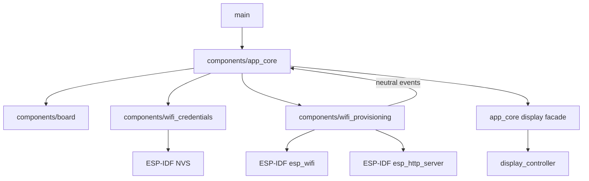
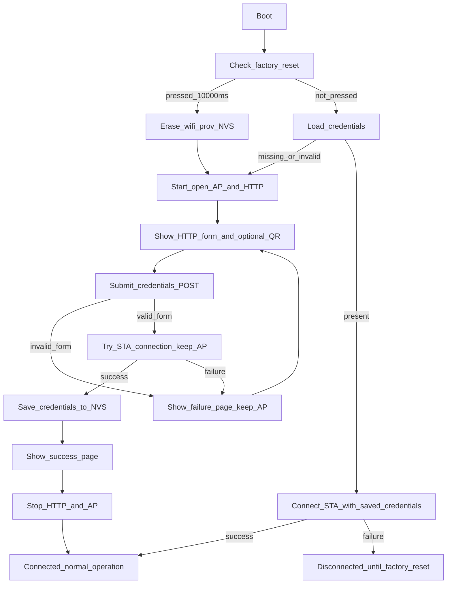
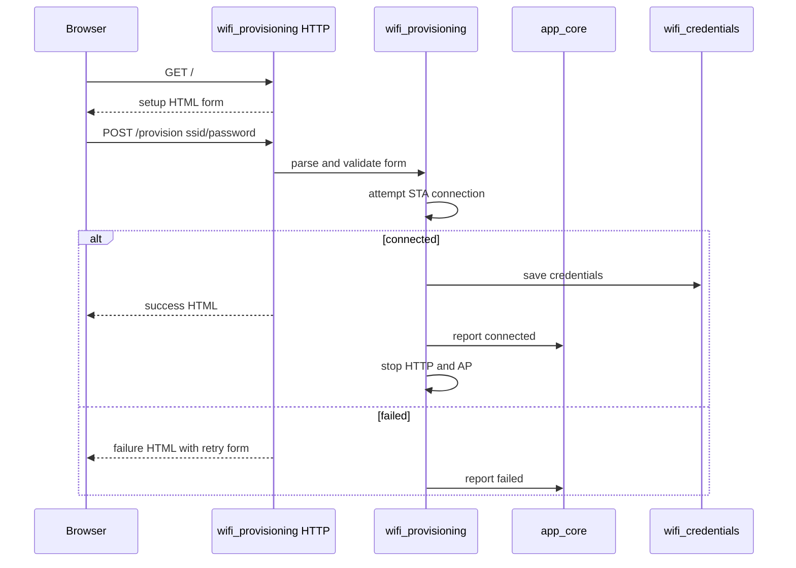

# WiFi Provisioning Architecture

This document is the **normative architecture** for WiFi provisioning in the
`b06_hil` firmware tree.

Source handoff: `agent-workspaces/architect/handoff.md`,
`WIFI_PROVISIONING_ARCHITECTURE`.

## Purpose

Allow a user to connect to a temporary device-owned WiFi access point, open a
local web page, submit the target WiFi network SSID and password, and let the
device connect as a station to that network.

The provisioning path must be deterministic, small, and separated from the OLED
display internals. WiFi provisioning may ask `app_core` to show status or a QR
setup URL, but display components must not include WiFi, TCP/IP, HTTP server, or
NVS credential-storage headers.

## Normative Language

- `MUST` means required.
- `MUST NOT` means prohibited.
- `SHOULD` means expected unless there is a strong platform reason not to.
- `MAY` means optional.

## Product Decisions (v1)

The v1 product profile is fixed:

| Topic | v1 decision |
| --- | --- |
| Provisioning AP SSID | Dynamic: `HIL-06-<MAC4>` for this board, e.g. `HIL-06-ABCD` |
| AP security | Open AP, no password |
| AP IPv4 address | `192.168.4.1` |
| AP subnet | `192.168.4.0/24` |
| Web portal URL | `http://192.168.4.1/` |
| Portal transport | HTTP only |
| Captive DNS | Not included in v1 |
| Stored credential backend | ESP-IDF NVS, normal unencrypted NVS for v1 |
| Factory reset input | `GPIO7`, active-low, per `docs/esp32_c3_supermini_connections.md` |
| Behavior after successful provisioning | Save credentials, show success, stop AP/HTTP, remain connected as STA |
| Behavior after failed submitted credentials | Do not save; keep AP/HTTP active; show failure and retry form |
| Behavior with saved credentials, no STA IP (boot or runtime) | **v2:** Indefinite connect cycle: 5 attempts → 15 s alert fast LED → repeat; never lock; never HOLD RESET OLED |
| Factory reset | Erase credentials; portal; LED solid ON |

**v1 (obsolete):** boot lock after 5 failures (`SAVED_FAILURE_LOCKED`, HOLD RESET).
See `docs/wifi_connect_cycle_architecture.md` for v2.

### Provisioning AP SSID format

The provisioning AP SSID is product-identifying and board-specific.

Format:

```text
HIL-<board_number_2_digits>-<last_4_softap_mac_hex>
```

For this project path, `b06_hil`, the board number is `06`, so examples look like:

```text
HIL-06-ABCD
```

Rules:

- `HIL` is a fixed uppercase prefix.
- `<board_number_2_digits>` MUST be extracted from the board project directory
  name, not hard-coded in the WiFi provisioning component. For `b06_hil`, use
  `06`. For a future `b12_hil`, use `12`.
- The board number extraction rule is: find the leading `bNN_` pattern in the
  board/project identifier and use `NN` exactly as two digits.
- The board component or board configuration owns this value. `wifi_provisioning`
  consumes a board-provided constant/helper such as `BOARD_HIL_NUMBER_STRING`,
  and must not parse filesystem paths at runtime.
- `<last_4_softap_mac_hex>` MUST be the last two bytes of the ESP32 WiFi SoftAP MAC
  address formatted as four uppercase hexadecimal characters with no separators.
- The SSID MUST be generated at runtime before `esp_wifi_set_config(WIFI_IF_AP, ...)`.
- The SSID MUST fit the 32-byte ESP-IDF SSID limit. `HIL-06-ABCD` is 11 bytes.
- Logs and tester records must show the generated SSID, not the old fixed
  `b06_hil_setup` string.

## Layer Model



Rules:

- `main/` remains thin and calls `app_core_start()`.
- `app_core` owns the boot orchestration and product state transitions.
- `wifi_credentials` owns NVS read, write, validate, and erase operations.
- `wifi_provisioning` owns SoftAP, STA connection attempts, and HTTP handlers.
- `board` owns the factory reset pin value and active-low interpretation.
- `display` remains downstream of `app_core`; it does not know WiFi state.
- `wifi_provisioning` reports provisioning changes through neutral events only.
  It must not include `app_core.h`, `display_controller.h`, or display headers.

## Expected Components

Implementers MUST use these component boundaries unless a future handoff changes
them:

```text
components/wifi_credentials/
  include/wifi_credentials.h
  wifi_credentials.c
  CMakeLists.txt

components/wifi_provisioning/
  include/wifi_provisioning.h
  wifi_provisioning.c
  CMakeLists.txt
```

`components/app_core/` is authorized to orchestrate these components and call the
existing display facade:

```text
app_core_display_show_template(...)
app_core_display_show_qr_setup(...)
```

No module outside `app_core` and display internals may call
`display_controller_*` directly.

## Neutral Event Boundary

WiFi provisioning must not depend on display or app_core public display APIs. The
boundary between `components/wifi_provisioning/` and `components/app_core/` is a
neutral event callback registered by `app_core`.

Dependency rules:

- `app_core` MAY include `wifi_provisioning.h`.
- `wifi_provisioning` MUST NOT include `app_core.h`.
- `wifi_provisioning` MUST NOT include `display_controller.h`,
  `display.h`, `display_task.h`, `display_types.h`, or any display renderer,
  canvas, driver, QR, or font header.
- `wifi_provisioning` MUST NOT know display template identifiers such as
  `DISPLAY_TEMPLATE_FULL_TWO_LINES`.
- `wifi_provisioning` MUST NOT know the existence of
  `app_core_display_show_template` or `app_core_display_show_qr_setup`.
- `wifi_provisioning` MUST NOT include `error_led.h` or call GPIO for the error
  LED.
- `wifi_provisioning` emits state and result events; `app_core` decides whether
  those events produce OLED text, QR, error LED patterns, logs, or no user-visible
  output.

Normative event model:

```c
typedef enum {
    WIFI_PROV_EVENT_AP_STARTED = 0,
    WIFI_PROV_EVENT_PORTAL_READY,
    WIFI_PROV_EVENT_SUBMITTED_CONNECTING,
    WIFI_PROV_EVENT_SUBMITTED_SUCCESS,
    WIFI_PROV_EVENT_SUBMITTED_FAILURE,
    WIFI_PROV_EVENT_SAVED_CONNECTING,
    WIFI_PROV_EVENT_SAVED_SUCCESS,
    WIFI_PROV_EVENT_SAVED_FAILURE_LOCKED,
    WIFI_PROV_EVENT_ERROR,
    WIFI_PROV_EVENT_LINK_STATUS_CHANGED,
    WIFI_PROV_EVENT_RUNTIME_RECONNECTING,
    WIFI_PROV_EVENT_RUNTIME_RESTORED,
    WIFI_PROV_EVENT_CONNECT_CYCLE_ACTIVE,
    WIFI_PROV_EVENT_CONNECT_ALERT_PHASE,
    WIFI_PROV_EVENT_CONNECT_RESTORED,
} wifi_prov_event_t;

typedef enum {
    WIFI_LINK_STATUS_UNPROVISIONED = 0,
    WIFI_LINK_STATUS_CONNECTING,
    WIFI_LINK_STATUS_CONNECTING_ALERT,
    WIFI_LINK_STATUS_CONNECTED,
    /* WIFI_LINK_STATUS_DISCONNECTED — deprecated v2 */
} wifi_link_status_t;

typedef struct {
    wifi_prov_event_t event;
    const char *setup_url;      /* optional; normally "http://192.168.4.1" */
    const char *ssid;           /* optional; never password */
    const char *sta_ipv4;       /* STA IPv4; SUBMITTED/SAVED success only */
    const char *sta_mac;        /* STA MAC AA:BB:CC:DD:EE:FF; success only */
    wifi_link_status_t link_status; /* product WiFi link state; every event */
    esp_err_t status;           /* ESP_OK or mapped failure */
} wifi_prov_event_info_t;

typedef void (*wifi_prov_event_cb_t)(const wifi_prov_event_info_t *info,
                                     void *ctx);
```

Recommended public lifecycle API:

```c
esp_err_t wifi_provisioning_init(wifi_prov_event_cb_t cb, void *ctx);
esp_err_t wifi_provisioning_start_ap_portal(void);
esp_err_t wifi_provisioning_connect_saved(const wifi_credentials_t *credentials);
esp_err_t wifi_provisioning_stop(void);
```

Rules:

- The callback is invoked from task context only, never ISR context.
- The callback MUST NOT receive or expose the submitted password.
- `setup_url` is optional event data for app_core convenience; it is still plain
  text content, not a display dependency.
- `ssid` field semantics (normative):
  - On `WIFI_PROV_EVENT_AP_STARTED` and `WIFI_PROV_EVENT_PORTAL_READY`: MUST be
    the provisioning SoftAP SSID (NUL-terminated C string owned by
    `wifi_provisioning` for the lifetime of the callback). MUST NOT be `NULL` when
    the AP started successfully.
  - On STA-related events (`SUBMITTED_*`, `SAVED_*`): MAY be the target home
    network SSID; unchanged from v1.
  - MUST never contain the submitted password.
- `sta_ipv4` and `sta_mac` field semantics (normative):
  - On `WIFI_PROV_EVENT_SUBMITTED_SUCCESS` and `WIFI_PROV_EVENT_SAVED_SUCCESS`
    with `status == ESP_OK`: MUST be non-NULL (see **WiFi connected OLED screen**).
  - On all other events: MUST be NULL.
  - `sta_mac` format: exactly 17 characters, uppercase hex octets separated by
    colons (`AA:BB:CC:DD:EE:FF`).
- `app_core` MUST map `WIFI_PROV_EVENT_AP_STARTED` and
  `WIFI_PROV_EVENT_PORTAL_READY` to the provisioning setup OLED screen documented
  in **Display Integration → Provisioning setup OLED screen**.
- `app_core` MUST map `WIFI_PROV_EVENT_SUBMITTED_SUCCESS` and
  `WIFI_PROV_EVENT_SAVED_SUCCESS` to the connected OLED screen documented in
  **Display Integration → WiFi connected OLED screen**.
- `link_status` field semantics (normative):
  - Present on **every** event; copied from `wifi_provisioning` internal
    `s_link_status` at emit time.
  - See **Error LED integration** and `docs/error_led_wifi_link_architecture.md`
    for the transition table.
- `WIFI_PROV_EVENT_LINK_STATUS_CHANGED` semantics (normative):
  - LED-only notification; `app_core` MUST NOT change OLED on this event.
  - `setup_url`, `ssid`, `sta_ipv4`, `sta_mac` MUST be NULL; `status` MUST be
    `ESP_OK`.
  - Emitted when `s_link_status` changes at runtime after initial connect (see
    **Runtime link_status for LED**).
  - Full contract: `docs/error_led_runtime_link_architecture.md`.
- `WIFI_PROV_EVENT_RUNTIME_RECONNECTING` semantics (normative):
  - Emitted when `runtime_reconnect_task` starts after link loss with valid NVS
    credentials.
  - `link_status` MUST be `WIFI_LINK_STATUS_CONNECTING`.
  - `ssid` MAY be the home network SSID; `sta_ipv4` and `sta_mac` MUST be NULL.
  - Full contract: `docs/wifi_runtime_reconnect_architecture.md`.
- `WIFI_PROV_EVENT_RUNTIME_RESTORED` semantics (normative):
  - Emitted when runtime reconnect obtains STA IP.
  - `link_status` MUST be `WIFI_LINK_STATUS_CONNECTED`.
  - `sta_ipv4` and `sta_mac` MUST follow the same success rules as
    `WIFI_PROV_EVENT_SAVED_SUCCESS`.
  - Full contract: `docs/wifi_runtime_reconnect_architecture.md` (v1, superseded).
- `WIFI_PROV_EVENT_CONNECT_CYCLE_ACTIVE` semantics (normative v2):
  - Start of each connect round (boot or runtime).
  - `link_status` MUST be `WIFI_LINK_STATUS_CONNECTING`.
  - Full contract: `docs/wifi_connect_cycle_architecture.md`.
- `WIFI_PROV_EVENT_CONNECT_ALERT_PHASE` semantics (normative v2):
  - After 5 failed attempts in current round; 15 s fast LED phase.
  - `link_status` MUST be `WIFI_LINK_STATUS_CONNECTING_ALERT`.
  - OLED remains `WIFI` / `CONNECTING` (no HOLD RESET).
- `WIFI_PROV_EVENT_CONNECT_RESTORED` semantics (normative v2):
  - STA obtained IP during a round.
  - `link_status` MUST be `WIFI_LINK_STATUS_CONNECTED`.
  - `sta_ipv4` / `sta_mac` same rules as saved success events.
- `WIFI_PROV_EVENT_SAVED_FAILURE_LOCKED` (deprecated v2):
  - MUST NOT be emitted. OLED HOLD RESET removed.
- `wifi_provisioning` must remain reusable in a headless product that has no OLED
  or error LED component.

## Credential Model

### Public data shape

The logical credential record is:

```c
#define WIFI_PROV_MAX_SSID_LEN 32
#define WIFI_PROV_MAX_PASSWORD_LEN 64

typedef struct {
    char ssid[WIFI_PROV_MAX_SSID_LEN + 1];
    char password[WIFI_PROV_MAX_PASSWORD_LEN + 1];
    bool has_password;
} wifi_credentials_t;
```

Rules:

- SSID length MUST be `1..32` bytes after form decoding.
- Password length MUST be `0..63` bytes after form decoding.
- Empty password is allowed because the target network may be open.
- SSID and password are byte strings for ESP-IDF WiFi APIs; v1 does not implement
  Unicode normalization.
- Web form inputs SHOULD be printable ASCII for v1. Non-ASCII bytes MAY be
  accepted as opaque bytes if ESP-IDF accepts them, but the portal UI copy itself
  must remain ASCII.
- The implementation MUST always NUL-terminate internal buffers.
- Overlength fields MUST be rejected before any STA connection attempt.

### NVS contract

Use one NVS namespace:

```text
namespace: wifi_prov
keys:
  ssid          string
  password      string
  provisioned   u8, value 1 only when ssid/password are valid
```

Rules:

- `provisioned` MUST be written only after `ssid` and `password` are committed.
- Loading credentials MUST require `provisioned == 1` and a valid SSID.
- A missing password key is equivalent to empty password only if `provisioned == 1`.
- Failed form submissions MUST NOT modify stored credentials.
- Successful provisioning MUST save credentials only after the STA connection
  attempt succeeds.
- Factory reset MUST erase the full `wifi_prov` namespace and commit the erase.
- NVS encryption is not required in v1. Documentation and tester records must not
  claim the WiFi password is encrypted unless a future security handoff changes
  the storage profile.

Recommended API:

```c
esp_err_t wifi_credentials_init(void);
bool wifi_credentials_load(wifi_credentials_t *out);
esp_err_t wifi_credentials_save(const wifi_credentials_t *credentials);
esp_err_t wifi_credentials_erase(void);
bool wifi_credentials_validate(const wifi_credentials_t *credentials);
```

## Factory Reset Contract

Full contract (boot + runtime): **`docs/wifi_factory_reset_architecture.md`**.

Factory reset uses `GPIO7` active-low as documented in
`docs/esp32_c3_supermini_connections.md`.

### Boot behavior

1. `app_core_start()` initializes board pin access before WiFi provisioning
   decisions.
2. It samples the factory reset switch during early boot.
3. The reset request is valid only if the input is active-low continuously for at
   least `10000 ms` (10 s).
4. On a valid reset request, erase `wifi_prov` credentials before loading WiFi
   state.
5. After erase, enter provisioning AP mode.

### Runtime behavior (v2 extension)

After `wifi_provisioning_init()`, `app_core_wifi` runs monitor task `wifi_fr_mon`.
Hold `GPIO7` ≥ `10000 ms` (10 s) at any time erases credentials and transitions to the
provisioning portal without requiring a reboot. See
`docs/wifi_factory_reset_architecture.md` for abort timing, connect-cycle
interaction, and `wifi_provisioning_factory_reset_to_portal()`.

The reset button is the only v1 recovery path from saved credentials. Do not add a
web reset, serial command, or automatic erase policy without a new architect handoff.

## Provisioning State Machine



## Corrective Architecture From Runs 007-009

Tester and implementer notes for Runs 007 through 009 exposed three failure
classes that this architecture now closes normatively:

| Run | Failure | Architectural correction |
| --- | --- | --- |
| 007 | Phone joined AP, but `GET /` never reached the handler; no request-level diagnostics existed. | Require AP L3 diagnostics, HTTP handler logs, and a `/health` reachability route. |
| 008 | `WIFI_EVENT_AP_START` fired, then the implementation cleared the event bit and waited for a second event, causing timeout and reboot loop. | Event bits must be cleared before the operation that emits the event; waits must not clear bits after `esp_wifi_start()`. |
| 009 | SoftAP and HTTP logged ready, phone associated, but `GET /` still never reached handler. | AP netif IP/DHCP must be configured before WiFi start and must not be stopped/restarted after AP start; portal is not "ready" until AP IP, DHCP, HTTP, handlers, and diagnostics are confirmed. |
| 010 | DHCP and `GET /` handler entry succeeded, but the HTTP worker crashed with stack protection fault while building/sending the setup page. | HTTP handlers must not allocate large HTML or form parsing buffers on task stack; page responses must use static/chunked output or small bounded stack buffers plus an explicit HTTP server stack budget. |
| 011 | `GET /` response completed and the form was visible, but mobile browser `POST /provision` failed before the handler with HTTP 431 because `CONFIG_HTTPD_MAX_REQ_HDR_LEN=512`. | The provisioning portal must budget ESP-IDF httpd request headers for real mobile browsers and persist that budget in `sdkconfig.defaults`; `POST /provision` acceptance requires handler entry, not just form rendering. |
| 012 | Header budget fix removed HTTP 431 and the form submitted, but browser showed no success/failure page, OLED showed `WIFI OK`, AP still appeared visible, and saved credentials failed on reboot. | Submitted credential success must be a committed transaction: fresh STA `GOT_IP` for the current attempt, success HTML delivered, credentials saved or rolled back, success event emitted only after web success, AP teardown deferred and logged, and reboot with saved credentials validated. |
| 013 | POST success path passed and credentials were known good, but saved-credential cold boot connected only 2/5 times; failed boots showed `WIFI_REASON_AUTH_FAIL` reason 202 on a WPA3-SAE network. | Saved-credential boot must use a robust retry policy, WPA2/WPA3-SAE-capable STA configuration, cold-start settle timing, per-attempt diagnostics, and acceptance across consecutive cold boots before entering locked failure. |

Implementers MUST treat these as regression guards. A build that repeats any of
these failure classes does not satisfy `WIFI_PROVISIONING_ARCHITECTURE`.

## ESP-IDF SoftAP Portal Startup Contract

The provisioning portal MUST follow this exact ordering on ESP-IDF. Do not
reinterpret the order unless a future architect handoff changes it.

### One-time WiFi stack initialization

`wifi_provisioning_init(cb, ctx)` MUST:

1. Create the internal event group before registering handlers.
2. Call `esp_netif_init()`.
3. Call `esp_event_loop_create_default()`. If the default loop already exists,
   treat that state as success only when ESP-IDF returns the documented
   already-created error.
4. Call `esp_wifi_init()`.
5. Register handlers before `esp_wifi_start()` for at least:
   - `WIFI_EVENT_AP_START`
   - `WIFI_EVENT_AP_STOP`
   - `WIFI_EVENT_AP_STACONNECTED`
   - `WIFI_EVENT_AP_STADISCONNECTED`
   - `IP_EVENT_STA_GOT_IP`
   - `WIFI_EVENT_STA_DISCONNECTED`
6. Create the AP netif needed for provisioning. Creating the STA netif MAY be
   deferred until a saved-credential or submitted-credential connection attempt.
7. Store callback and context after initialization succeeds, or ensure failed
   initialization leaves no half-registered callback state.

Rules:

- Initialization must be idempotent. A second `wifi_provisioning_init()` call
  returns success if the stack is already ready with the same callback contract.
- Do not create duplicate default AP/STA netifs on repeated calls.
- Public headers must not expose `esp_netif_t`, `httpd_handle_t`,
  `wifi_config_t`, or event group handles.

### AP netif IP and DHCP setup

The AP netif must be configured before `esp_wifi_start()` brings SoftAP up.

Required AP network contract:

```text
AP IP:      192.168.4.1
Gateway:    192.168.4.1
Netmask:    255.255.255.0
DHCP range: implementation default is acceptable if it serves 192.168.4.x clients
```

Rules:

- Configure AP IP while the DHCP server is stopped or before it starts.
- If `esp_netif_dhcps_stop()` reports "already stopped" or equivalent, treat that
  as success for this setup step.
- After setting IP info, ensure DHCP server will serve AP clients.
- MUST NOT stop or restart DHCP after `WIFI_EVENT_AP_START` during normal portal
  startup. Run 009 evidence indicates post-start DHCP/IP churn can make the phone
  associate at L2 while HTTP traffic never reaches the handler.
- Log the final AP IP, gateway, and netmask before marking the portal ready.

### SoftAP start sequence

`wifi_provisioning_start_ap_portal()` MUST:

1. Ensure the WiFi stack is initialized.
2. Configure AP netif IP/DHCP as above.
3. Configure AP mode only:

   ```text
   esp_wifi_set_mode(WIFI_MODE_AP)
   ```

4. Configure SoftAP:

   ```text
   ssid = "HIL-06-ABCD"  // example only; generated from board number + SoftAP MAC
   authmode = WIFI_AUTH_OPEN
   channel = 1
   max_connection = 4
   ```

5. Clear `WIFI_AP_STARTED_BIT` immediately before `esp_wifi_start()`.
6. Call `esp_wifi_start()`.
7. Wait for `WIFI_EVENT_AP_START` with timeout `10000 ms`.
8. Start HTTP server only after AP start succeeds.
9. Register `GET /`, `GET /health`, `POST /provision`, and 404 handlers.
10. Log the portal ready line only after all prior steps succeed.
11. Emit `WIFI_PROV_EVENT_PORTAL_READY` only after the portal ready line.

Event bit rule:

```text
Correct:
  clear AP_STARTED bit
  esp_wifi_start()
  wait for AP_STARTED bit

Forbidden:
  esp_wifi_start()
  clear AP_STARTED bit
  wait for AP_STARTED bit
```

The forbidden sequence caused Run 008's reboot loop.

### HTTP server binding and routes

The HTTP server uses ESP-IDF `esp_http_server`.

Required configuration:

- Use `HTTPD_DEFAULT_CONFIG()` as the base.
- Server port MUST be `80`.
- Set `config.stack_size` to at least `8192` bytes for v1 unless the implementation
  proves by code review that every handler uses only small stack frames as defined
  in **HTTP Handler Stack Safety** below. The preferred v1 setting is `8192`.
- `CONFIG_HTTPD_MAX_REQ_HDR_LEN` MUST be set in `sdkconfig.defaults` to `2048` for
  v1. The default `512` is not acceptable because Run 011 proved a normal mobile
  browser POST can be rejected by `esp_http_server` before `POST /provision`
  reaches the application handler.
- `CONFIG_HTTPD_MAX_URI_LEN` MAY remain `512` because v1 routes are short and
  form data is carried in the POST body, not the URI.
- `lru_purge_enable` MAY be true.
- Do not bind to a STA-only address. Use default binding or an AP-reachable bind
  address.
- Register handlers only after `httpd_start()` succeeds.

Required routes:

| Method | Path | Purpose |
| --- | --- | --- |
| `GET` | `/` | Setup HTML form |
| `GET` | `/health` | Plaintext reachability diagnostic |
| `POST` | `/provision` | Credential submission |
| any | other | 404 or redirect to `/` |

`GET /health` response:

```text
Status: 200 OK
Content-Type: text/plain; charset=utf-8
Cache-Control: no-store
Body: OK
```

`/health` has no product state side effects and MUST NOT expose SSID, password,
MAC addresses, or NVS state. It exists so tester and implementer can distinguish:

- AP association or DHCP failure;
- HTTP server reachability failure;
- HTML rendering failure.

### Required diagnostics

WiFi provisioning MUST log these stable messages or equivalent wording with the
same facts:

```text
wifi_prov: AP netif ip=192.168.4.1 gw=192.168.4.1 netmask=255.255.255.0
wifi_prov: starting SoftAP ssid=HIL-06-ABCD mode=AP
wifi_prov: SoftAP started
wifi_prov: HTTP server started on port 80
wifi_prov: HTTP handlers registered (GET /, GET /health, POST /provision)
wifi_prov: provisioning portal ready at http://192.168.4.1
wifi_prov: station joined mac=<redacted-or-mac> aid=<aid>
wifi_prov: GET /health from client
wifi_prov: GET / from client
wifi_prov: POST /provision from client
wifi_prov: POST /provision parsed form
wifi_prov: POST /provision attempting STA ssid=<redacted-or-ssid>
wifi_prov: STA got IP ip=<ipv4> source=submitted
wifi_prov: credentials saved source=submitted
wifi_prov: POST /provision success response sent
wifi_prov: success teardown scheduled delay_ms=<ms>
wifi_prov: SoftAP stopped after provisioning success
```

Rules:

- Passwords MUST NOT be logged.
- SSID submitted by the user MAY be logged only if needed for debugging and must
  be omitted from tester-facing examples unless redacted.
- The tester must be able to prove whether a phone session reached `/health` and
  `/` from serial logs.

### Error handling and non-fatal provisioning failures

Provisioning startup failures are product errors, not firmware panics.

Rules:

- `app_core_start()` MUST NOT wrap `app_core_wifi_start()` or
  `wifi_provisioning_start_ap_portal()` in `ESP_ERROR_CHECK`.
- Timeout waiting for AP start, HTTP start failure, handler registration failure,
  or DHCP/IP setup failure MUST return an error to `app_core` and leave firmware
  stable enough to log and show `WIFI` / `AP FAIL` or `WIFI` / `WEB FAIL` if the
  display is available.
- Any recoverable provisioning error MUST emit `WIFI_PROV_EVENT_ERROR`.
- Reboot loops caused by provisioning errors violate this architecture.

## HTTP Handler Stack Safety

Run 010 proved that AP reachability and handler entry are not sufficient: `GET /`
entered the handler and then the HTTP worker hit a stack protection fault before
the browser received the form. The architecture therefore treats handler stack
usage as part of the public contract.

### Forbidden handler memory pattern

HTTP handlers and page helpers MUST NOT allocate large response buffers on the
HTTP worker stack.

Forbidden examples:

```c
char html[2048];                  /* forbidden in any httpd handler/page helper */
char body[WIFI_PROV_MAX_FORM_BODY_LEN + 1];  /* forbidden if on httpd stack */
char pair[WIFI_PROV_MAX_FORM_BODY_LEN + 1];  /* forbidden inside parser loop */
```

Rules:

- Any single local array in an HTTP handler or a function called synchronously by
  a handler MUST be `<= 128` bytes.
- The total local array storage in a handler call chain SHOULD stay below
  `512` bytes.
- The setup, success, and failure HTML pages MUST NOT be assembled into a single
  large stack buffer.
- Form parsing MUST NOT copy every pair into a stack buffer sized like the whole
  request body.
- If a buffer larger than `128` bytes is unavoidable, it MUST be either:
  - static internal storage protected by the single httpd worker context; or
  - heap allocated with bounded size and freed on all paths; or
  - avoided by streaming/chunked output.

Preferred v1 approach:

- Render pages with constant string chunks using `httpd_resp_send_chunk`.
- Send dynamic pieces, such as an escaped status message or escaped SSID, through
  small temporary buffers no larger than `128` bytes.
- Finish chunked responses with `httpd_resp_send_chunk(req, NULL, 0)`.

### Page rendering contract

The setup page MUST be sent in bounded chunks:

```text
chunk 1: fixed doctype/head/opening body
chunk 2: optional escaped status paragraph, or omitted
chunk 3: fixed form opening through SSID input
chunk 4: fixed password input, submit button, closing tags
chunk final: NULL, 0
```

The failure page MUST follow the same pattern and MAY include an escaped SSID in
a small bounded buffer. The password field remains empty.

The success page MAY be sent as one constant string because it is small and has no
dynamic user data.

Required helper shape (names may vary, behavior must not):

```c
esp_err_t wifi_prov_send_html_begin(httpd_req_t *req, int status_code);
esp_err_t wifi_prov_send_chunk(httpd_req_t *req, const char *chunk);
esp_err_t wifi_prov_send_html_end(httpd_req_t *req);
```

HTML escaping MUST support streaming or bounded output. If an escaped value does
not fit in the bounded temporary buffer, truncate it safely or omit the prefill;
do not grow the stack buffer.

### Form parsing stack contract

The POST parser may read the request body into a bounded buffer, but not on the
HTTP worker stack.

Allowed approaches:

- Static internal body buffer sized `WIFI_PROV_MAX_FORM_BODY_LEN + 1`, used only
  during one request because v1 httpd handles one request in the worker context.
- Heap allocation of exactly `req->content_len + 1` after validating
  `content_len <= WIFI_PROV_MAX_FORM_BODY_LEN`, with free on all paths.
- Streaming parser that decodes fields without storing full duplicate pairs.

Forbidden:

- `char body[257]` on the handler stack.
- `char pair[257]` inside the parser loop.
- Any parser design that duplicates the whole body one or more times on stack.

### Handler response diagnostics

Handlers MUST log completion after a response is successfully queued/sent:

```text
wifi_prov: GET /health response sent
wifi_prov: GET / response sent
wifi_prov: POST /provision failure response sent
wifi_prov: POST /provision success response sent
```

If a send operation fails, log:

```text
wifi_prov: GET / response failed: <esp_err>
```

Run 010 acceptance requires both `GET / from client` and `GET / response sent`
before the tester can treat HTML delivery as successful.

## HTTP Request Header Budget

Run 011 proved that successful `GET /` rendering is still not enough for WiFi
onboarding: a phone browser can render the form, submit it, and still receive
HTTP 431 before `provision_post_handler` runs if ESP-IDF's httpd request-header
limit is too small.

### Required build-time configuration

The firmware MUST persist the v1 header budget in `sdkconfig.defaults`:

```text
CONFIG_HTTPD_MAX_REQ_HDR_LEN=2048
```

Rules:

- Do not rely only on generated `sdkconfig`; the source-controlled default must
  contain the value so a clean build uses it.
- Do not lower this value below `2048` without a new tester run proving a common
  mobile browser can submit `/provision` successfully.
- Do not work around HTTP 431 by changing the form to `GET`, putting credentials
  in the URL, using JavaScript, shortening field names, or adding a custom socket
  protocol.
- `CONFIG_HTTPD_MAX_URI_LEN=512` is sufficient for v1 because `/provision` is a
  short path and credentials are submitted in the request body.

### POST acceptance contract

The `POST /provision` path is considered reachable only when serial logs include:

```text
wifi_prov: POST /provision from client
```

A browser-visible `431 Request Header Fields Too Large`, or logs like:

```text
httpd_parse: parse_block: request URI/header too long
httpd_txrx: httpd_resp_send_err: 431 Request Header Fields Too Large
```

mean ESP-IDF rejected the request before application code. That failure class is
configuration/header-budget, not form parsing, STA connection, NVS, or HTML
rendering.

### Required POST diagnostics

After the header budget is fixed, `POST /provision` attempts MUST distinguish
these milestones:

```text
wifi_prov: POST /provision from client
wifi_prov: POST /provision parsed form
wifi_prov: POST /provision attempting STA ssid=<redacted-or-ssid>
wifi_prov: POST /provision failure response sent
wifi_prov: POST /provision success response sent
```

Rules:

- Passwords MUST NOT be logged.
- The parsed-form log MUST occur after content type, body length, percent-decoding,
  and credential bounds validation pass.
- The STA attempt log MUST occur before the blocking STA connection wait begins.
- If `POST /provision from client` is absent, the tester must first inspect header
  budget and httpd parser logs before investigating form parser or WiFi STA logic.

## Submitted Success Commit Contract

Run 012 showed a dangerous split-brain success: the web page gave no success or
failure feedback, the OLED displayed `WIFI OK`, credentials were persisted, and a
later STA-only boot failed authentication. The submitted credential path therefore
uses an explicit commit contract.

### Fresh STA attempt requirement

Each `POST /provision` attempt MUST create a fresh connection attempt context.

Rules:

- Clear submitted-attempt event bits before applying submitted STA config and
  before calling `esp_wifi_connect()`.
- Ignore stale `GOT_IP` bits or events from saved-credential boot, previous POST
  attempts, or AP startup.
- Log `STA got IP ip=<ipv4> source=submitted` only from the `IP_EVENT_STA_GOT_IP`
  event that belongs to the current submitted credential attempt.
- The submitted success path MUST NOT proceed without this fresh submitted
  `GOT_IP` event.
- Saved-credential boot MUST use a separate log: `STA got IP ip=<ipv4> source=saved`.

### Success commit ordering

For submitted credentials, success is committed only after all of these steps
succeed in this order:

```text
POST /provision from client
POST /provision parsed form
POST /provision attempting STA ssid=<redacted-or-ssid>
STA got IP ip=<ipv4> source=submitted
credentials saved source=submitted
POST /provision success response sent
WIFI_PROV_EVENT_SUBMITTED_SUCCESS emitted
success teardown scheduled delay_ms=2000
SoftAP stopped after provisioning success
STA-only mode active after provisioning success
```

Rules:

- `WIFI_PROV_EVENT_SUBMITTED_SUCCESS` MUST NOT be emitted before
  `POST /provision success response sent`.
- `app_core` MUST NOT show OLED `WIFI OK` before the web success response has been
  sent successfully.
- If the success response send fails after credentials were saved, the
  implementation MUST clear the `provisioned` flag or erase the saved credentials,
  keep AP/HTTP active, emit a neutral error/failure event, and log the rollback.
- If credential save fails, return a failure page, keep AP/HTTP active, and do not
  emit `WIFI_PROV_EVENT_SUBMITTED_SUCCESS`.
- Passwords MUST NOT be logged in any success, failure, rollback, or NVS message.

### Deferred AP and HTTP teardown

Do not stop HTTP or disable the SoftAP inside the same call stack immediately after
queueing the success response. The browser must have a grace window to receive and
render the page.

Rules:

- After `POST /provision success response sent`, schedule teardown on a timer or
  worker task with `delay_ms=2000`.
- During the grace window, the AP may still appear in phone WiFi settings. This is
  acceptable only until the scheduled teardown executes.
- Teardown MUST log:

```text
wifi_prov: success teardown scheduled delay_ms=2000
wifi_prov: HTTP server stopped after provisioning success
wifi_prov: SoftAP stopped after provisioning success
wifi_prov: STA-only mode active after provisioning success
```

- Tester acceptance requires the AP to disappear or stop accepting new
  associations after teardown, not necessarily instantly at the moment the success
  page appears.

### Saved credential reboot proof

Submitted success is not fully accepted until a later boot with saved credentials
connects STA-only.

Rules:

- Saved-credential boot MUST log `STA got IP ip=<ipv4> source=saved` on success.
- Saved-credential boot failure MUST log the failure reason or WiFi disconnect
  reason if ESP-IDF provides it.
- If submitted success was reported but saved-credential boot later fails
  authentication or never gets IP, the full provisioning flow is FAIL even if the
  OLED previously showed `WIFI OK`.

## Saved Boot Reliability Contract

> **v2 as-built:** Saved boot uses the unified connect cycle engine
> (`connect_cycle_run_forever` with source `SAVED`, logs as `source=boot`).
> There is **no** terminal lock, **no** `SAVED_FAILURE_LOCKED`, and **no** OLED
> HOLD RESET. See `docs/wifi_connect_cycle_architecture.md` and
> **`docs/wifi_connect_cycle_implementation_reference.md`**.

The sections below describe **v1 historical policy** (5 attempts → lock). STA
configuration requirements (WPA2/WPA3-SAE, shared `apply_sta_config`) remain valid
for v2; retry/lock semantics are superseded by the connect cycle contract.

### Product decision

Intermittent saved-credential boot failure is not acceptable in v1 when the
credentials have already been proven by POST provisioning and by at least one
successful STA connection.

Supported v1 router security profiles:

- Open target network with empty password is allowed only if the form submitted an
  empty password and credential validation accepted it.
- WPA2-Personal / WPA2-PSK.
- WPA2/WPA3 transition mode.
- WPA3-SAE Personal.

Unsupported v1 profiles remain:

- WPA/WPA2 Enterprise.
- Captive portal upstream networks.
- Networks requiring browser login after association.

### STA configuration requirements

The same STA configuration helper MUST be used for submitted attempts and saved
boot attempts.

Rules:

- Do not hard-code a configuration that effectively makes saved boot WPA2-only.
- Configure the STA for WPA2/WPA3/WPA3-SAE personal compatibility on ESP-IDF 5.3.
- PMF MUST be enabled as capable for WPA3 compatibility, but MUST NOT be required
  for v1 transition-mode compatibility unless a future handoff narrows support.
- If ESP-IDF exposes SAE PWE selection, use a compatibility setting that supports
  both H2E and hunting-and-pecking where available.
- Log the selected auth compatibility profile once per STA config application:

```text
wifi_prov: STA config auth_profile=wpa2_wpa3_personal pmf_capable=true pmf_required=false
```

### Saved boot retry policy (v1 — obsolete lock semantics)

**v2:** Replaced by connect cycle (`CONNECT_ROUND_MAX_ATTEMPTS=5`,
`CONNECT_BOOT_SETTLE_MS=1000`, same backoff array, then 15 s alert and repeat).
Do not emit `WIFI_PROV_EVENT_SAVED_FAILURE_LOCKED`.

Historical v1 requirement (obsolete):

Saved boot MUST try more than once before entering
`WIFI_PROV_EVENT_SAVED_FAILURE_LOCKED`.

Required policy:

```text
max_attempts: 5
cold_start_settle_ms: 1000 before attempt 1 after esp_wifi_start()
per_attempt_timeout_ms: 12000
backoff_after_failure_ms: [0, 1000, 3000, 5000, 8000]
success_condition: IP_EVENT_STA_GOT_IP for source=saved
failure_condition: all attempts exhausted without saved GOT_IP
```

Rules:

- A disconnect reason such as `WIFI_REASON_AUTH_FAIL` MUST end the current attempt
  promptly; do not wait the full timeout after an early disconnect.
- Clear `WIFI_CONNECTED_BIT`, saved-attempt disconnect bits, and last disconnect
  reason before every attempt.
- Set the pending STA source to `saved` for each attempt and clear it only after
  that attempt completes or after the full retry policy is exhausted.
- Late `GOT_IP` events after all attempts are exhausted MUST be logged as stale and
  ignored.
- Do not erase credentials and do not reopen provisioning AP after all saved boot
  retries fail. **v1:** locked-disconnected / factory-reset recovery applied.
  **v2:** cycle repeats indefinitely; `wifi_provisioning_locked_disconnected()`
  always returns `false`.

Required saved-boot logs:

```text
wifi_prov: saved boot connect policy attempts=5 per_attempt_timeout_ms=12000
wifi_prov: saved boot attempt 1/5 start
wifi_prov: STA disconnected reason=<reason> source=saved attempt=1/5
wifi_prov: saved boot attempt 1/5 failed reason=<reason> backoff_ms=<ms>
wifi_prov: saved boot attempt 2/5 start
wifi_prov: STA got IP ip=<ipv4> source=saved attempt=<n>/5
wifi_prov: saved boot connected attempt=<n>/5 ip=<ipv4>
wifi_prov: saved boot failed attempts=5 last_reason=<reason>
```

### ESP-IDF auto-reconnect interaction

The application retry policy is authoritative for v1.

Rules:

- If ESP-IDF auto-reconnect or `failure_retry_cnt` is used, document its value and
  ensure it cannot create unbounded retries outside the `max_attempts=5` policy.
- The application MUST still log attempt boundaries and final success/failure.
- The final locked failure event can be emitted only after the application retry
  policy is exhausted.

### Reliability acceptance

Saved credential boot is accepted only if the same saved credentials connect
reliably across a consecutive reboot sweep.

Acceptance requirement:

```text
10 consecutive saved-credential cold boots PASS
0/10 AUTH_FAIL reason=202 without recovery
each boot logs STA got IP ip=<ipv4> source=saved
```

If any boot requires more than one attempt but eventually connects, the run MAY
pass only if the logs show the retry recovered within the policy and the 10-boot
sweep completes with no final locked failures.

## WiFi Connect Cycle Contract (v2)

Handoff: `WIFI_CONNECT_CYCLE_AND_ERROR_LED_V2`. Full contract:
`docs/wifi_connect_cycle_architecture.md`. **As-built reference:**
`docs/wifi_connect_cycle_implementation_reference.md`. LED mapping:
`docs/error_led_connect_cycle_architecture.md`.

**Operator validated:** 2026-06-23.

Boot and runtime use the **same** connect cycle when credentials exist in NVS:

```text
round: 5 attempts (12 s timeout each, intra-round backoff)
alert: 15 s CONNECTING_ALERT (fast LED)
repeat: unbounded until GOT_IP or factory reset
```

### Product rules (v2)

- MUST NOT emit `SAVED_FAILURE_LOCKED` or show OLED HOLD RESET.
- MUST NOT set `s_locked_disconnected` on credential paths (`locked_disconnected()`
  API returns `false` in v2).
- MUST NOT erase credentials or open portal due to connect failure.
- Boot path blocks `app_core_wifi_start()` caller task until success or portal/creds exit.

### Events and display (v2)

Events **emitted** by `wifi_provisioning` on connect paths: `CONNECT_CYCLE_ACTIVE`,
`CONNECT_ALERT_PHASE`, `CONNECT_RESTORED` (plus portal events as before).

| Event | OLED |
| --- | --- |
| `CONNECT_CYCLE_ACTIVE` | `WIFI` / `CONNECTING` |
| `CONNECT_ALERT_PHASE` | `WIFI` / `CONNECTING` |
| `CONNECT_RESTORED` | WiFi connected screen (IP + MAC) |
| `SAVED_FAILURE_LOCKED` | **deprecated — not emitted; handler is no-op** |

### Required logs (v2)

```text
wifi_prov: connect cycle round start source=<boot|runtime>
wifi_prov: connect cycle attempt <n>/5 start source=<boot|runtime>
wifi_prov: connect cycle alert_phase_ms=15000 source=<boot|runtime>
wifi_prov: connect cycle restored ip=<ipv4> source=<boot|runtime>
```

## Runtime Reconnect Contract (v1, superseded)

Handoff: `WIFI_RUNTIME_RECONNECT`. Superseded by **WiFi Connect Cycle Contract (v2)**
above. Retained for historical reference only.

<details>
<summary>v1 runtime reconnect (obsolete)</summary>

After the device has connected with saved credentials and later loses STA link or
IP at runtime, `wifi_provisioning` MUST reconnect indefinitely with capped backoff
until `IP_EVENT_STA_GOT_IP` or factory reset.

### Product rules

- Runtime reconnect MUST NOT set `s_locked_disconnected` or
  `s_saved_policy_exhausted`.
- Runtime reconnect MUST NOT erase credentials or open the provisioning AP.
- **v1 obsolete:** Saved boot policy (5 attempts → `SAVED_FAILURE_LOCKED`) — v2
  uses the same connect cycle as runtime (unbounded rounds).
- `link_status` MUST remain `CONNECTING` for the full reconnect episode (attempt
  plus inter-attempt backoff) so LED stays solid ON per
  `docs/error_led_wifi_link_architecture.md`.

### Retry policy

```text
per_attempt_timeout_ms: 12000
backoff_after_failure_ms: [1000, 3000, 5000, 8000, 12000, 15000, 20000, 30000]
backoff_cap_ms: 30000 (hold forever after sequence end)
max_attempts: unbounded until GOT_IP or factory reset
```

### Events and display

- `WIFI_PROV_EVENT_RUNTIME_RECONNECTING` → OLED `WIFI` / `CONNECTING`.
- `WIFI_PROV_EVENT_RUNTIME_RESTORED` → OLED WiFi connected screen (IP + MAC).
- Do not reuse `SAVED_CONNECTING` / `SAVED_SUCCESS` for runtime paths.

### Concurrency

- At most one `runtime_reconnect_task`; dedupe triggers from `STA_DISCONNECTED`
  and `STA_LOST_IP`.
- Do not start runtime reconnect during portal activity, boot lock, or active
  `connect_saved()` (`s_pending_sta_source == SAVED`).

### Required logs

```text
wifi_prov: runtime reconnect attempt <n> start
wifi_prov: STA got IP ip=<ipv4> source=runtime attempt=<n>
wifi_prov: runtime reconnect restored ip=<ipv4>
```

</details>

### State rules

`Start_open_AP_and_HTTP`:

- Follow the ESP-IDF SoftAP Portal Startup Contract above.
- Start SoftAP with dynamic SSID `HIL-06-<MAC4>` for this board, no password, and
  IP `192.168.4.1`.
- Ensure DHCP server can lease `192.168.4.x` addresses to AP clients.
- Start the HTTP server after SoftAP is ready and AP IP/DHCP are configured.
- The device MAY run AP+STA while testing submitted credentials so the browser can
  receive a success or failure response.

`Connect_STA_with_saved_credentials`:

- Use saved credentials without opening the provisioning AP.
- **v2:** Follow the WiFi Connect Cycle Contract (5 attempts per round, 15 s alert,
  repeat until success). Do not enter locked failure or HOLD RESET OLED.
- Wait `1000 ms` after cold `esp_wifi_start()` before round 1 attempt 1.
- If connection succeeds, enter normal connected operation.
- If connection fails within a round, enter alert phase and continue cycling.
  Do not erase credentials and do not start provisioning AP.

`Try_STA_connection_keep_AP`:

- Validate form data before attempting connection.
- Attempt STA connection using submitted credentials with a `30000 ms` timeout.
- Keep AP and HTTP server active during the attempt.
- If success, save credentials and return success page before stopping AP/HTTP.
- If failure, do not save credentials and return failure page with retry form.

## HTTP Portal Contract

The portal is intentionally minimal.

Routes:

| Method | Path | Behavior |
| --- | --- | --- |
| `GET` | `/` | Return the credential form. |
| `GET` | `/health` | Return plaintext `OK` diagnostic response. |
| `POST` | `/provision` | Validate submitted fields, attempt STA connection, return success/failure page. |
| any | other path | Return `404 Not Found` or redirect to `/`; no captive DNS in v1. |

Form fields:

```text
ssid
password
```

Form requirements:

- `ssid` is required.
- `password` is optional.
- `Content-Type: application/x-www-form-urlencoded` MUST be supported.
- Maximum accepted HTTP request body for `/provision` is `256` bytes.
- Percent-decoding MUST be bounded and reject malformed escapes.
- The HTTP server MUST reject overlength fields before copying into credential
  buffers.

Required user-visible pages:

```text
GET /
  Title: b06_hil WiFi Setup
  Fields: SSID, Password
  Submit label: Connect

POST /provision success
  Message: WiFi connected. You can close this page.

POST /provision failure
  Message: WiFi connection failed. Check SSID and password.
  Include the form again for retry.
```

All portal copy MUST be ASCII-only in v1.

## Web Page Architecture

The provisioning portal UI is part of `components/wifi_provisioning/`. It is a
small server-rendered HTML interface generated by firmware, not a separate
frontend application.

### Page ownership

`wifi_provisioning` owns all HTTP page rendering and form parsing:

```text
components/wifi_provisioning/
  wifi_provisioning.c
    - HTTP route registration
    - request body read limits
    - form parser
    - STA connection attempt coordination

  include/wifi_provisioning.h
    - public provisioning lifecycle API only
    - no HTML templates exposed to other components

  optional internal split if needed:
    wifi_provisioning_pages.c
      - render setup, success, and failure pages
    wifi_provisioning_form.c
      - parse application/x-www-form-urlencoded bodies
```

If the implementer splits page rendering into `wifi_provisioning_pages.c`, that
file remains private to the component and MUST NOT expose a public frontend API.

### Rendering model

The v1 portal MUST use static server-rendered HTML strings assembled in firmware.

Rules:

- No JavaScript is required or allowed in v1.
- No external CSS, images, fonts, icons, CDN, or web assets.
- No filesystem or SPIFFS/LittleFS dependency for the page.
- CSS MAY be inline inside the HTML response, but it MUST remain optional for
  function. The form must be usable if styles are ignored.
- The complete `GET /` response SHOULD stay under `2048` bytes.
- The success and failure responses SHOULD each stay under `1024` bytes.
- Responses MUST be generated into bounded buffers or sent as constant chunks via
  `esp_http_server`; do not allocate heap for unbounded page construction.

Recommended private rendering helpers:

```c
esp_err_t wifi_prov_send_setup_page(httpd_req_t *req,
                                    const char *message);
esp_err_t wifi_prov_send_success_page(httpd_req_t *req);
esp_err_t wifi_prov_send_failure_page(httpd_req_t *req,
                                      const char *message);
```

These helpers are conceptual. If the implementation uses different private
names, behavior and boundaries MUST remain the same.

### Required `GET /` HTML structure

The setup page MUST contain exactly one credential form:

```html
<!doctype html>
<html lang="en">
  <head>
    <meta charset="utf-8">
    <meta name="viewport" content="width=device-width,initial-scale=1">
    <title>b06_hil WiFi Setup</title>
  </head>
  <body>
    <main>
      <h1>b06_hil WiFi Setup</h1>
      <p>Enter the WiFi network for this device.</p>
      <form method="post" action="/provision">
        <label for="ssid">SSID</label>
        <input id="ssid" name="ssid" type="text" maxlength="32" required>
        <label for="password">Password</label>
        <input id="password" name="password" type="password" maxlength="63">
        <button type="submit">Connect</button>
      </form>
    </main>
  </body>
</html>
```

Implementations MAY add minimal inline CSS and a short status paragraph, but MUST
preserve these semantics:

- form method: `post`
- form action: `/provision`
- SSID input name: `ssid`
- password input name: `password`
- SSID maxlength: `32`
- password maxlength: `63`
- submit label: `Connect`

### Success page

After a submitted credential set connects successfully, `/provision` MUST return
an HTML success page before AP/HTTP are stopped.

Required semantics:

```html
<h1>WiFi connected</h1>
<p>WiFi connected. You can close this page.</p>
```

Rules:

- The success page MUST NOT include the submitted password.
- The success page SHOULD NOT include the SSID unless escaped with the rules
  below.
- AP/HTTP shutdown MAY be scheduled immediately after the response is sent. Do
  not stop the HTTP server before the success response can be transmitted.

### Failure page

For invalid form input or STA connection failure, `/provision` MUST return a
failure page and keep AP/HTTP active.

Required semantics:

```html
<h1>WiFi setup failed</h1>
<p>WiFi connection failed. Check SSID and password.</p>
```

The failure page MUST include the same setup form again so the user can retry.
The SSID field MAY be prefilled with the attempted SSID only if it is HTML-escaped
and its length is valid. The password field MUST always be empty.

### HTTP response details

All HTML responses MUST set:

```text
Content-Type: text/html; charset=utf-8
Cache-Control: no-store
```

Recommended status codes:

| Case | Status |
| --- | --- |
| `GET /` setup page | `200 OK` |
| `GET /health` reachability diagnostic | `200 OK` |
| submitted credentials accepted and connected | `200 OK` |
| invalid form input | `400 Bad Request` |
| STA connection failed or timed out | `200 OK` with failure page |
| unknown route | `404 Not Found` or `302` redirect to `/` |

Use `400 Bad Request` only for malformed input, overlength values, unsupported
content type, or malformed percent-encoding. Wrong WiFi credentials are a normal
provisioning outcome and SHOULD return `200 OK` with the failure page.

### Escaping and input handling

The page renderer MUST HTML-escape any user-controlled value before inserting it
into a response.

Required escape mapping:

```text
&  -> &amp;
<  -> &lt;
>  -> &gt;
"  -> &quot;
'  -> &#39;
```

Rules:

- The submitted password MUST never be echoed in any HTML response, log message,
  or tester-facing implementation note.
- The SSID MAY be echoed only after HTML escaping.
- Malformed percent-encoding in the request body MUST reject the submission.
- Repeated fields use first value wins; later duplicates are ignored.
- Unknown fields are ignored.
- Missing `ssid` is invalid.
- Empty `password` is valid.

### User interaction sequence



The browser does not call a JSON API in v1. There is no asynchronous polling,
websocket, redirect-to-status page, or frontend-side state machine.

## Display Integration

WiFi provisioning is **not** allowed to request display updates directly. It emits
neutral events; `app_core` owns the mapping from those events to display calls.

### Provisioning setup OLED screen (no saved credentials)

Shown when `app_core` receives `WIFI_PROV_EVENT_AP_STARTED` or
`WIFI_PROV_EVENT_PORTAL_READY` during the no-credentials boot path.

Layout: `DISPLAY_TEMPLATE_QR_LEFT_TEXT_RIGHT` via
`app_core_display_show_qr_setup` only (see `docs/display_delivery_contract.md`).

| Region | Content |
| --- | --- |
| Left 64×64 | QR payload `http://192.168.4.1` (unchanged) |
| Right 64×64 | Four SMALL text lines (see below) |

Right-panel lines (English, product v1):

| Line index | Source | Example | Max useful chars |
| --- | --- | --- | --- |
| 0 | Fixed literal | `1 JOIN` | 6 |
| 1 | SSID prefix | `HIL-06-` | 7 |
| 2 | SSID suffix | `24CE` | 4 |
| 3 | Fixed literal | `2 SCAN QR` | 9 |

User flow the screen must communicate:

1. Join the provisioning SoftAP shown on lines 1–2 (full SSID = line 1 + line 2).
2. After joined, scan the QR on the left to open `http://192.168.4.1`.

SSID split algorithm (`app_core_wifi.c`; implementer MUST reproduce exactly):

```c
#define PROV_SETUP_LINE_JOIN     "1 JOIN"
#define PROV_SETUP_LINE_SCAN_QR  "2 SCAN QR"
#define PROV_SETUP_SSID_PREFIX_LEN 7

/* ap_ssid from info->ssid on AP_STARTED / PORTAL_READY */
if (ap_ssid == NULL || strlen(ap_ssid) < 8) {
    /* Fallback only — should not occur on successful AP start */
    lines = { "WIFI", "SETUP" };
    line_count = 2;
} else {
    /* line1 = PROV_SETUP_LINE_JOIN */
    strncpy(line2, ap_ssid, PROV_SETUP_SSID_PREFIX_LEN);
    line2[PROV_SETUP_SSID_PREFIX_LEN] = '\0';
    strncpy(line3, ap_ssid + PROV_SETUP_SSID_PREFIX_LEN, DISPLAY_MAX_LINE_LEN - 1);
    line3[DISPLAY_MAX_LINE_LEN - 1] = '\0';
    /* line4 = PROV_SETUP_LINE_SCAN_QR */
    line_count = 4;
}
```

Rules for the split:

- `PROV_SETUP_SSID_PREFIX_LEN` is `7` because the current AP SSID format
  `HIL-<NN>-<MAC4>` always places the hyphen after the board number at index 6
  (0-based), e.g. `HIL-06-` + `24CE`.
- Do not search for `-` at runtime; use fixed prefix length `7` for v1.
- If a future board changes SSID length, a new architect handoff must update
  `PROV_SETUP_SSID_PREFIX_LEN` and this table together.
- Companion lines MUST be printable ASCII; renderer sanitizes non-ASCII to `?`.

Event emission contract (`wifi_provisioning.c`):

```c
emit_event(WIFI_PROV_EVENT_AP_STARTED, WIFI_PROV_SETUP_URL, s_ap_ssid, ESP_OK);
/* ... HTTP server start ... */
emit_event(WIFI_PROV_EVENT_PORTAL_READY, WIFI_PROV_SETUP_URL, s_ap_ssid, ESP_OK);
```

Both events trigger the same OLED content. Re-showing on `PORTAL_READY` is
idempotent and intentional.

### Display event map (all provisioning states)

| Neutral event | `app_core` display call |
| --- | --- |
| `WIFI_PROV_EVENT_AP_STARTED` or `WIFI_PROV_EVENT_PORTAL_READY` | `app_core_display_show_qr_setup(setup_url, 4 lines per table above, 4)` or fallback 2 lines |
| `WIFI_PROV_EVENT_SUBMITTED_CONNECTING` | `app_core_display_show_template(FULL_TWO_LINES, ["WIFI", "CONNECTING"], 2)` |
| `WIFI_PROV_EVENT_SUBMITTED_SUCCESS` | Connected screen (4 lines: IP + MAC); see **WiFi connected OLED screen** |
| `WIFI_PROV_EVENT_SUBMITTED_FAILURE` | `app_core_display_show_template(FULL_TWO_LINES, ["WIFI", "FAILED"], 2)` |
| `WIFI_PROV_EVENT_SAVED_SUCCESS` | Connected screen (same as `SUBMITTED_SUCCESS`) |
| `WIFI_PROV_EVENT_CONNECT_CYCLE_ACTIVE` | `WIFI` / `CONNECTING` (v2) |
| `WIFI_PROV_EVENT_CONNECT_ALERT_PHASE` | `WIFI` / `CONNECTING` (v2; no HOLD RESET) |
| `WIFI_PROV_EVENT_CONNECT_RESTORED` | Connected screen (v2) |
| `WIFI_PROV_EVENT_SAVED_FAILURE_LOCKED` | **v2: deprecated — do not emit or display** |

### WiFi connected OLED screen

Shown when STA connection succeeds. Applies to **both**:

- `WIFI_PROV_EVENT_SUBMITTED_SUCCESS` (post-provisioning, before AP teardown)
- `WIFI_PROV_EVENT_SAVED_SUCCESS` (saved-credentials boot)

Layout: `DISPLAY_TEMPLATE_FULL_FOUR_LINES` via `app_core_display_show_template`.

| Line index | Source | Example | Max chars | Role |
| --- | --- | --- | --- | --- |
| 0 | Fixed literal | `WIFI OK` | 7 | Connection status |
| 1 | `info->sta_ipv4` | `192.168.1.42` | 15 | STA IPv4 dotted quad |
| 2 | `info->sta_mac[0..7]` | `AA:BB:CC` | 8 | MAC bytes 0–2 (with colons) |
| 3 | `info->sta_mac[9..16]` | `DD:EE:FF` | 8 | MAC bytes 3–5 (with colons) |

Visual mock (128×64, FULL_FOUR_LINES, AUTO_FIT → SMALL, left-aligned):

```text
WIFI OK
192.168.1.42
AA:BB:CC
DD:EE:FF
```

Rationale:

- IPv4 alone on line 1 (max 15 chars) fits full width at 6 px/glyph without split.
- MAC `AA:BB:CC:DD:EE:FF` (17 chars) is split after byte 3 into two familiar
  `XX:XX:XX` groups; each line is 8 chars and fits without truncation.
- Line 0 uses `WIFI OK` (one line) instead of the legacy two-line `WIFI` / `OK`
  template so four lines of connection detail fit on one screen.

Event payload contract — extend `wifi_prov_event_info_t`:

```c
typedef struct {
    wifi_prov_event_t event;
    const char *setup_url;
    const char *ssid;
    const char *sta_ipv4;   /* NEW: STA IPv4 dotted quad */
    const char *sta_mac;    /* NEW: STA MAC AA:BB:CC:DD:EE:FF uppercase */
    esp_err_t status;
} wifi_prov_event_info_t;
```

Field rules:

| Field | `SUBMITTED_SUCCESS` / `SAVED_SUCCESS` (ESP_OK) | All other events |
| --- | --- | --- |
| `sta_ipv4` | MUST be non-NULL, `x.x.x.x` printable ASCII | MUST be NULL |
| `sta_mac` | MUST be non-NULL, exactly 17 chars `XX:XX:XX:XX:XX:XX` | MUST be NULL |

String lifetime: `wifi_provisioning` copies into static buffers (`s_event_sta_ipv4`,
`s_event_sta_mac`) before invoking the callback; pointers are valid only for the
duration of the callback (same pattern as `s_ap_ssid`).

`wifi_provisioning` data sourcing (implementer MUST reproduce):

1. **IPv4**: on `IP_EVENT_STA_GOT_IP` for an active pending STA source
   (`submitted` or `saved`), copy `esp_ip4addr_ntoa(&event->ip_info.ip, ...)` into
   `s_sta_ipv4[16]`. On `SUBMITTED_SUCCESS` / `SAVED_SUCCESS`, copy `s_sta_ipv4`
   into `s_event_sta_ipv4` for the event payload.
2. **MAC**: before emitting success, read `esp_wifi_get_mac(WIFI_IF_STA, mac)` and
   format with `snprintf(mac_str, sizeof(mac_str),
   "%02X:%02X:%02X:%02X:%02X:%02X", mac[0], mac[1], mac[2], mac[3], mac[4],
   mac[5])` into `s_event_sta_mac[18]`.
3. Extend internal `emit_event` (or add `emit_event_ex`) to populate `sta_ipv4` and
   `sta_mac` in the `wifi_prov_event_info_t` passed to the callback.

`app_core_wifi` display algorithm (implementer MUST reproduce):

```c
#define WIFI_OK_LINE_STATUS   "WIFI OK"
#define WIFI_OK_MAC_PREFIX_LEN 8
#define WIFI_OK_MAC_SUFFIX_OFFSET 9

static void show_wifi_connected_display(const wifi_prov_event_info_t *info)
{
    if (info == NULL || info->sta_ipv4 == NULL || info->sta_mac == NULL ||
        strlen(info->sta_mac) != 17U) {
        const char *fallback[] = { "WIFI", "OK" };
        (void)app_core_display_show_template(DISPLAY_TEMPLATE_FULL_TWO_LINES,
                                             fallback, 2);
        return;
    }

    char mac_line2[9];
    char mac_line3[9];
    strncpy(mac_line2, info->sta_mac, WIFI_OK_MAC_PREFIX_LEN);
    mac_line2[WIFI_OK_MAC_PREFIX_LEN] = '\0';
    strncpy(mac_line3, info->sta_mac + WIFI_OK_MAC_SUFFIX_OFFSET, 8);
    mac_line3[8] = '\0';

    const char *lines[] = { WIFI_OK_LINE_STATUS, info->sta_ipv4, mac_line2, mac_line3 };
    (void)app_core_display_show_template(DISPLAY_TEMPLATE_FULL_FOUR_LINES, lines, 4);
}
```

Call sites in `on_wifi_prov_event`:

- `WIFI_PROV_EVENT_SUBMITTED_SUCCESS` → `show_wifi_connected_display(info)` (replaces
  legacy `WIFI` / `OK` two-line template).
- `WIFI_PROV_EVENT_SAVED_SUCCESS` → `show_wifi_connected_display(info)` (replaces
  current no-op `break`).

Fallback: if `sta_ipv4` or `sta_mac` is missing on a success event, show legacy
`FULL_TWO_LINES` `WIFI` / `OK` (must not show partial or blank IP/MAC lines).

Persistence: the connected screen remains until a later display event replaces it.
No timeout or auto-clear in v1.

Rules:
- `wifi_provisioning` MUST NOT include `app_core.h`.
- `wifi_provisioning` MUST NOT include display renderer, task, canvas, or driver
  headers.
- `wifi_provisioning` reports product events to `app_core` through
  `wifi_prov_event_cb_t`; `app_core` performs display calls.
- The display stack MUST NOT poll WiFi state.
- The QR payload remains root-only `http://192.168.4.1`, matching
  `docs/qr_encoder_interface.md`.

## Error LED integration

Handoff: `WIFI_CONNECT_CYCLE_AND_ERROR_LED_V2`. Full contract:
`docs/error_led_connect_cycle_architecture.md`. **As-built adapter:**
`docs/wifi_connect_cycle_implementation_reference.md` (LED section).

`WIFI_LINK_STATUS_DISCONNECTED` remains in `wifi_provisioning.h` (deprecated v2) but
**must not** be assigned on credential connect paths; LED `default` → ON if it
arrives.

`app_core_wifi` maps `info->link_status` to `app_core_error_led_set_pattern`:

| `wifi_link_status_t` | Error LED pattern |
| --- | --- |
| `WIFI_LINK_STATUS_UNPROVISIONED` | Solid ON |
| `WIFI_LINK_STATUS_CONNECTING` | Slow blink |
| `WIFI_LINK_STATUS_CONNECTING_ALERT` | Fast blink |
| `WIFI_LINK_STATUS_CONNECTED` | OFF |

Rules:

- `wifi_provisioning` updates `s_link_status` per connect cycle (see
  `docs/wifi_connect_cycle_architecture.md`).
- `emit_event` MUST set `info.link_status = s_link_status`.
- `app_core_wifi` MUST NOT derive LED state from `wifi_prov_event_t` alone.
- Boot gap: before first callback, `app_core_wifi_start` sets `UNPROVISIONED`
  (solid ON) if no credentials, else `CONNECTING` (slow blink).

**v1 mapping** (superseded): `docs/error_led_wifi_link_architecture.md`.

### Runtime link_status for LED (v1, superseded)

See WiFi Connect Cycle Contract (v2). Layer-1 `LINK_STATUS_CHANGED` is optional
when all cycle events carry `link_status`.

## Startup Order

Canonical startup order:

```text
1. app_main calls app_core_start().
2. app_core initializes board pin access needed for factory reset.
3. app_core initializes NVS through wifi_credentials_init().
4. app_core checks factory reset GPIO7 active-low for 10000 ms (10 s).
5. If reset is active, erase wifi_prov credentials.
6. app_core initializes wifi_provisioning with a `wifi_prov_event_cb_t` callback.
7. app_core loads wifi credentials.
8. If credentials are missing, start provisioning AP and HTTP portal.
9. If credentials are present, connect STA without opening AP.
10. app_core maps neutral provisioning events to display screens through
    app_core_display_show_* and to error LED patterns through
    app_core_error_led_set_pattern (from info->link_status).
11. Normal product services start only after WiFi state is resolved or explicitly
    allowed to run disconnected by a future handoff.
```

For v1, normal product services that require network connectivity MUST NOT assume
the device is connected unless WiFi provisioning reports connected state.

## ESP-IDF Binding (Current Target)

The current target uses ESP-IDF on ESP32-C3.

Expected ESP-IDF APIs:

- WiFi: `esp_wifi`
- TCP/IP glue: `esp_netif`
- Events: `esp_event`
- HTTP server: `esp_http_server`
- Non-volatile storage: `nvs_flash`, `nvs`

Rules:

- SDK-specific WiFi and HTTP headers belong inside `wifi_provisioning`.
- SDK-specific NVS headers belong inside `wifi_credentials`.
- Public headers SHOULD expose project data types and `esp_err_t`, but SHOULD NOT
  expose raw `wifi_config_t`, `httpd_handle_t`, or `nvs_handle_t`.
- `app_core` may call public component APIs and receive status values; it should
  not implement HTTP handlers directly unless the implementer documents a strong
  reason and keeps the same public behavior.
- `wifi_provisioning` public headers must expose neutral lifecycle APIs and event
  types only. They must not expose display, app_core, HTTP server handles, WiFi
  SDK structs, or NVS handles.

## Error Handling

| Error | Required behavior |
| --- | --- |
| NVS init fails | Log error; do not start provisioning; show `WIFI` / `NVS ERR` if display is available. |
| Credential load malformed | Treat as missing credentials; start provisioning AP. |
| Factory reset erase fails | Log error; do not claim reset success; remain in previous safe state. |
| AP start fails | Log error; show `WIFI` / `AP FAIL` if display is available. |
| HTTP server start fails | Stop AP if it was started only for provisioning; show `WIFI` / `WEB FAIL`. |
| Submitted form invalid | Return failure page; keep AP active; do not attempt STA. |
| Submitted STA connection timeout/failure | Return failure page; keep AP active; do not save credentials. |
| Saved STA connection timeout/failure at boot | Remain disconnected until factory reset; do not erase credentials. |

## Security Notes (v1)

- The provisioning AP is open in v1. Anyone nearby may connect during provisioning.
- HTTP is plaintext in v1.
- NVS credentials are not required to be encrypted in v1.
- These are accepted v1 product trade-offs. Future requirements for WPA2 AP,
  per-device setup passwords, HTTPS, captive DNS, NVS encryption, or flash
  encryption require a new architect handoff.

## Non-Goals

- Captive DNS portal.
- HTTPS or TLS termination.
- WPA2 password on the provisioning AP.
- Per-device AP credentials.
- Encrypted NVS or flash encryption as a v1 requirement.
- Web UI for clearing saved credentials.
- Automatic credential erase after boot connection failure.
- Automatic AP fallback after boot connection failure when credentials exist.
- Display-owned WiFi state or network-owned display controller calls.
- Supporting WiFi enterprise authentication in v1.
- Supporting AP channel selection UI in v1.

## Acceptance Criteria

An implementation satisfies this architecture if:

- Missing credentials start open AP with dynamic SSID `HIL-06-<MAC4>` at
  `192.168.4.1`.
- AP netif IP/DHCP are configured before `esp_wifi_start()` and are not
  stopped/restarted after `WIFI_EVENT_AP_START`.
- `WIFI_AP_STARTED_BIT` is cleared before `esp_wifi_start()`, never after.
- Portal startup emits required diagnostics through AP ready, HTTP ready, handler
  registration, and portal ready.
- A provisioning startup failure returns error and logs state; it does not cause a
  reboot loop through `ESP_ERROR_CHECK`.
- `GET /health` returns plaintext `OK` from a phone joined to the AP.
- `GET /health` logs both handler entry and response completion.
- `GET /` returns the ASCII setup form.
- `GET /` logs both handler entry and response completion without stack protection
  fault, panic, abort, or reboot.
- `GET /` and `/provision` responses follow the Web Page Architecture section:
  server-rendered HTML, no JavaScript, no external assets, bounded response sizes,
  `text/html; charset=utf-8`, and `Cache-Control: no-store`.
- HTTP page helpers follow the HTTP Handler Stack Safety section: no large HTML
  buffers on stack, chunked/static response preferred, and `httpd` stack size is
  explicitly budgeted.
- `sdkconfig.defaults` sets `CONFIG_HTTPD_MAX_REQ_HDR_LEN=2048`, and a clean build
  carries that value into the generated ESP-IDF configuration.
- `POST /provision` accepts bounded `ssid` and `password` fields.
- A phone browser POST reaches application code: serial logs include
  `POST /provision from client`; HTTP 431 before handler entry is not acceptable.
- Submitted forms log `POST /provision parsed form` before any STA attempt.
- Form parsing rejects malformed percent-encoding, overlength request bodies, and
  unsupported content types.
- The password is never echoed in HTML, logs, or handoff notes.
- Valid submitted credentials are tested before being saved.
- Valid submitted credentials produce a fresh `STA got IP ip=<ipv4> source=submitted`
  event for the current POST attempt before success processing continues.
- Successful submitted credentials follow the Submitted Success Commit Contract:
  credentials are saved, the success page is sent, `WIFI_PROV_EVENT_SUBMITTED_SUCCESS`
  is emitted only after the page send succeeds, AP/HTTP teardown is deferred and
  logged, and the device remains connected as STA.
- If success page delivery fails after credentials were saved, saved credentials
  are rolled back or marked not provisioned, AP/HTTP stay active, and OLED must not
  show `WIFI OK`.
- Failed submitted credentials are not saved, AP/HTTP stay active, and the failure
  page lets the user retry.
- Saved credentials are loaded on later boot and used without opening AP.
- Saved-credential boot success logs `STA got IP ip=<ipv4> source=saved`.
- Saved-credential boot follows the Saved Boot Reliability Contract: WPA2/WPA3-SAE
  compatible STA config, cold-start settle, up to 5 application attempts, bounded
  backoff, and per-attempt diagnostics.
- Saved credential connection failure at boot does not erase credentials and does
  not reopen AP.
- Holding `GPIO7` active-low for at least `10000 ms` (10 s) at boot erases credentials and
  enters provisioning AP mode.
- Display updates, including setup QR, are routed through `app_core` display APIs.
- Display components do not include WiFi, HTTP, or NVS credential headers.
- `wifi_provisioning` does not call `display_controller_*` directly.
- `wifi_provisioning` does not include `app_core.h` or any display header.
- `wifi_provisioning` emits only neutral `wifi_prov_event_t` events and remains
  buildable in a product with no display component.
- Another LLM implementer can create the same component layout, NVS keys, state
  machine, portal routes, and validation behavior from this document alone.

## Suggested Validation

Implementer:

- Build for `esp32c3`.
- Component or host tests for `wifi_credentials_validate`, NVS save/load/erase,
  and form parser bounds.
- Static audit that display component tree has no WiFi, HTTP, or NVS credential
  includes.
- Static audit that `wifi_provisioning` does not include `app_core.h`,
  `display_controller.h`, or any display header.
- Static audit that `wifi_provisioning` public headers expose neutral event types
  and do not expose `httpd_handle_t`, `wifi_config_t`, `nvs_handle_t`, or display
  template types.

Tester:

- Fresh NVS or erased credentials: AP matching `HIL-06-[0-9A-F]{4}` appears and serves
  `http://192.168.4.1/`.
- Fresh NVS or erased credentials: phone joined to AP can load
  `http://192.168.4.1/health` and serial logs `GET /health from client`.
- `/health` serial logs include `GET /health response sent`.
- Serial logs show AP IP/DHCP configured before portal ready and no DHCP stop/start
  after `SoftAP started`.
- Phone can load `http://192.168.4.1/`; serial logs include both
  `GET / from client` and `GET / response sent`.
- No stack protection fault, Guru Meditation, abort, or reboot occurs while serving
  `/health`, `/`, failure page, or success page.
- Phone/laptop joins open AP and submits bad credentials; failure page appears and
  AP remains active.
- Bad credential submission serial logs include `POST /provision from client`,
  `POST /provision parsed form`, `POST /provision attempting STA`, and
  `POST /provision failure response sent`.
- Submit valid credentials; success page appears, AP stops, and device connects as
  STA.
- Valid credential submission serial logs include fresh submitted `STA got IP`,
  `credentials saved source=submitted`, `POST /provision success response sent`,
  `success teardown scheduled`, `SoftAP stopped after provisioning success`, and
  `STA-only mode active after provisioning success`.
- OLED `WIFI OK` appears only after `POST /provision success response sent`.
- Reboot with saved credentials and AP does not appear.
- Reboot with saved credentials logs `STA got IP ip=<ipv4> source=saved`.
- Ten consecutive saved-credential cold boots connect successfully or recover
  within the saved boot retry policy; no final locked failure occurs in the
  10-boot sweep.
- Reboot with saved but unreachable network and device remains disconnected until
  factory reset.
- Hold `GPIO7` active-low at boot for at least `10000 ms` (10 s); credentials erase and AP
  starts again.
- OLED QR in provisioning mode scans to `http://192.168.4.1` without display code
  depending on WiFi.

## Open Questions

None for v1 provisioning architecture.
