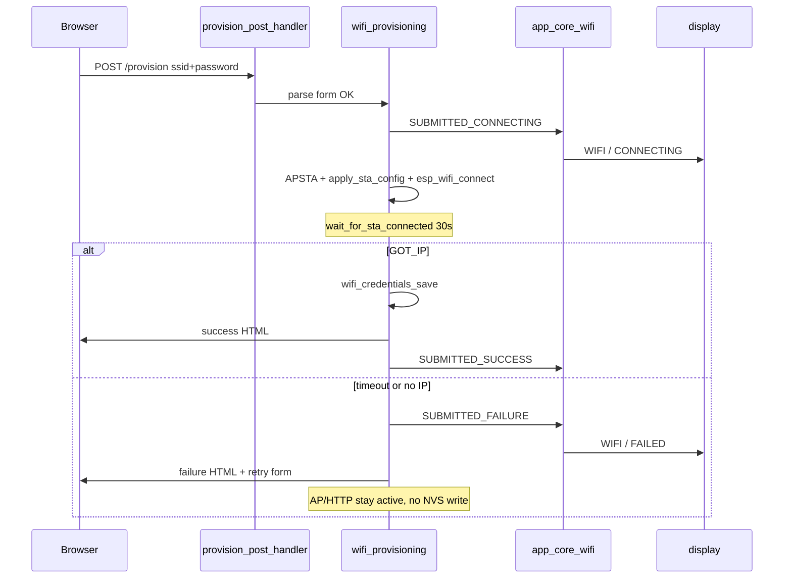

# WiFi Provisioning First-Connect Failure Flow

Normative architecture for what happens when a device **without saved NVS
credentials** attempts its first WiFi connection through the provisioning portal
and the STA attempt **fails**.

Source handoff: `WIFI_PROVISIONING_FIRST_CONNECT_FAILURE_FLOW` in
`agent-workspaces/architect/handoff.md`.

Related:

- [`wifi_provisioning_architecture.md`](wifi_provisioning_architecture.md) — portal,
  HTTP, events, display map
- [`error_led_connect_cycle_architecture.md`](error_led_connect_cycle_architecture.md) —
  LED mapping for `UNPROVISIONED` during portal
- [`wifi_connect_cycle_architecture.md`](wifi_connect_cycle_architecture.md) —
  saved-credentials boot/runtime (different path)

## Scope

**First connect** in this document means:

- Boot with **no valid credentials in NVS**
- User joins the open SoftAP and submits SSID/password via `POST /provision`
- STA connection attempt fails (timeout, config error, wrong credentials, etc.)

This document does **not** describe saved-credentials boot or runtime reconnect.
Those paths use the indefinite connect cycle (5 attempts → 15 s alert LED →
repeat) and never show a locked `WIFI / FAILED` OLED screen. See
[`wifi_connect_cycle_architecture.md`](wifi_connect_cycle_architecture.md).

Parent contract ([`wifi_provisioning_architecture.md`](wifi_provisioning_architecture.md)
Product Decisions):

| Outcome | Required behavior |
| --- | --- |
| Failed submitted credentials | Do not save; keep AP/HTTP active; show failure and retry form |

**UX v2 approved (2026-06-28):**
[`wifi_provisioning_first_connect_failure_ux_proposal.md`](wifi_provisioning_first_connect_failure_ux_proposal.md)
— 3 s `WIFI / FAILED` flash, then restore **unchanged** standard QR setup screen.

## Initial state (no credentials)

`app_core_wifi_start()` in `components/app_core/app_core_wifi.c`:

1. `wifi_credentials_load()` fails → `wifi_provisioning_start_ap_portal()`.
2. LED: `WIFI_LINK_STATUS_UNPROVISIONED` → solid ON
   (`ERROR_LED_PATTERN_ON`).
3. Events `WIFI_PROV_EVENT_AP_STARTED` and `WIFI_PROV_EVENT_PORTAL_READY` →
   provisioning setup OLED via `show_provisioning_setup_display()`.

| Region | Content |
| --- | --- |
| Left 64×64 | QR payload `http://192.168.4.1` |
| Right 64×64 | `1 JOIN` / `HIL-06-` / `<MAC4>` / `2 SCAN QR` |

Portal remains active (`s_portal_active = true`); SoftAP SSID `HIL-06-<MAC4>`;
HTTP at `http://192.168.4.1/`.

## Sequence when form is submitted and STA fails

### HTTP handler contract

`provision_post_handler()` in `components/wifi_provisioning/wifi_provisioning.c`
after valid form parse:

1. `set_link_status(WIFI_LINK_STATUS_UNPROVISIONED)` — link status stays
   **unprovisioned** for the entire submitted attempt (does not transition to
   `CONNECTING`).
2. Emit `WIFI_PROV_EVENT_SUBMITTED_CONNECTING`.
3. `ensure_sta_netif()` → `esp_wifi_set_mode(WIFI_MODE_APSTA)` →
   `apply_sta_config()` →
   `wait_for_sta_connected(WIFI_PROV_STA_SOURCE_SUBMITTED, 30000 ms)`.

`wait_for_sta_connected()`:

- Disconnects STA, calls `esp_wifi_connect()`, waits for `WIFI_CONNECTED_BIT`
  (GOT_IP) up to **30 s**.
- Unlike the saved-boot connect cycle, this path performs **one attempt only**:
  success (GOT_IP) or `ESP_ERR_TIMEOUT`. It does not poll for early
  `STA_DISCONNECTED` or apply round backoff.

On failure (timeout, netif/mode/config error):

- `set_link_status(WIFI_LINK_STATUS_UNPROVISIONED)`.
- Emit `WIFI_PROV_EVENT_SUBMITTED_FAILURE`.
- Return `wifi_prov_send_failure_page()` (`wifi_provisioning_pages.c`).
- Do **not** call `wifi_credentials_save()`.
- Do **not** stop AP or HTTP (`s_portal_active` remains `true`).

## Operator-visible surfaces

### OLED (128×64)

Mapping in `on_wifi_prov_event()` (`components/app_core/app_core_wifi.c`):

| Phase | Event | Display |
| --- | --- | --- |
| Boot, no credentials | `AP_STARTED` / `PORTAL_READY` | QR + `1 JOIN` / SoftAP SSID / `2 SCAN QR` |
| Form submitted | `SUBMITTED_CONNECTING` | `WIFI` / `CONNECTING` (`FULL_TWO_LINES`) |
| STA failure | `SUBMITTED_FAILURE` | `WIFI` / `FAILED` (`FULL_TWO_LINES`) |
| Success (contrast) | `SUBMITTED_SUCCESS` | `WIFI OK` + IP + MAC (4 lines) |

**Post-failure persistence (v1 as-built):** OLED remained on `WIFI / FAILED`.

**v2 approved:** flash `WIFI / FAILED` for `PROV_FAILURE_FLASH_MS` (3000 ms), then
auto-restore standard QR setup via cached portal context. See
[`wifi_provisioning_first_connect_failure_ux_proposal.md`](wifi_provisioning_first_connect_failure_ux_proposal.md).

### Browser (HTTP portal)

Failure page from `wifi_prov_send_failure_page()`:

- Heading: **WiFi setup failed**
- Message (wrong credentials / connection failure):
  **`WiFi connection failed. Check SSID and password.`**
- Retry form: `POST /provision` with SSID prefilled (password always empty).
- HTTP **200** for connection failures; **400** only for invalid form with
  *Invalid form submission.*

SoftAP stays reachable; the user may retry without rebooting the device.

### Error LED

During `SUBMITTED_CONNECTING` and after `SUBMITTED_FAILURE`, `link_status`
remains `UNPROVISIONED` on the submitted path → LED **solid ON** (not slow
blink).

| `wifi_link_status_t` | LED pattern |
| --- | --- |
| `UNPROVISIONED` | Solid ON |
| `CONNECTING` | Slow blink (saved-credentials boot/runtime only) |
| `CONNECTED` | OFF |

**Known product asymmetry (v1, accepted):** OLED shows `CONNECTING` while LED
stays solid ON because submitted attempts do not set `link_status` to
`CONNECTING`. Aligning LED with OLED during portal STA attempts requires an
explicit future contract change.

## What must NOT happen on first-connect failure

- Credentials MUST NOT be written to NVS.
- AP and HTTP MUST remain active.
- `SUBMITTED_SUCCESS` and `WIFI OK` OLED MUST NOT appear.
- The saved-boot connect cycle (5 attempts, alert phase, indefinite retry) MUST
  NOT run on the submitted path.
- Locked failure / `HOLD RESET` / `SAVED_FAILURE_LOCKED` MUST NOT apply
  (deprecated v2).
- OLED MUST NOT remain on `WIFI / FAILED` indefinitely (v2: flash 3 s, then
  auto-restore standard QR setup).

## Failure variants (same flow)

| Cause | Event emitted | OLED | Browser |
| --- | --- | --- | --- |
| Malformed form / oversize body | *(none)* | Unchanged (QR or prior state) | *Invalid form submission.* |
| Netif / APSTA / config / STA timeout | `SUBMITTED_FAILURE` | `WIFI / FAILED` (~3 s), then QR setup | Standard message + retry |
| STA OK, NVS save fails | `WIFI_PROV_EVENT_ERROR` | `WIFI / AP FAIL` | Generic failure HTML |
| STA OK, save OK, success page send fails | NVS rollback + `SUBMITTED_FAILURE` | `WIFI / FAILED` (~3 s), then QR setup | Failure page |

Invalid form submissions MUST NOT emit `SUBMITTED_CONNECTING` or
`SUBMITTED_FAILURE`; OLED is unchanged.

## Contrast: first connect vs saved-credentials boot

| Aspect | First connect (portal) | Saved-credentials boot |
| --- | --- | --- |
| Entry | No NVS credentials | Valid NVS credentials |
| STA attempts | Single 30 s wait | Connect cycle: 5 × 12 s + backoff, repeat |
| OLED on failure | `WIFI / FAILED` (~3 s), then QR setup | `WIFI / CONNECTING` (indefinite) |
| LED on failure path | Solid ON (`UNPROVISIONED`) | Slow blink, then fast blink in alert |
| Portal | Stays active | Not started |
| NVS | Not written on failure | Never erased on failure |

## Implementation reference (as-built)

| Concern | File | Symbol / note |
| --- | --- | --- |
| Boot orchestration | `components/app_core/app_core_wifi.c` | `app_core_wifi_start`, `on_wifi_prov_event`, failure-restore timer |
| POST handler | `components/wifi_provisioning/wifi_provisioning.c` | `provision_post_handler` |
| STA wait | `components/wifi_provisioning/wifi_provisioning.c` | `wait_for_sta_connected`, `WIFI_PROV_STA_TIMEOUT_MS` = 30000 |
| HTML pages | `components/wifi_provisioning/wifi_provisioning_pages.c` | `wifi_prov_send_failure_page` |
| LED adapter | `components/app_core/app_core_wifi.c` | `apply_wifi_link_status_led` |

## Validation expectations

See [`test_strategy.md`](test_strategy.md) section **Submitted credential
outcomes** and **First-connect failure OLED and LED** (added with this handoff).

Tester MUST verify on hardware:

1. Wrong credentials → OLED `WIFI / CONNECTING` then `WIFI / FAILED` (~3 s),
   then standard QR setup; failure page in browser; AP still visible; no NVS save.
2. After failure flash, OLED restores QR setup (`1 JOIN` / AP SSID / `2 SCAN QR`).
3. Retry from failure page (or new POST during flash) → OLED briefly `CONNECTING` again.
4. Reboot after failure (still no credentials) → QR setup screen returns.
5. LED solid ON throughout submitted connecting and after failure (not slow
   blink).
