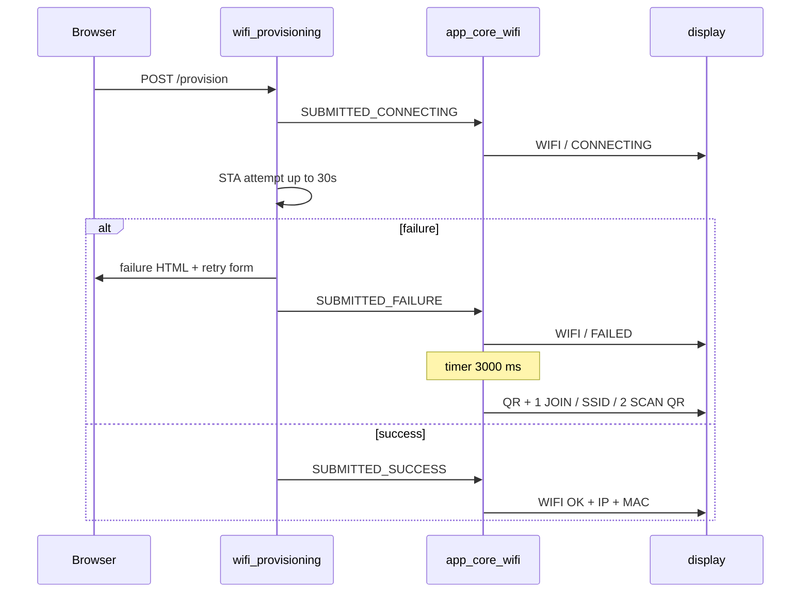

# WiFi First-Connect Failure Display UX

**Status: approved** — human decision 2026-06-28.

Source: architect review of
[`wifi_provisioning_first_connect_failure_flow.md`](wifi_provisioning_first_connect_failure_flow.md).

Related:

- [`wifi_provisioning_architecture.md`](wifi_provisioning_architecture.md)
- [`display_delivery_contract.md`](display_delivery_contract.md)

Handoff ID: `WIFI_PROVISIONING_FIRST_CONNECT_FAILURE_UX_V2`

## Human decision (2026-06-28)

The operator **rejects** modifying the QR setup screen copy (no `WIFI FAIL` on the
QR layout). The approved UX is:

```text
SUBMITTED_FAILURE → FULL_TWO_LINES ["WIFI","FAILED"] for 3 s
                  → standard QR setup (1 JOIN / AP SSID / 2 SCAN QR) unchanged
```

Option B (failure-aware QR lines) is **withdrawn**.

## Problem

After a failed first credential attempt, the OLED stays on **`WIFI / FAILED`**
indefinitely and never restores the standard QR setup guide, even though the
portal remains active.

## Goals

1. Show a clear failure moment on OLED (`WIFI / FAILED`).
2. Automatically restore the **unchanged** provisioning QR screen so the user
   can retry from the device.
3. Reuse existing templates only; no QR layout or copy changes.
4. Keep module boundaries: timer and display sequencing in `app_core_wifi`.
5. Unchanged: browser failure page, NVS rules, portal lifetime.

## Non-goals

- Altering QR setup line copy (`1 JOIN`, `2 SCAN QR`, etc.).
- New WiFi provisioning events (not required for this UX).
- Saved-credentials boot / connect-cycle display changes.

---

## Normative display behavior

### Portal idle (unchanged)

`AP_STARTED` / `PORTAL_READY` → standard QR setup via
`show_provisioning_setup_display()`:

| Right panel lines |
| --- |
| `1 JOIN` |
| `HIL-06-` |
| `<MAC4>` |
| `2 SCAN QR` |

`app_core_wifi` MUST cache `setup_url` and AP `ssid` from every
`AP_STARTED` / `PORTAL_READY` event into static buffers for later restore.

### Connecting (unchanged)

| Event | Display |
| --- | --- |
| `WIFI_PROV_EVENT_SUBMITTED_CONNECTING` | `FULL_TWO_LINES`: `WIFI` / `CONNECTING` |

Cancel any pending failure-restore timer when this event is handled.

Duration: up to `WIFI_PROV_STA_TIMEOUT_MS` (30 s).

### Failure flash + QR restore (new)

On `WIFI_PROV_EVENT_SUBMITTED_FAILURE` (submitted STA connection failures only):

1. Show `FULL_TWO_LINES`: `WIFI` / `FAILED` immediately.
2. Start a **one-shot** restore timer for `PROV_FAILURE_FLASH_MS` (**3000 ms**).
3. When the timer expires **and** cached portal context is valid (`setup_url` and
   AP `ssid` from last portal event), call `show_provisioning_setup_display()`
   with the **same content as boot** (standard QR setup — no failure copy).
4. If cached portal context is invalid, fall back to `FULL_TWO_LINES`
   `WIFI` / `SETUP`.

Timer rules:

- Only one failure-restore timer may be armed at a time; re-arming cancels the
  previous timer.
- Cancel the timer on `SUBMITTED_CONNECTING`, `SUBMITTED_SUCCESS`, and
  `app_core_wifi` deinit/stop if such a path exists.
- Do **not** start the timer on invalid form submissions (those never emit
  `SUBMITTED_FAILURE`).
- Do **not** start the timer for `WIFI_PROV_EVENT_ERROR` (keep existing
  `WIFI / AP FAIL` or `WEB FAIL` mapping).

Visual timeline:

```text
t=0        CONNECTING (up to 30 s)
t=fail     WIFI / FAILED
t=fail+3s  QR + 1 JOIN / HIL-06- / MAC4 / 2 SCAN QR  (unchanged setup screen)
```

### Superseded rules

| Old (v1 as-built) | New (v2 approved) |
| --- | --- |
| `SUBMITTED_FAILURE` → persistent `WIFI / FAILED` | Flash `FAILED` for 3 s, then QR setup |
| Post-failure MUST NOT auto-restore QR | QR setup MUST auto-restore after flash |

---

## Event model

**No new `wifi_prov_event_t` values.** Existing events only.

`wifi_provisioning.c` behavior unchanged except docs alignment: continue emitting
`WIFI_PROV_EVENT_SUBMITTED_FAILURE` on connection-failure paths as today.

All sequencing lives in `app_core_wifi.c`:

```c
#define PROV_FAILURE_FLASH_MS 3000U

/* Static cache — updated on AP_STARTED / PORTAL_READY */
static char s_cached_setup_url[...];
static char s_cached_ap_ssid[...];
static bool s_portal_display_cached;

/* esp_timer or FreeRTOS one-shot — implementer choice; esp_timer preferred */
static void prov_failure_restore_timer_cb(...);
static void schedule_provisioning_setup_restore(void);
static void cancel_provisioning_setup_restore(void);
```

Handler sketch:

```c
case WIFI_PROV_EVENT_AP_STARTED:
case WIFI_PROV_EVENT_PORTAL_READY:
    cache_portal_display_context(info);
    show_provisioning_setup_display(info);
    break;

case WIFI_PROV_EVENT_SUBMITTED_CONNECTING:
    cancel_provisioning_setup_restore();
    /* existing CONNECTING display */
    break;

case WIFI_PROV_EVENT_SUBMITTED_FAILURE:
    /* existing FAILED display */
    schedule_provisioning_setup_restore();
    break;
```

---

## Sequence



---

## LED (optional — not required for v2 approval)

During `SUBMITTED_CONNECTING`, `wifi_provisioning` MAY set
`link_status = CONNECTING` (slow blink). Human did not request this explicitly;
implementer MAY include if trivial alongside display work.

---

## Files to change (implementer)

| File | Change |
| --- | --- |
| `components/app_core/app_core_wifi.c` | Portal context cache; failure flash timer; restore call |
| `docs/wifi_provisioning_architecture.md` | Display event map; supersede FAILED persistence |
| `docs/wifi_provisioning_first_connect_failure_flow.md` | Update post-failure OLED behavior |
| `docs/test_strategy.md` | Flash + restore criteria |

**No changes required** to `wifi_provisioning.h` / `wifi_provisioning.c` for the
approved UX (unless optional LED 1b is added).

---

## Acceptance criteria

1. Wrong credentials → OLED: `CONNECTING` → `FAILED` (~3 s) → **standard QR setup**
   (`1 JOIN`, not `WIFI FAIL` on QR panel).
2. QR setup screen after restore is **pixel-identical** to pre-attempt setup.
3. Browser failure page and AP visibility unchanged; no NVS write.
4. Invalid form: OLED unchanged; no timer started.
5. New POST while `FAILED` flash showing → cancel timer, show `CONNECTING`.
6. Reboot without credentials → normal setup screen only.

---

## Withdrawn alternative

**Option B (failure-aware QR)** — QR right panel line 0 = `WIFI FAIL` instead of
`1 JOIN`. Withdrawn per operator preference; do not implement.
